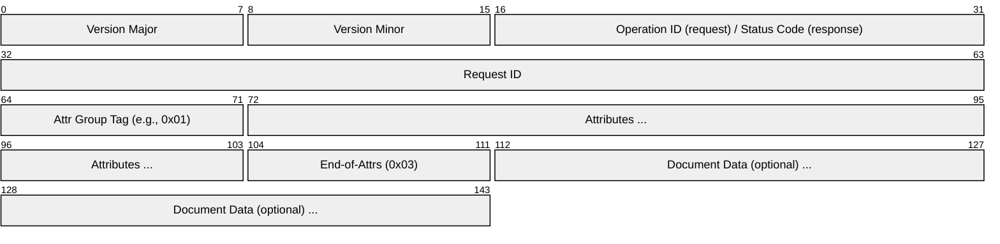
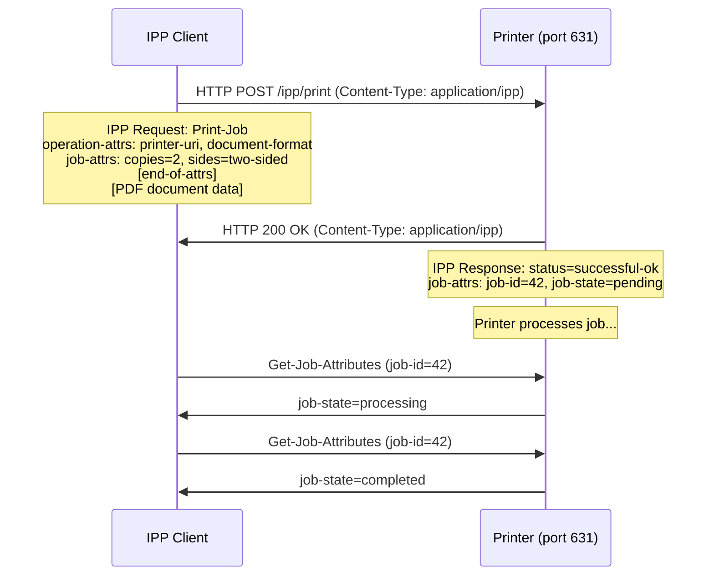
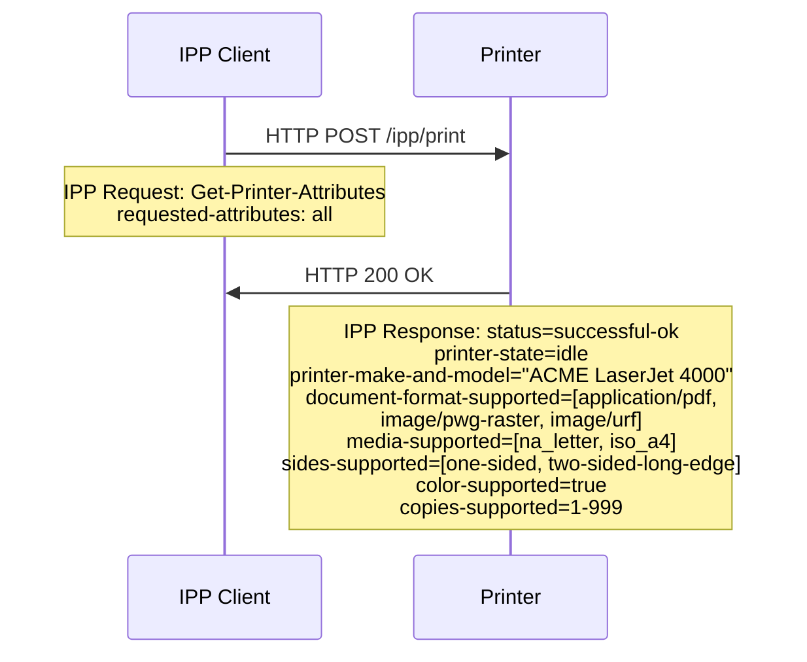
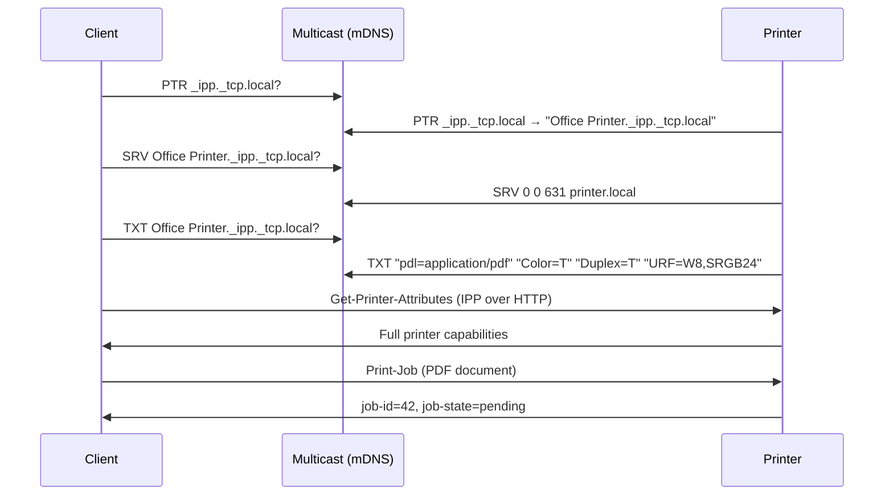
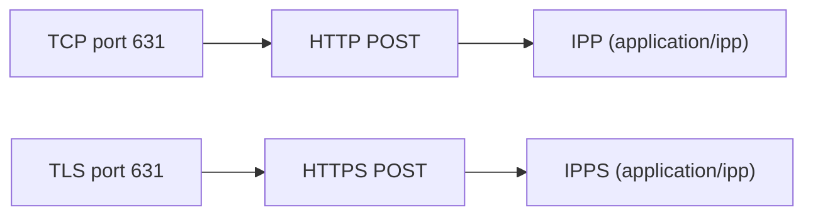

# IPP (Internet Printing Protocol)

> **Standard:** [RFC 8011](https://www.rfc-editor.org/rfc/rfc8011) | **Layer:** Application (Layer 7) | **Wireshark filter:** `ipp`

IPP is the standard protocol for printing over HTTP/HTTPS. An IPP client sends print jobs, queries printer capabilities, and manages job queues by POSTing binary-encoded IPP requests to a printer's URI. IPP replaced the venerable LPD/LPR protocol and the raw-socket port 9100 approach by providing rich attribute-based job control, encryption via TLS, and authentication -- all tunneled through standard HTTP. IPP is the foundation of driverless printing: Apple AirPrint, Mopria (Android), and IPP Everywhere all rely on IPP 2.0 with DNS-SD discovery, eliminating the need for vendor-specific printer drivers.

## IPP Request Encoding

IPP operations are carried as HTTP POST requests with Content-Type `application/ipp`. The binary encoding:

## Key Fields

| Field | Size | Description |
|-------|------|-------------|
| Version Major | 1 byte | IPP major version (2 for IPP 2.0) |
| Version Minor | 1 byte | IPP minor version (0 for IPP 2.0) |
| Operation ID | 2 bytes | Operation code (request) or status code (response) |
| Request ID | 4 bytes | Matches requests to responses (client-chosen) |
| Attribute Group Tag | 1 byte | Delimiter for attribute groups (operation, job, printer, etc.) |
| Attributes | Variable | Tag-length-value encoded name/value pairs |
| End-of-Attributes Tag | 1 byte | 0x03 marks the end of attribute sections |
| Document Data | Variable | Print data (PDF, PWG Raster, etc.) -- only in Print-Job/Send-Document |

## Attribute Group Tags

| Tag | Value | Description |
|-----|-------|-------------|
| operation-attributes-tag | 0x01 | Operation-level attributes (URI, charset, language) |
| job-attributes-tag | 0x02 | Job-level attributes (copies, sides, media) |
| end-of-attributes-tag | 0x03 | Marks the end of all attribute groups |
| printer-attributes-tag | 0x04 | Printer-level attributes (capabilities, state) |
| unsupported-attributes-tag | 0x05 | Attributes not supported by the printer |

## Operations

| Operation | Code | Description |
|-----------|------|-------------|
| Print-Job | 0x0002 | Submit a complete print job (attributes + document data) |
| Print-URI | 0x0003 | Print a document referenced by URI |
| Validate-Job | 0x0004 | Check if a job would be accepted (no actual printing) |
| Create-Job | 0x0005 | Create a job with attributes only (document sent via Send-Document) |
| Send-Document | 0x0006 | Send document data for a previously created job |
| Send-URI | 0x0007 | Add a URI-referenced document to a job |
| Cancel-Job | 0x0008 | Cancel a pending or processing job |
| Get-Job-Attributes | 0x0009 | Query attributes of a specific job |
| Get-Jobs | 0x000A | List jobs on a printer |
| Get-Printer-Attributes | 0x000B | Query printer capabilities and state |
| Hold-Job | 0x000C | Hold a job in the queue |
| Release-Job | 0x000D | Release a held job for printing |
| Restart-Job | 0x000E | Restart a completed/canceled job |

## Common Attributes

### Operation Attributes

| Attribute | Type | Description |
|-----------|------|-------------|
| attributes-charset | charset | Always "utf-8" |
| attributes-natural-language | naturalLanguage | e.g., "en-us" |
| printer-uri | uri | Target printer URI (e.g., `ipp://printer.local:631/ipp/print`) |
| requesting-user-name | name | Username of the requesting user |
| job-name | name | Human-readable job name |
| document-format | mimeMediaType | MIME type of document (e.g., "application/pdf") |

### Job Template Attributes

| Attribute | Type | Description |
|-----------|------|-------------|
| copies | integer | Number of copies |
| sides | keyword | "one-sided", "two-sided-long-edge", "two-sided-short-edge" |
| media | keyword | Paper size (e.g., "iso_a4_210x297mm", "na_letter_8.5x11in") |
| print-quality | enum | 3=draft, 4=normal, 5=high |
| orientation-requested | enum | 3=portrait, 4=landscape, 5=reverse-landscape, 6=reverse-portrait |
| print-color-mode | keyword | "auto", "monochrome", "color" |
| page-ranges | rangeOfInteger | Pages to print (e.g., 1-5) |
| finishings | enum | 3=none, 4=staple, 5=punch, 6=cover, 7=bind |
| number-up | integer | Pages per sheet (1, 2, 4, 6, 9, 16) |

## Job States

| State | Value | Description |
|-------|-------|-------------|
| pending | 3 | Queued, waiting to be processed |
| pending-held | 4 | Held in queue (manual release required) |
| processing | 5 | Currently being printed |
| processing-stopped | 6 | Processing paused (e.g., out of paper) |
| canceled | 7 | Job was canceled |
| aborted | 8 | Job aborted due to error |
| completed | 9 | Job finished successfully |

## Print-Job Flow

## Get-Printer-Attributes Flow

## IPP Everywhere (Driverless Printing)

IPP Everywhere eliminates printer drivers by combining:

| Component | Description |
|-----------|-------------|
| DNS-SD (mDNS) | Discover printers on the local network (`_ipp._tcp` / `_ipps._tcp`) |
| IPP 2.0 | Standard operations with required attributes |
| Document formats | PDF, PWG Raster, Apple Raster (URF), or JPEG |
| TLS (IPPS) | Encrypted printing via `ipps://` URI scheme |

Discovery flow:

## IPP vs LPD/LPR vs Raw 9100

| Feature | IPP | LPD/LPR (RFC 1179) | Raw 9100 |
|---------|-----|---------------------|----------|
| Transport | HTTP/HTTPS (port 631) | TCP port 515 | TCP port 9100 |
| Encryption | TLS (IPPS) | None | None |
| Authentication | HTTP auth, TLS certs | None | None |
| Job attributes | Rich (copies, duplex, media, quality) | Minimal (class, name) | None |
| Job management | Cancel, Hold, Release, Get status | Limited | None |
| Printer discovery | DNS-SD / mDNS | Manual configuration | Manual configuration |
| Bidirectional | Yes (query status, capabilities) | Minimal | SNMP for status (separate) |
| Driverless | Yes (IPP Everywhere) | No | No |
| Protocol age | 1999 (current: 2017) | 1990 | 1990s |

## Encapsulation

## Standards

| Document | Title |
|----------|-------|
| [RFC 8011](https://www.rfc-editor.org/rfc/rfc8011) | Internet Printing Protocol/1.1: Model and Semantics |
| [RFC 8010](https://www.rfc-editor.org/rfc/rfc8010) | Internet Printing Protocol/1.1: Encoding and Transport |
| [PWG 5100.12](https://ftp.pwg.org/pub/pwg/candidates/cs-ippjobext21-20230210-5100.12.pdf) | IPP 2.0, 2.1, and 2.2 |
| [PWG 5100.14](https://ftp.pwg.org/pub/pwg/candidates/cs-ippeve11-20200515-5100.14.pdf) | IPP Everywhere |
| [RFC 6763](https://www.rfc-editor.org/rfc/rfc6763) | DNS-SD for printer discovery |

## See Also

- [HTTP](http.md) -- transport layer for IPP
- [mDNS](../../naming/mdns.md) -- printer discovery via DNS-SD
- [SNMP](../../monitoring/snmp.md) -- printer status monitoring (legacy)
