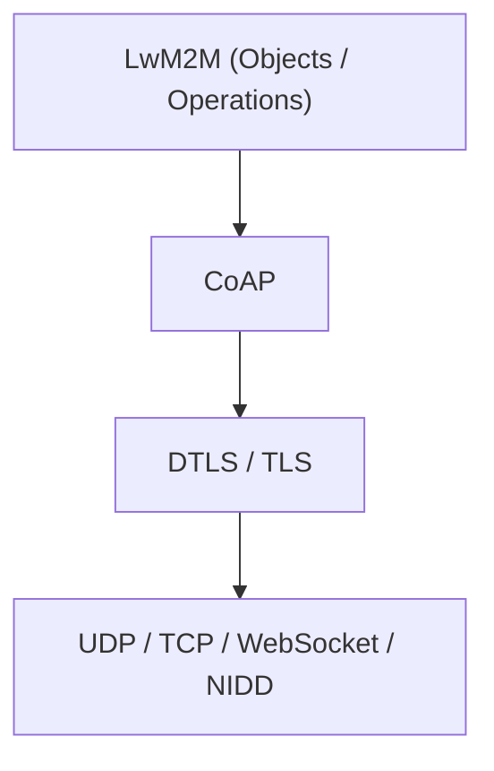
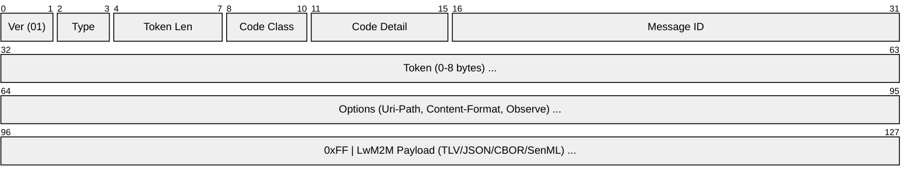
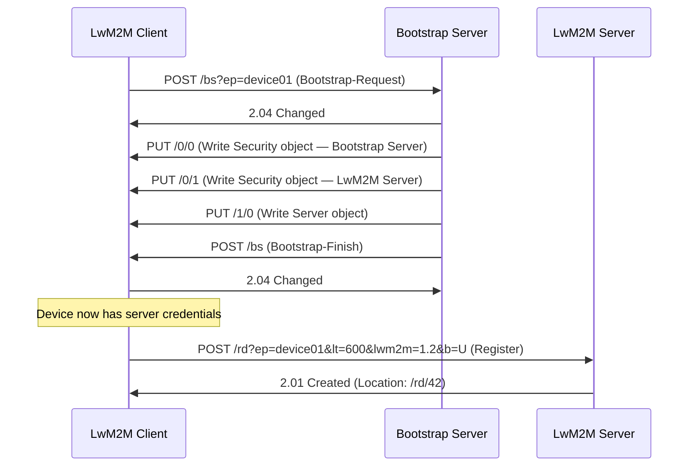
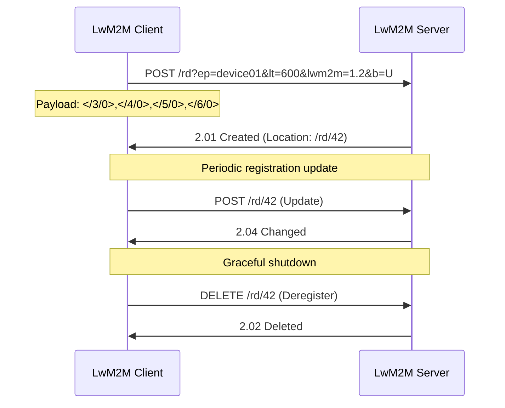
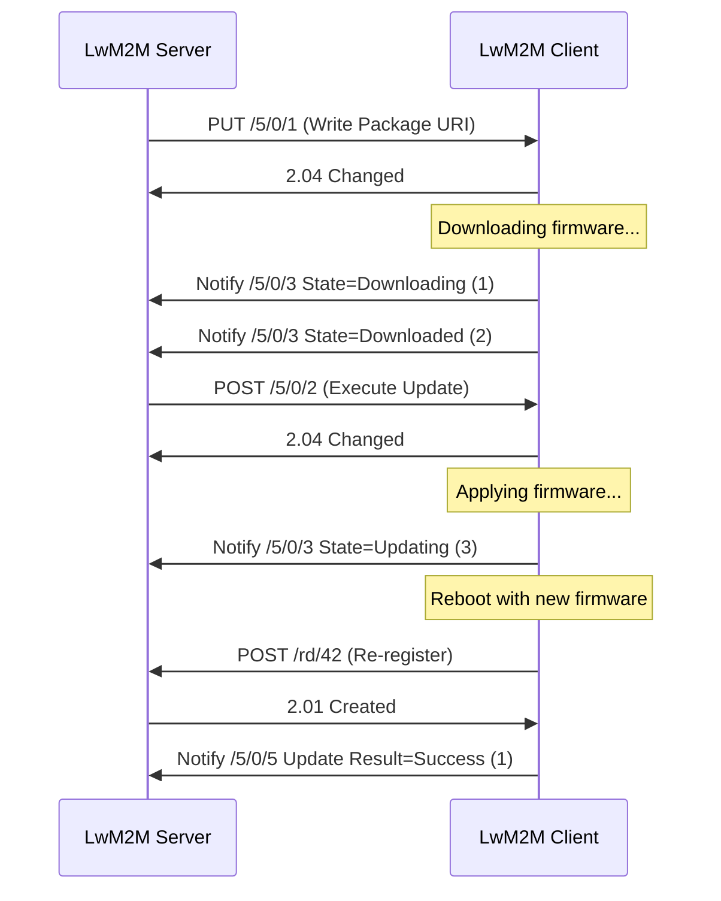

# LwM2M (Lightweight Machine-to-Machine)

> **Standard:** [OMA LwM2M v1.2](https://openmobilealliance.org/release/LightweightM2M/) | **Layer:** Application (Layer 7) | **Wireshark filter:** `lwm2m` or `coap`

LwM2M is an IoT device management and service enablement protocol developed by OMA SpecWorks. It provides a standardized way to remotely manage constrained devices -- bootstrapping, registration, firmware updates, configuration, and telemetry collection. LwM2M is built on top of CoAP and uses a well-defined Object/Instance/Resource data model, making it far more structured than raw MQTT or HTTP for device management. It is used in smart metering, asset tracking, industrial sensors, and cellular IoT (NB-IoT/LTE-M) deployments.

## Protocol Stack



## CoAP Message with LwM2M Payload

LwM2M rides on CoAP. Each LwM2M operation maps to a CoAP method (GET, PUT, POST, DELETE) targeting an Object/Instance/Resource URI:



## Interfaces

LwM2M defines four interfaces between the LwM2M Client (device) and LwM2M Server:

| Interface | Direction | Description |
|-----------|-----------|-------------|
| Bootstrap | Server → Client | Initial provisioning of server URIs, security credentials, and access control |
| Registration | Client → Server | Client registers its objects/instances; periodic updates and deregistration |
| Device Management & Service Enablement | Server → Client | Read, Write, Execute, Create, Delete, Discover operations on resources |
| Information Reporting | Client → Server | Observe/Notify for asynchronous telemetry and event reporting |

## Object / Instance / Resource Model

LwM2M organizes all device data into a three-level hierarchy addressed as `/{Object ID}/{Instance ID}/{Resource ID}`:

```
/3/0/0    → Device Manufacturer (Object 3, Instance 0, Resource 0)
/3/0/9    → Battery Level
/5/0/1    → Firmware Update URI
/6/0/0    → Latitude
```

| Level | Description | Example |
|-------|-------------|---------|
| Object | A class of functionality (e.g., Device, Firmware Update) | `/3` |
| Instance | A specific instance of an object (multi-instance supported) | `/3/0` |
| Resource | An individual data point, action, or configuration | `/3/0/9` (Battery Level) |

## Standard Objects

| Object ID | Name | Description |
|-----------|------|-------------|
| 0 | Security | LwM2M Server URI, security mode, keys/certs |
| 1 | Server | Registration lifetime, binding mode, notification storing |
| 2 | Access Control | Per-object ACLs for multi-server deployments |
| 3 | Device | Manufacturer, model, serial, battery, memory, error codes |
| 4 | Connectivity Monitoring | Radio signal, link quality, IP addresses, cell ID |
| 5 | Firmware Update | Firmware URI, state machine, update result |
| 6 | Location | Latitude, longitude, altitude, velocity, timestamp |

OMA maintains a public registry of 300+ defined objects at [OMA LwM2M Object Registry](https://technical.openmobilealliance.org/OMNA/LwM2M/LwM2MRegistry.html).

## Operations

| Operation | CoAP Method | Direction | Description |
|-----------|-------------|-----------|-------------|
| Read | GET | Server → Client | Read resource or object instance value |
| Discover | GET (Accept: application/link-format) | Server → Client | List available resources and their attributes |
| Write | PUT / POST | Server → Client | Set resource value(s) |
| Write-Attributes | PUT (on attributes) | Server → Client | Set observation parameters (pmin, pmax, gt, lt, st) |
| Execute | POST | Server → Client | Trigger an action (e.g., reboot, firmware update) |
| Create | POST | Server → Client | Create a new object instance |
| Delete | DELETE | Server → Client | Delete an object instance |
| Observe | GET + Observe option | Server → Client | Subscribe to resource changes |
| Notify | Response (2.05) | Client → Server | Asynchronous value update for observed resource |

## Data Formats

| Format | Content-Format ID | Description |
|--------|-------------------|-------------|
| Plain Text | 0 | Single resource value as UTF-8 string |
| Opaque | 42 | Single resource value as raw bytes |
| TLV | 11542 | Type-Length-Value binary encoding (compact, default in v1.0) |
| JSON | 11543 | LwM2M JSON (human-readable) |
| SenML JSON | 110 | IETF Sensor Measurement Lists in JSON |
| SenML CBOR | 112 | IETF Sensor Measurement Lists in CBOR (compact) |
| CBOR | 11544 | LwM2M CBOR encoding (v1.1+) |

## Bootstrap Flow



## Registration Flow



## Firmware Update Flow



## Firmware Update State Machine

| State | Value | Description |
|-------|-------|-------------|
| Idle | 0 | No firmware update in progress |
| Downloading | 1 | Firmware package is being downloaded |
| Downloaded | 2 | Firmware package downloaded, ready to update |
| Updating | 3 | Firmware update is in progress |

## Security

LwM2M mandates transport security via DTLS (over UDP) or TLS (over TCP):

| Security Mode | Value | Description |
|---------------|-------|-------------|
| PSK | 0 | Pre-Shared Key -- lightweight, common in constrained devices |
| RPK | 1 | Raw Public Key -- ECDSA key pair without full certificate |
| Certificate | 2 | X.509 certificate-based authentication |
| NoSec | 3 | No security (testing/development only) |

## Binding Modes

| Mode | Transport | Description |
|------|-----------|-------------|
| U | UDP | Default CoAP over UDP |
| T | TCP | CoAP over TCP (persistent connections) |
| S | SMS | CoAP over SMS (cellular IoT) |
| N | Non-IP | NIDD -- Non-IP Data Delivery (NB-IoT) |
| Q | Queue Mode | Server queues requests while device sleeps |

## LwM2M vs MQTT vs HTTP for IoT

| Feature | LwM2M | MQTT | HTTP |
|---------|-------|------|------|
| Data model | Standardized (Object/Instance/Resource) | Application-defined topics | Application-defined endpoints |
| Device management | Built-in (bootstrap, firmware, config) | Not included | Not included |
| Transport | CoAP (UDP/TCP) | TCP | TCP |
| Header overhead | 4 bytes (CoAP) | 2 bytes minimum | ~200+ bytes |
| Observe/Push | CoAP Observe (server-initiated) | Pub/Sub (broker-mediated) | Polling or WebSocket |
| Offline queuing | Queue mode (Q binding) | QoS 1/2 + persistent sessions | Not built-in |
| Firmware update | Standardized (Object 5) | Custom implementation | Custom implementation |
| Constrained devices | Designed for (Class 1-2 devices) | Suitable | Heavy for constrained |
| Standardization | OMA SpecWorks | OASIS | IETF |

## Encapsulation


## Standards

| Document | Title |
|----------|-------|
| [OMA LwM2M v1.2](https://openmobilealliance.org/release/LightweightM2M/) | Lightweight Machine-to-Machine Technical Specification (Core + Transport) |
| [OMA LwM2M v1.1.1](https://openmobilealliance.org/release/LightweightM2M/) | LwM2M v1.1.1 (widely deployed) |
| [OMA LwM2M Object Registry](https://technical.openmobilealliance.org/OMNA/LwM2M/LwM2MRegistry.html) | Public registry of LwM2M object definitions |
| [RFC 7252](https://www.rfc-editor.org/rfc/rfc7252) | CoAP -- underlying transport protocol |
| [RFC 8132](https://www.rfc-editor.org/rfc/rfc8132) | PATCH and FETCH methods for CoAP |

## See Also

- [MQTT](../../messaging/mqtt.md) -- pub/sub IoT messaging (no device management)
- [HTTP](http.md) -- heavyweight alternative for IoT APIs
- [mDNS](../../naming/mdns.md) -- local service discovery
