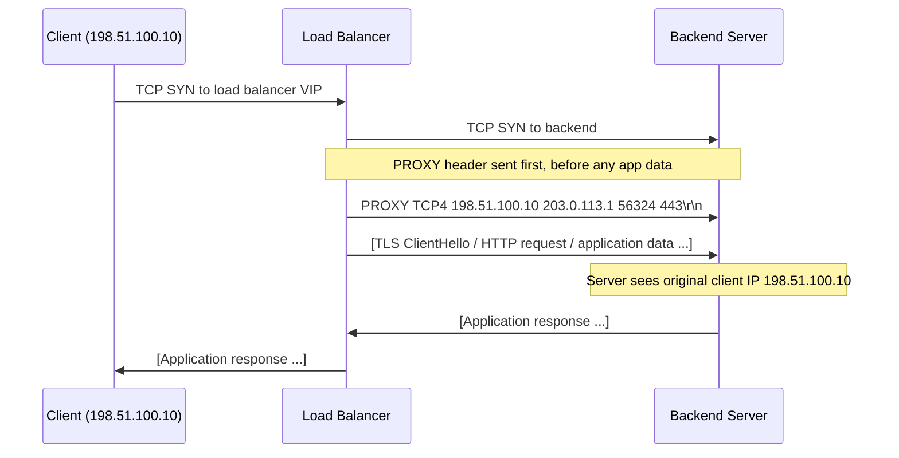
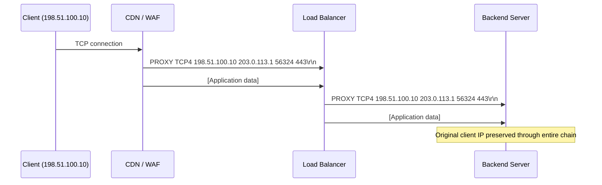
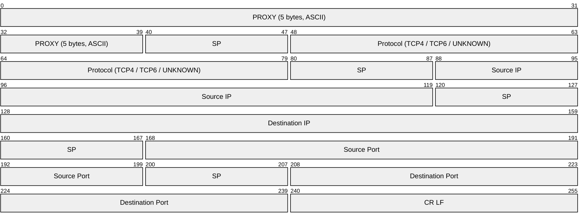
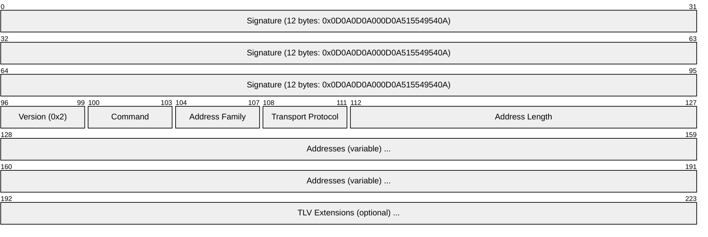
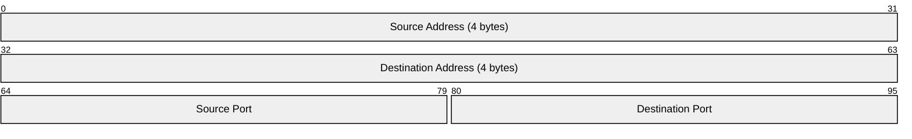
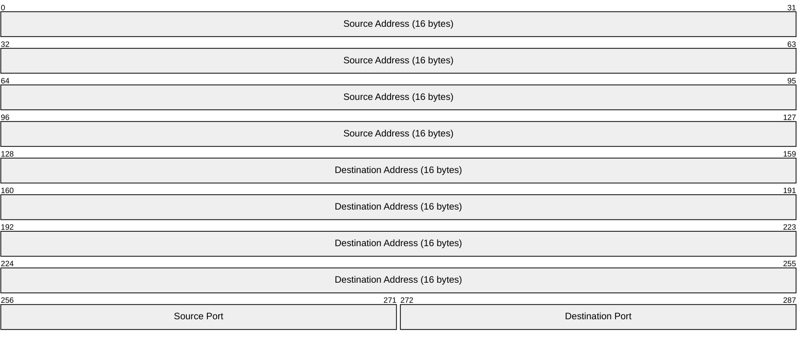
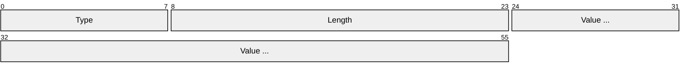
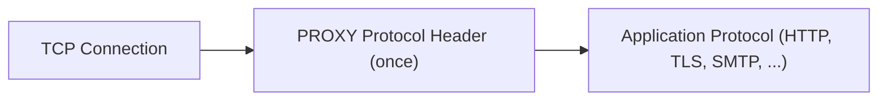

# PROXY Protocol

> **Standard:** [HAProxy PROXY Protocol v1/v2](https://www.haproxy.org/download/2.9/doc/proxy-protocol.txt) | **Layer:** Between Transport and Application (Layer 4.5) | **Wireshark filter:** `proxy` (v2)

The PROXY protocol preserves original client connection information (source IP, destination IP, ports) when traffic passes through load balancers and reverse proxies. Without it, the backend server sees only the proxy's IP address. Developed by HAProxy, it has become a de facto standard supported by nginx, AWS ELB/NLB, Cloudflare, Envoy, Traefik, and most modern proxies. The PROXY protocol header is sent exactly once, at the very beginning of a connection, before any application data -- making it protocol-agnostic (works with HTTP, TLS, SMTP, MySQL, or any TCP/UDP stream).

## How It Works



## Multi-Proxy Chain



## Version 1 (Text)

Version 1 is a human-readable ASCII text header terminated by `\r\n`:

```
PROXY TCP4 198.51.100.10 203.0.113.1 56324 443\r\n
```



### v1 Format

```
"PROXY" SP PROTO SP SRC_IP SP DST_IP SP SRC_PORT SP DST_PORT "\r\n"
```

| Field | Description | Example |
|-------|-------------|---------|
| PROXY | Fixed signature | `PROXY` |
| PROTO | `TCP4`, `TCP6`, or `UNKNOWN` | `TCP4` |
| SRC_IP | Original client IP address | `198.51.100.10` |
| DST_IP | Original destination IP (proxy's incoming address) | `203.0.113.1` |
| SRC_PORT | Original client source port | `56324` |
| DST_PORT | Original destination port | `443` |
| `\r\n` | Line terminator | CRLF |

Maximum line length: 107 bytes (including CRLF). The `UNKNOWN` protocol is used when the proxy cannot determine the original addresses.

## Version 2 (Binary)

Version 2 uses a fixed binary header for faster parsing and additional features:



### Signature

The 12-byte binary signature ensures the header is not confused with application data:

```
\x0D\x0A\x0D\x0A\x00\x0D\x0A\x51\x55\x49\x54\x0A
```

This was specifically chosen to be invalid in HTTP, SMTP, and most text protocols.

### Key Fields

| Field | Size | Description |
|-------|------|-------------|
| Signature | 12 bytes | Fixed magic bytes (see above) |
| Version | 4 bits | Always 0x2 for PROXY protocol v2 |
| Command | 4 bits | 0x0 = LOCAL, 0x1 = PROXY |
| Address Family | 4 bits | 0x0 = AF_UNSPEC, 0x1 = AF_INET, 0x2 = AF_INET6, 0x3 = AF_UNIX |
| Transport Protocol | 4 bits | 0x0 = UNSPEC, 0x1 = STREAM (TCP), 0x2 = DGRAM (UDP) |
| Address Length | 2 bytes | Length of the address block that follows |
| Addresses | Variable | Source/Destination addresses and ports |

### Commands

| Command | Value | Description |
|---------|-------|-------------|
| LOCAL | 0x0 | Health check or proxy-to-proxy connection -- no client info |
| PROXY | 0x1 | Proxied connection -- address block contains original client info |

### Address Families

| Family | Value | Address Block Size | Contents |
|--------|-------|--------------------|----------|
| AF_UNSPEC | 0x0 | 0 bytes | No address information |
| AF_INET | 0x1 | 12 bytes | src_addr (4) + dst_addr (4) + src_port (2) + dst_port (2) |
| AF_INET6 | 0x2 | 36 bytes | src_addr (16) + dst_addr (16) + src_port (2) + dst_port (2) |
| AF_UNIX | 0x3 | 216 bytes | src_addr (108) + dst_addr (108) |

### IPv4 Address Block



### IPv6 Address Block



## TLV Extensions (v2)

After the address block, v2 supports optional Type-Length-Value extensions:



| Type | Value | Name | Description |
|------|-------|------|-------------|
| PP2_TYPE_ALPN | 0x01 | ALPN | Application-Layer Protocol Negotiation (e.g., "h2", "http/1.1") |
| PP2_TYPE_AUTHORITY | 0x02 | Authority | SNI hostname from TLS ClientHello |
| PP2_TYPE_CRC32C | 0x03 | CRC32C | CRC32C checksum of the entire PROXY header |
| PP2_TYPE_NOOP | 0x04 | No-op | Padding (ignored by receiver) |
| PP2_TYPE_UNIQUE_ID | 0x05 | Unique ID | Connection-unique identifier for tracing |
| PP2_TYPE_SSL | 0x20 | SSL | TLS version, cipher, client cert info (sub-TLVs) |
| PP2_TYPE_NETNS | 0x30 | Network Namespace | Linux network namespace name |
| PP2_TYPE_AWS | 0xEA | AWS VPC | AWS VPC endpoint ID (vendor extension) |

### SSL Sub-TLVs (Type 0x20)

| Sub-Type | Value | Description |
|----------|-------|-------------|
| PP2_SUBTYPE_SSL_VERSION | 0x21 | TLS version string (e.g., "TLSv1.3") |
| PP2_SUBTYPE_SSL_CN | 0x22 | Client certificate Common Name |
| PP2_SUBTYPE_SSL_CIPHER | 0x23 | TLS cipher suite name |
| PP2_SUBTYPE_SSL_SIG_ALG | 0x24 | Signature algorithm |
| PP2_SUBTYPE_SSL_KEY_ALG | 0x25 | Key algorithm |

## Supported Software

| Software | v1 | v2 | Sends | Receives |
|----------|----|----|-------|----------|
| HAProxy | Yes | Yes | Yes | Yes |
| nginx | Yes | Yes | Yes | Yes |
| AWS ELB (Classic) | Yes | No | Yes | N/A |
| AWS NLB | Yes | Yes | Yes | N/A |
| AWS ALB | No | No | No | N/A |
| Cloudflare | Yes | Yes | Yes | N/A |
| Envoy Proxy | Yes | Yes | Yes | Yes |
| Traefik | Yes | Yes | Yes | Yes |
| Go net/http | No | No | No | With library |
| Apache httpd | No | No | No | With mod_remoteip |
| Postfix | Yes | Yes | No | Yes |
| MySQL Proxy | No | No | No | Yes (native) |

## Configuration Examples

### HAProxy (sending PROXY protocol)

```
backend web_servers
    server srv1 10.0.0.1:80 send-proxy-v2
```

### nginx (receiving PROXY protocol)

```
server {
    listen 80 proxy_protocol;
    set_real_ip_from 10.0.0.0/8;
    real_ip_header proxy_protocol;
}
```

## v1 vs v2

| Feature | v1 (Text) | v2 (Binary) |
|---------|-----------|-------------|
| Format | ASCII text line | Binary with 12-byte signature |
| Parsing speed | String splitting | Direct memory read |
| Max header size | 107 bytes | 16 + address length + TLVs |
| Extensions (TLV) | No | Yes (ALPN, SNI, SSL, AWS, etc.) |
| AF_UNIX | No | Yes |
| UDP support | No | Yes (DGRAM) |
| Human-readable | Yes (debug-friendly) | No (requires decoder) |
| Health check signal | UNKNOWN protocol | LOCAL command |

## Encapsulation



## Standards

| Document | Title |
|----------|-------|
| [PROXY Protocol Spec](https://www.haproxy.org/download/2.9/doc/proxy-protocol.txt) | The PROXY protocol Versions 1 & 2 (HAProxy) |

## See Also

- [HTTP](http.md) -- most common protocol carried behind PROXY protocol
