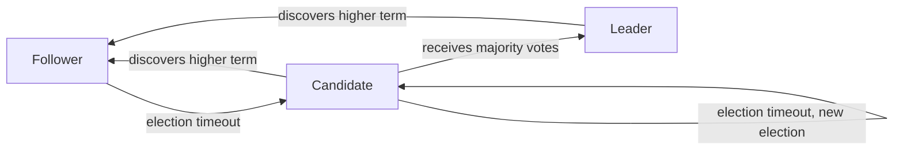
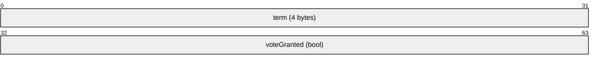
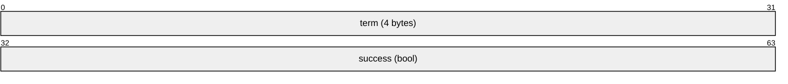
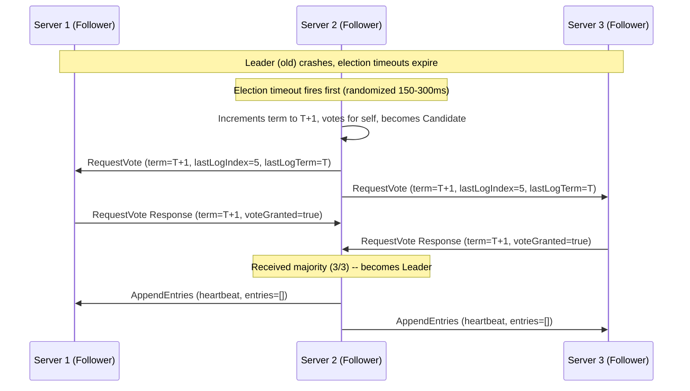
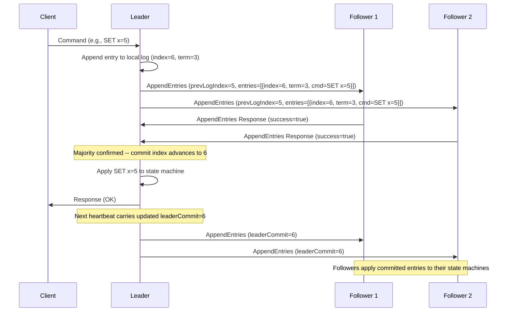
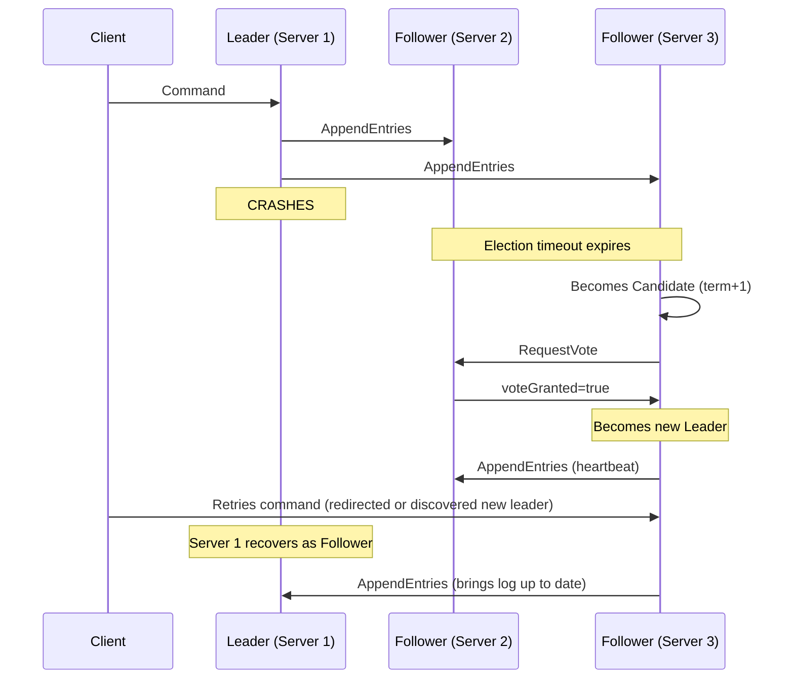
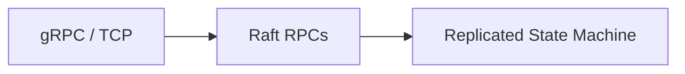

# Raft Consensus Protocol

> **Standard:** [In Search of an Understandable Consensus Algorithm](https://raft.github.io/raft.pdf) (Ongaro & Ousterhout, 2014) | **Layer:** Application (Layer 7) | **Wireshark filter:** N/A (application-level, typically gRPC or custom TCP)

Raft is a consensus algorithm for managing a replicated log across a cluster of servers. It was designed as an understandable alternative to Paxos, decomposing consensus into three sub-problems: leader election, log replication, and safety. Raft guarantees that all nodes in a cluster agree on the same sequence of state machine commands, even in the presence of failures. It is the consensus engine behind etcd, Consul, CockroachDB, TiKV, and many other distributed systems.

## Node Roles

Every server in a Raft cluster is in one of three states at any time:

| Role | Description |
|------|-------------|
| Leader | Handles all client requests, replicates log entries to followers, sends heartbeats |
| Follower | Passive -- responds to RPCs from leader and candidates |
| Candidate | Transitional state during leader election; requests votes from peers |

## RequestVote RPC

Used by candidates to gather votes during an election.

### RequestVote Response

## AppendEntries RPC

Used by the leader for log replication and as a heartbeat (with empty entries).

### AppendEntries Response

## InstallSnapshot RPC

Used by the leader to send a snapshot to followers that are too far behind.

## Key Fields

| Field | RPC | Description |
|-------|-----|-------------|
| term | All | Monotonically increasing logical clock; identifies the election epoch |
| candidateId | RequestVote | ID of the candidate requesting the vote |
| lastLogIndex | RequestVote | Index of the candidate's last log entry |
| lastLogTerm | RequestVote | Term of the candidate's last log entry |
| voteGranted | RequestVote Response | True if the follower granted its vote |
| leaderId | AppendEntries | ID of the current leader (so followers can redirect clients) |
| prevLogIndex | AppendEntries | Index of log entry immediately preceding new ones |
| prevLogTerm | AppendEntries | Term of the prevLogIndex entry |
| entries[] | AppendEntries | Log entries to replicate (empty for heartbeat) |
| leaderCommit | AppendEntries | Leader's commit index |
| success | AppendEntries Response | True if follower's log matched prevLogIndex/prevLogTerm |

## Leader Election

Election rules:
- Each server votes for at most one candidate per term (first-come-first-served)
- Candidate must have a log at least as up-to-date as the voter's
- Randomized election timeouts (typically 150-300ms) prevent split votes
- A candidate that receives a majority of votes becomes leader

## Log Replication

Replication rules:
- Leader appends the command to its local log
- Leader sends AppendEntries to all followers in parallel
- Entry is committed once a majority of servers have written it
- Committed entries are applied to the state machine in log order
- If a follower's log is inconsistent, the leader decrements nextIndex and retries

## Leader Failure and Recovery

## Safety Properties

| Property | Guarantee |
|----------|-----------|
| Election Safety | At most one leader per term |
| Leader Append-Only | Leader never overwrites or deletes log entries; it only appends |
| Log Matching | If two logs contain an entry with the same index and term, all preceding entries are identical |
| Leader Completeness | If an entry is committed in a given term, it will be present in the logs of all leaders for higher terms |
| State Machine Safety | If a server applies a log entry at a given index, no other server applies a different entry at that index |

## Membership Changes

Raft supports dynamic cluster membership changes without downtime:

| Approach | Description |
|----------|-------------|
| Single-server changes | Add or remove one server at a time; safe because any majority of the old and new configurations overlap |
| Joint consensus | Two-phase approach for arbitrary changes; the cluster transitions through a joint configuration |

## Log Compaction

As the log grows, Raft uses snapshots to compact it:

| Concept | Description |
|---------|-------------|
| Snapshot | Captures the entire state machine state at a given log index |
| lastIncludedIndex | The last log entry included in the snapshot |
| lastIncludedTerm | The term of that entry |
| InstallSnapshot RPC | Leader sends snapshot to slow followers instead of replaying the entire log |

## Raft vs Paxos

| Feature | Raft | Paxos |
|---------|------|-------|
| Design goal | Understandability | Theoretical elegance |
| Leader | Strong leader required | Optional (Multi-Paxos uses leader) |
| Election | Randomized timeouts, single round | Complex, multi-round possible |
| Log replication | Leader-driven, sequential | Proposer-driven, out-of-order possible |
| Membership changes | Built-in (joint consensus or single-server) | Not specified in basic Paxos |
| Implementations | etcd, Consul, CockroachDB, TiKV | Chubby, Spanner (modified) |
| Specification | Single paper, clear rules | Multiple papers, many variants |
| Understandability | High (designed for clarity) | Low (notoriously difficult) |

## Encapsulation

Raft RPCs are typically carried over gRPC (etcd, TiKV) or custom TCP protocols. The wire format varies by implementation since Raft defines the algorithm, not a wire protocol.

## Standards

| Document | Title |
|----------|-------|
| [Raft Paper](https://raft.github.io/raft.pdf) | In Search of an Understandable Consensus Algorithm (Ongaro & Ousterhout, 2014) |
| [Raft Dissertation](https://web.stanford.edu/~ouster/cgi-bin/papers/OngaroPhD.pdf) | Consensus: Bridging Theory and Practice (Ongaro, 2014) |
| [raft.github.io](https://raft.github.io/) | Raft Consensus Algorithm — resources and implementations |

## See Also

- [gRPC](grpc.md) -- common transport for Raft implementations (etcd, TiKV)
- [HTTP](http.md) -- client-facing API for Raft-backed services
