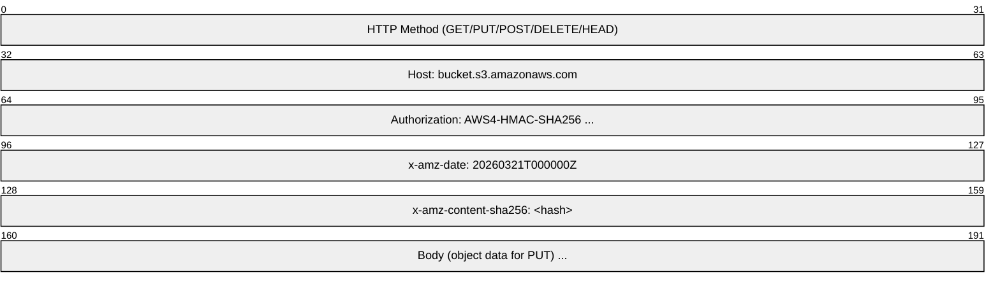
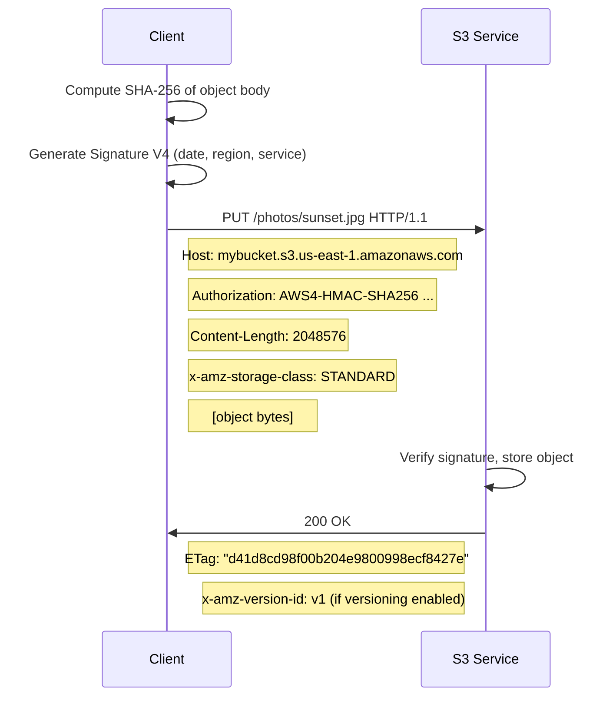
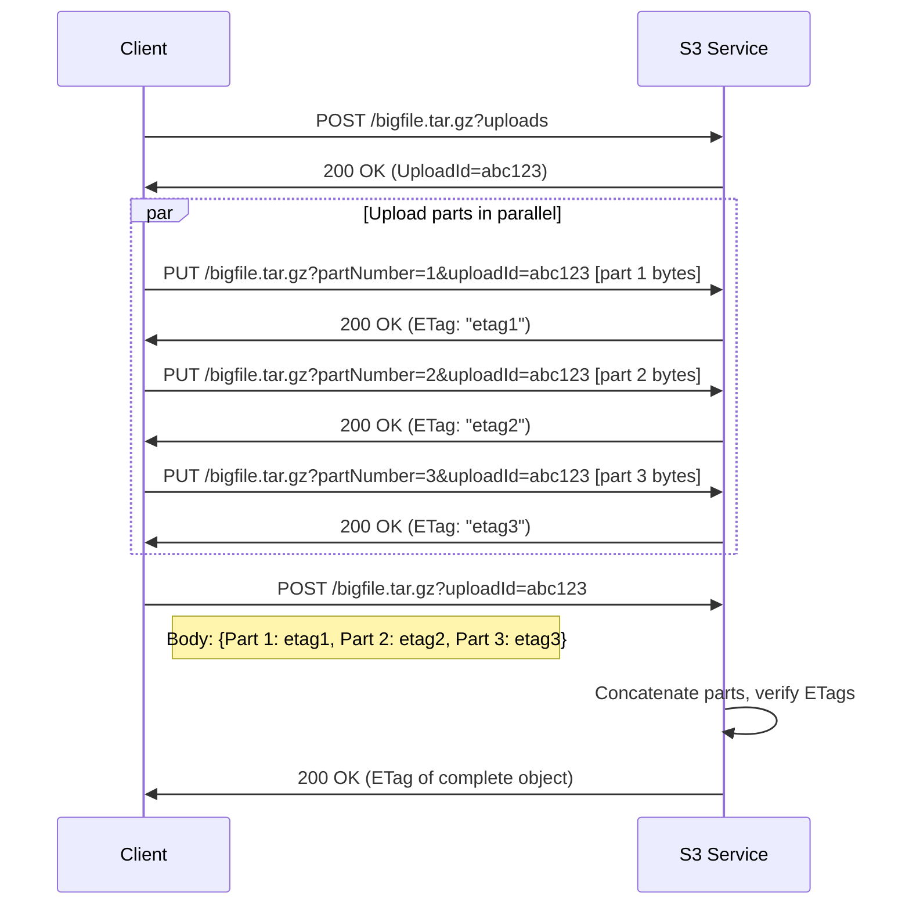
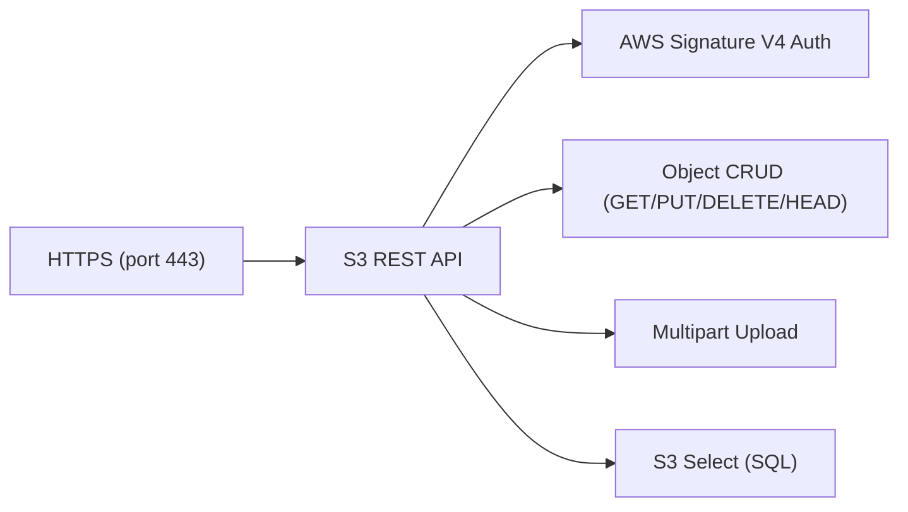

# S3 API (Amazon Simple Storage Service)

> **Standard:** [Amazon S3 API Reference](https://docs.aws.amazon.com/AmazonS3/latest/API/) (de facto standard) | **Layer:** Application (Layer 7) | **Wireshark filter:** `http` or `http2`

The Amazon S3 REST API is the de facto standard for object storage. It provides a simple HTTP-based interface for storing and retrieving any amount of data as objects in buckets. Beyond AWS, the S3 API has been adopted as an industry standard -- MinIO, Ceph, Wasabi, Backblaze B2, and Cloudflare R2 all implement S3-compatible APIs. Objects are addressed by bucket name and key (path), accessed via standard HTTP methods, and authenticated using AWS Signature Version 4 (HMAC-SHA256). The S3 API supports multipart uploads for large objects, conditional requests, lifecycle policies, versioning, and server-side encryption.

## Request Structure

S3 requests are standard HTTP requests with AWS-specific headers:



## URL Styles

| Style | Format | Example |
|-------|--------|---------|
| Virtual-hosted (preferred) | `https://bucket.s3.region.amazonaws.com/key` | `https://photos.s3.us-east-1.amazonaws.com/2026/sunset.jpg` |
| Path-style (legacy) | `https://s3.region.amazonaws.com/bucket/key` | `https://s3.us-east-1.amazonaws.com/photos/2026/sunset.jpg` |
| S3:// URI | `s3://bucket/key` | `s3://photos/2026/sunset.jpg` |

## Key Operations

| Operation | Method | Path | Description |
|-----------|--------|------|-------------|
| PutObject | PUT | /{key} | Upload an object |
| GetObject | GET | /{key} | Download an object |
| HeadObject | HEAD | /{key} | Get object metadata without body |
| DeleteObject | DELETE | /{key} | Delete an object |
| CopyObject | PUT | /{key} (x-amz-copy-source header) | Copy an object server-side |
| ListObjectsV2 | GET | /?list-type=2 | List objects in a bucket |
| CreateBucket | PUT | / (on bucket host) | Create a new bucket |
| DeleteBucket | DELETE | / (on bucket host) | Delete an empty bucket |
| HeadBucket | HEAD | / (on bucket host) | Check bucket existence and access |
| CreateMultipartUpload | POST | /{key}?uploads | Initiate a multipart upload |
| UploadPart | PUT | /{key}?partNumber=N&uploadId=X | Upload one part |
| CompleteMultipartUpload | POST | /{key}?uploadId=X | Finalize the multipart upload |
| AbortMultipartUpload | DELETE | /{key}?uploadId=X | Cancel and clean up parts |
| GetBucketVersioning | GET | /?versioning | Check versioning status |
| PutBucketVersioning | PUT | /?versioning | Enable/suspend versioning |
| SelectObjectContent | POST | /{key}?select&select-type=2 | Run SQL query on object (S3 Select) |

## Authentication: AWS Signature V4

All S3 requests are authenticated using HMAC-SHA256 signing:

| Step | Description |
|------|-------------|
| 1. Canonical Request | HTTP method + URI + query string + headers + payload hash |
| 2. String to Sign | Algorithm + timestamp + credential scope + hash of canonical request |
| 3. Signing Key | HMAC chain: secret key -> date -> region -> service -> "aws4_request" |
| 4. Signature | HMAC-SHA256(signing key, string to sign) |

### Authorization Header

```
Authorization: AWS4-HMAC-SHA256
  Credential=AKID/20260321/us-east-1/s3/aws4_request,
  SignedHeaders=host;x-amz-content-sha256;x-amz-date,
  Signature=abcdef1234567890...
```

### Presigned URLs

For sharing temporary access without credentials:

```
https://bucket.s3.us-east-1.amazonaws.com/key
  ?X-Amz-Algorithm=AWS4-HMAC-SHA256
  &X-Amz-Credential=AKID/20260321/us-east-1/s3/aws4_request
  &X-Amz-Date=20260321T000000Z
  &X-Amz-Expires=3600
  &X-Amz-Signature=abcdef...
```

## PutObject Flow



## Multipart Upload Flow

For objects larger than 5 GB (up to 5 TB total, 10,000 parts max):



### Multipart Limits

| Constraint | Value |
|------------|-------|
| Minimum part size | 5 MB (except last part) |
| Maximum part size | 5 GB |
| Maximum parts | 10,000 |
| Maximum object size | 5 TB |
| Recommended threshold | Use multipart for objects > 100 MB |

## Conditional Requests

| Header | Description |
|--------|-------------|
| If-Match | Only proceed if ETag matches (prevents overwrite conflicts) |
| If-None-Match | Only proceed if ETag does not match (skip if unchanged) |
| If-Modified-Since | Return object only if modified after this date |
| If-Unmodified-Since | Return object only if not modified after this date |
| Range | Retrieve a byte range (e.g., `bytes=0-1023`) |

## Storage Classes

| Class | Description | Retrieval |
|-------|-------------|-----------|
| STANDARD | Frequently accessed data | Instant |
| STANDARD_IA | Infrequent access, lower storage cost | Instant |
| ONEZONE_IA | Single-AZ infrequent access | Instant |
| INTELLIGENT_TIERING | Auto-moves between tiers based on access patterns | Instant |
| GLACIER_IR | Archive with instant retrieval | Instant |
| GLACIER_FLEXIBLE | Low-cost archive | Minutes to hours |
| DEEP_ARCHIVE | Lowest-cost long-term archive | 12-48 hours |

## Common Response Headers

| Header | Description |
|--------|-------------|
| ETag | MD5 hash of the object (or multipart composite hash) |
| x-amz-version-id | Object version (when versioning is enabled) |
| x-amz-request-id | Unique request identifier for debugging |
| x-amz-storage-class | Storage class of the object |
| x-amz-server-side-encryption | Encryption algorithm (AES256, aws:kms) |
| Last-Modified | Timestamp of last object modification |
| Content-Length | Size of the object in bytes |

## S3 Select

Query structured data (CSV, JSON, Parquet) directly in S3 without downloading the entire object:

```
POST /{key}?select&select-type=2

SELECT s.name, s.age FROM S3Object s WHERE s.age > 30
```

| Format | Support |
|--------|---------|
| CSV | Full SQL support |
| JSON | Full SQL support |
| Parquet | Columnar pushdown |

## S3-Compatible Services

| Service | Provider | Notes |
|---------|----------|-------|
| MinIO | Open source | Self-hosted, full S3 API compatibility |
| Ceph (RGW) | Open source | Distributed storage with S3 gateway |
| Wasabi | Wasabi | S3-compatible cloud, no egress fees |
| Backblaze B2 | Backblaze | S3-compatible API layer |
| Cloudflare R2 | Cloudflare | S3-compatible, no egress fees |
| DigitalOcean Spaces | DigitalOcean | S3-compatible object storage |
| Google Cloud Storage | Google | S3-compatible interoperability API |

## Encapsulation



## Standards

| Document | Title |
|----------|-------|
| [S3 API Reference](https://docs.aws.amazon.com/AmazonS3/latest/API/) | Amazon S3 REST API specification |
| [Signature V4](https://docs.aws.amazon.com/general/latest/gr/signature-version-4.html) | AWS Signature Version 4 signing process |
| [S3 Developer Guide](https://docs.aws.amazon.com/AmazonS3/latest/userguide/) | Amazon S3 User Guide |

## See Also

- [HTTP](http.md) -- S3 API transport
- [TLS](../security/tls.md) -- encrypts all S3 traffic
- [REST](http.md) -- S3 follows RESTful design principles
