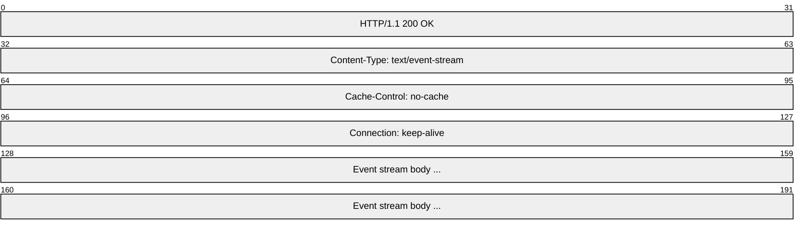
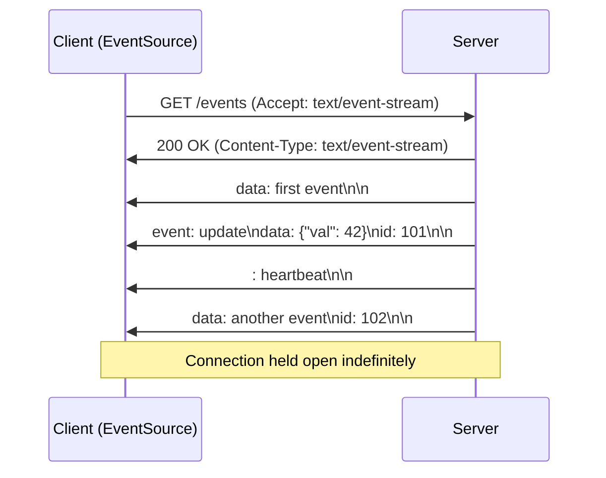
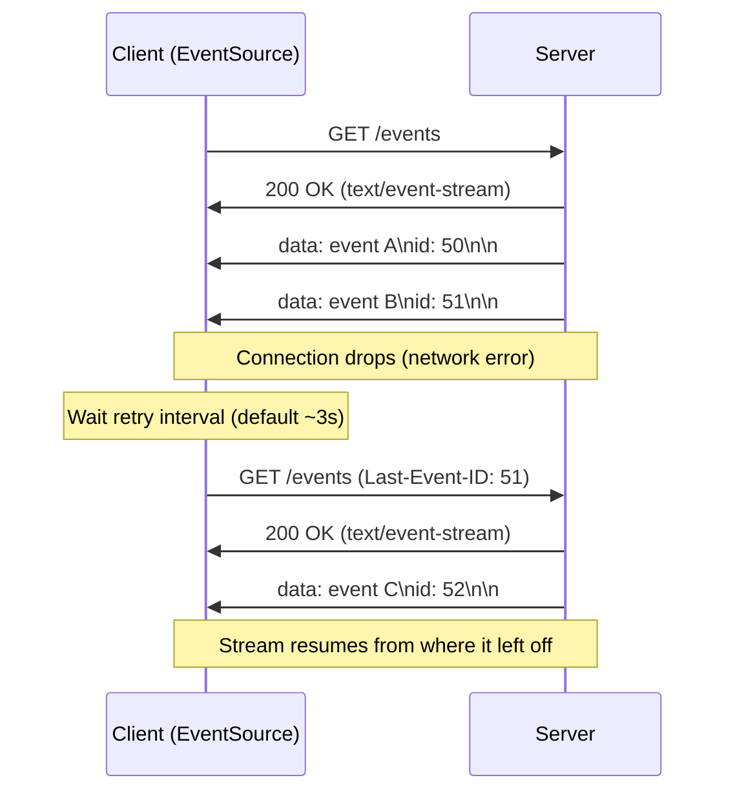
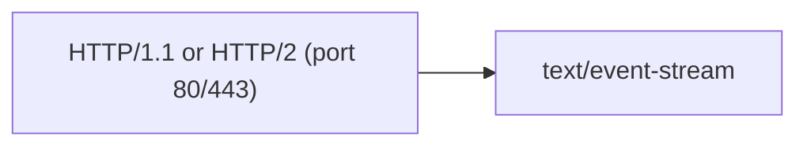

# Server-Sent Events (SSE)

> **Standard:** [WHATWG HTML Living Standard — Server-Sent Events](https://html.spec.whatwg.org/multipage/server-sent-events.html) | **Layer:** Application (Layer 7) | **Wireshark filter:** `http`

Server-Sent Events (SSE) is a lightweight, unidirectional streaming protocol that allows a server to push events to a client over a single long-lived HTTP connection. The client opens a standard HTTP request, and the server responds with `Content-Type: text/event-stream`, sending a stream of text-formatted events. SSE is built on top of standard HTTP (no protocol upgrade needed) and includes automatic reconnection and event ID tracking. Browsers expose SSE through the `EventSource` API. SSE is commonly used for live feeds, notifications, real-time dashboards, and AI/LLM token streaming.

## Event Stream Format

The response body is a stream of UTF-8 text blocks, where each event is a set of `field:value` lines terminated by a blank line (`\n\n`):



### Event Fields

Each line in the stream has the format `field:value\n`. A blank line (`\n\n`) dispatches the accumulated event:

| Field | Description |
|-------|-------------|
| `data` | Event payload. Multiple `data:` lines are joined with newlines in the dispatched event |
| `event` | Event type name. If set, dispatches a named event; otherwise dispatches a generic `message` event |
| `id` | Event ID. Sets the last event ID; sent back on reconnect via `Last-Event-ID` header |
| `retry` | Reconnection time in milliseconds. Overrides the client's default reconnection delay |

Lines starting with `:` (colon) are comments, often used as keep-alive heartbeats.

### Example Stream

```
: heartbeat

event: user-joined
data: {"user": "alice", "room": "general"}
id: 1001

data: Simple message without event type
id: 1002

event: score-update
data: {"home": 3, "away": 2}
id: 1003

retry: 5000

```

## SSE Connection Flow



## Automatic Reconnection

If the connection drops, the `EventSource` API automatically reconnects. The client sends the last received event ID in the `Last-Event-ID` header so the server can resume the stream:



## EventSource Browser API

| Property / Method | Description |
|-------------------|-------------|
| `new EventSource(url, options)` | Open an SSE connection; `options.withCredentials` enables cookies |
| `.readyState` | `0` = CONNECTING, `1` = OPEN, `2` = CLOSED |
| `.url` | The URL being connected to |
| `.onopen` | Fires when connection is established |
| `.onmessage` | Fires on unnamed events (no `event:` field) |
| `.onerror` | Fires on connection error or server close |
| `.addEventListener(type, fn)` | Listen for named event types |
| `.close()` | Close the connection (no automatic reconnect) |

## HTTP Headers

| Header | Direction | Description |
|--------|-----------|-------------|
| `Accept: text/event-stream` | Request | Client indicates SSE support |
| `Content-Type: text/event-stream` | Response | Server indicates event stream |
| `Cache-Control: no-cache` | Response | Prevents caching of the stream |
| `Connection: keep-alive` | Response | Keeps the HTTP connection open |
| `Last-Event-ID` | Request | Sent on reconnection with the last received `id` value |

## SSE vs WebSocket vs Long Polling

| Feature | SSE | WebSocket | Long Polling |
|---------|-----|-----------|-------------|
| Direction | Server-to-client only | Bidirectional | Server-to-client (simulated) |
| Protocol | Standard HTTP | Upgraded protocol (ws://) | Standard HTTP |
| Connection | Single long-lived HTTP response | Persistent upgraded connection | Repeated HTTP requests |
| Data format | UTF-8 text (event stream) | Text or binary frames | Any HTTP response body |
| Auto-reconnect | Built-in (EventSource API) | Manual (application must implement) | Manual (application logic) |
| Event IDs | Built-in (`id:` field) | Not built-in | Not built-in |
| Browser API | `EventSource` | `WebSocket` | `fetch` / `XMLHttpRequest` |
| HTTP/2 multiplexing | Yes (shares connection) | No (separate TCP connection) | Yes (each poll is HTTP) |
| Proxy/firewall compat | Excellent (standard HTTP) | Can be blocked (upgrade required) | Excellent (standard HTTP) |
| Max connections | ~6 per domain (HTTP/1.1); no limit on HTTP/2 | No browser limit | ~6 per domain (HTTP/1.1) |
| Binary data | No (text only; base64 encode if needed) | Yes (native binary frames) | Yes |
| Overhead | Very low (plain text, no framing) | Low (2-14 byte frame header) | High (full HTTP headers per poll) |

## Encapsulation



SSE works over standard HTTP. With HTTP/2, multiple SSE streams can be multiplexed over a single TCP connection, eliminating the browser connection limit.

## Standards

| Document | Title |
|----------|-------|
| [HTML Living Standard — SSE](https://html.spec.whatwg.org/multipage/server-sent-events.html) | Server-Sent Events (WHATWG specification) |
| [W3C EventSource](https://www.w3.org/TR/eventsource/) | Server-Sent Events (W3C, superseded by WHATWG) |
| [RFC 9110 Section 15.5.14](https://www.rfc-editor.org/rfc/rfc9110#section-15.5.14) | HTTP Semantics — 204 No Content (used to stop reconnection) |

## See Also

- [HTTP](http.md) -- underlying transport for SSE
- [WebSocket](websocket.md) -- bidirectional alternative
- [WebTransport](webtransport.md) -- modern bidirectional streaming over HTTP/3
- [gRPC](grpc.md) -- server streaming RPCs serve a similar role
