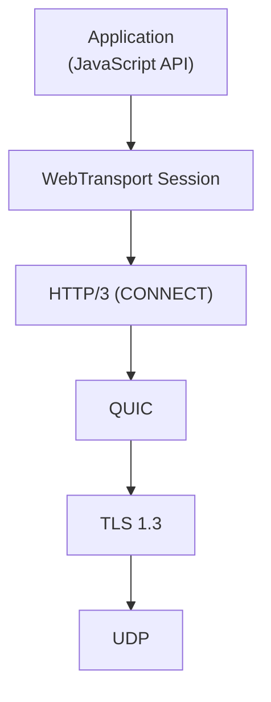
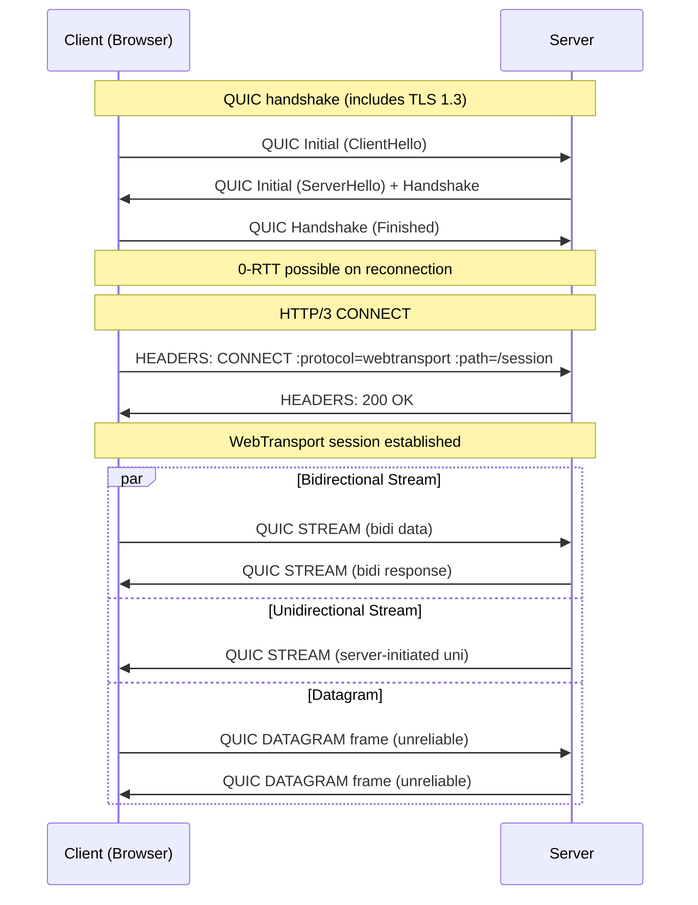
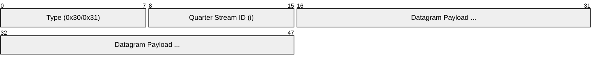
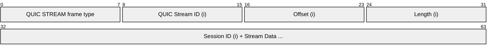
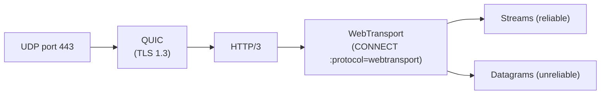

# WebTransport

> **Standard:** [W3C WebTransport API](https://www.w3.org/TR/webtransport/) / [RFC 9297](https://www.rfc-editor.org/rfc/rfc9297) | **Layer:** Application (Layer 7) | **Wireshark filter:** `quic` (WebTransport runs over QUIC/HTTP/3)

WebTransport is a browser API and protocol framework for low-latency, bidirectional client-server communication built on HTTP/3 and QUIC. Unlike WebSocket, which is limited to a single ordered byte stream over TCP, WebTransport provides multiple independent streams and unreliable datagrams over QUIC — eliminating head-of-line blocking and enabling use cases like real-time gaming, live media, and cloud rendering where occasional packet loss is acceptable. It reuses the HTTP/3 connection establishment (including TLS 1.3 and certificate-based authentication), avoiding the need for a separate protocol upgrade path.

## Protocol Stack



## Transport Types

WebTransport exposes three transport primitives over a single HTTP/3 connection:

| Transport | Reliability | Ordering | Multiplexing | Use Case |
|-----------|-------------|----------|-------------|----------|
| Bidirectional Stream | Reliable | Ordered (per-stream) | Yes | Request-response, RPC, file transfer |
| Unidirectional Stream | Reliable | Ordered (per-stream) | Yes | Server push, log streaming, media segments |
| Datagram | Unreliable | Unordered | N/A | Game state, live video frames, sensor data |

## Connection Establishment

WebTransport sessions are established by sending an extended HTTP/3 CONNECT request with the `:protocol` pseudo-header set to `webtransport`:



## HTTP/3 CONNECT Request

The extended CONNECT method (RFC 8441 adapted for HTTP/3) carries these pseudo-headers:

| Pseudo-Header | Value | Description |
|---------------|-------|-------------|
| `:method` | `CONNECT` | HTTP method |
| `:protocol` | `webtransport` | Extended CONNECT protocol |
| `:scheme` | `https` | Always HTTPS (TLS required) |
| `:authority` | `server.example.com` | Server hostname and port |
| `:path` | `/session` | Application-defined session URL |

The server responds with HTTP status 200 to accept the session or 4xx/5xx to reject it.

## QUIC DATAGRAM Frame

WebTransport datagrams use the QUIC DATAGRAM extension (RFC 9221):



| Field | Size | Description |
|-------|------|-------------|
| Type | Variable | QUIC frame type 0x30 (no length) or 0x31 (with length) |
| Quarter Stream ID | Variable-length integer | Identifies the WebTransport session (CONNECT stream ID / 4) |
| Datagram Payload | Variable | Application data (max size limited by QUIC packet) |

Datagrams are not retransmitted — if the QUIC packet is lost, the datagram is gone. Maximum datagram size is constrained by the QUIC max_datagram_frame_size transport parameter (typically ~1200 bytes after overhead).

## WebTransport Stream Frame

Streams opened within a WebTransport session carry a session ID prefix:



| Field | Description |
|-------|-------------|
| QUIC Stream ID | QUIC-level stream identifier |
| Session ID | Variable-length integer identifying the WebTransport session |
| Stream Data | Application payload (reliable, ordered within this stream) |

## Browser API Overview (JavaScript)

```
// Establish a WebTransport session
const transport = new WebTransport("https://server.example.com/session");
await transport.ready;

// Bidirectional stream
const bidi = await transport.createBidirectionalStream();
const writer = bidi.writable.getWriter();
await writer.write(new Uint8Array([1, 2, 3]));

// Receive bidirectional streams
const reader = transport.incomingBidirectionalStreams.getReader();
const { value: stream } = await reader.read();

// Unreliable datagrams
const dgWriter = transport.datagrams.writable.getWriter();
await dgWriter.write(new Uint8Array([0x01, 0x02]));

const dgReader = transport.datagrams.readable.getReader();
const { value: datagram } = await dgReader.read();

// Close the session
transport.close({ closeCode: 0, reason: "done" });
```

## WebTransport vs WebSocket

| Feature | WebTransport | WebSocket |
|---------|-------------|-----------|
| Transport | QUIC (UDP) | TCP |
| Multiplexing | Multiple independent streams | Single ordered stream |
| Head-of-line blocking | No (per-stream only) | Yes (one lost packet blocks all) |
| Unreliable delivery | Yes (datagrams) | No (TCP guarantees delivery) |
| Connection setup | QUIC 1-RTT (0-RTT on reconnect) | TCP + TLS + HTTP upgrade |
| Encryption | Always TLS 1.3 (via QUIC) | Optional (wss://) |
| Binary/text | Binary streams + datagrams | Text and binary frames |
| Server certificate | Required (CA-signed) | Required for wss://, optional for ws:// |
| Browser support | Chrome, Edge, Firefox (partial) | Universal |
| Protocol overhead | QUIC framing | 2-14 bytes per frame |
| Congestion control | QUIC built-in | TCP built-in |

## When to Use WebTransport

| Scenario | Recommended |
|----------|-------------|
| Chat, notifications, live feeds | WebSocket (universal support, simpler) |
| Real-time multiplayer gaming | WebTransport (datagrams, no HOL blocking) |
| Live video/audio streaming | WebTransport (unreliable delivery, low latency) |
| Cloud rendering / remote desktop | WebTransport (datagrams for frames, streams for control) |
| File upload with progress | WebTransport (multiple streams, no HOL blocking) |
| Legacy browser support required | WebSocket |

## Encapsulation



## Standards

| Document | Title |
|----------|-------|
| [RFC 9297](https://www.rfc-editor.org/rfc/rfc9297) | HTTP Datagrams and the Capsule Protocol |
| [RFC 9298](https://www.rfc-editor.org/rfc/rfc9298) | Proxying UDP in HTTP (CONNECT-UDP) |
| [draft-ietf-webtrans-http3](https://datatracker.ietf.org/doc/draft-ietf-webtrans-http3/) | WebTransport over HTTP/3 |
| [W3C WebTransport API](https://www.w3.org/TR/webtransport/) | Browser JavaScript API specification |
| [RFC 9221](https://www.rfc-editor.org/rfc/rfc9221) | An Unreliable Datagram Extension to QUIC |
| [RFC 9114](https://www.rfc-editor.org/rfc/rfc9114) | HTTP/3 |
| [RFC 9000](https://www.rfc-editor.org/rfc/rfc9000) | QUIC: A UDP-Based Multiplexed and Secure Transport |

## See Also

- [WebSocket](websocket.md) — predecessor for bidirectional browser-server communication
- [HTTP](http.md) — WebTransport sessions are established via HTTP/3 CONNECT
- [gRPC](grpc.md) — RPC framework that can also run over HTTP/3
