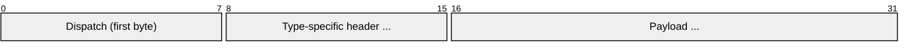
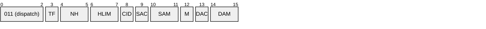
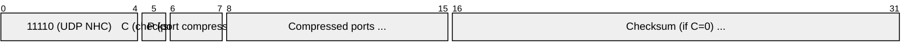
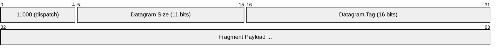
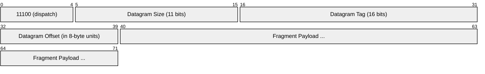
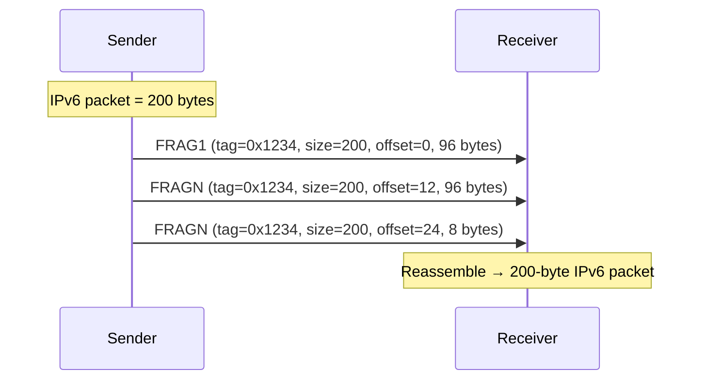
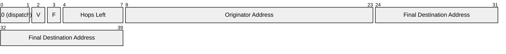
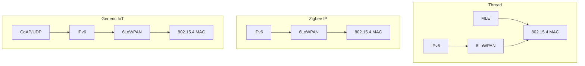

# 6LoWPAN (IPv6 over Low-Power Wireless Personal Area Networks)

> **Standard:** [RFC 4944](https://www.rfc-editor.org/rfc/rfc4944) / [RFC 6282](https://www.rfc-editor.org/rfc/rfc6282) | **Layer:** Network Adaptation (between L2 and L3) | **Wireshark filter:** `6lowpan`

6LoWPAN is an adaptation layer that enables IPv6 packets to be carried over IEEE 802.15.4 networks, which have a maximum frame size of only 127 bytes. Since an IPv6 header alone is 40 bytes (and a full IPv6 + UDP header is 48 bytes), 6LoWPAN provides header compression that can squeeze a typical IPv6/UDP header from 48 bytes down to just 6-7 bytes. It also handles fragmentation for packets that exceed the 802.15.4 MTU. 6LoWPAN is the foundation of Thread and is used in Zigbee IP and various IoT deployments.

## The Problem

| Layer | Size | Problem |
|-------|------|---------|
| 802.15.4 MAX frame | 127 bytes | |
| 802.15.4 MAC header | 9-23 bytes | |
| **Available for payload** | **~104 bytes** | |
| IPv6 header | 40 bytes | Half the space gone! |
| UDP header | 8 bytes | |
| **Available for data** | **~56 bytes** | Very little room for application data |

6LoWPAN solves this with header compression and fragmentation.

## Dispatch Byte

Every 6LoWPAN frame begins with a dispatch byte (or two) that identifies the frame type:



### Dispatch Values

| Pattern | Name | Description |
|---------|------|-------------|
| 00 xxxxxx | NALP | Not a LoWPAN frame (reserved) |
| 01 000001 | IPv6 | Uncompressed IPv6 (full 40-byte header follows) |
| 01 1xxxxx | LOWPAN_IPHC | Compressed IPv6 header (RFC 6282) |
| 10 0xxxxx | MESH | Mesh addressing header (for multi-hop) |
| 11 000xxx | FRAG1 | First fragment |
| 11 100xxx | FRAGN | Subsequent fragment |
| 11 110000 | LOWPAN_BC0 | Broadcast header |

## IPHC Header Compression (RFC 6282)

IPHC compresses IPv6 and UDP headers by eliding fields that can be inferred from the 802.15.4 layer or from defaults:

### IPHC Encoding (2 bytes)



### Compression Strategies

| IPv6 Field | Uncompressed | Compressed | How |
|-----------|-------------|-----------|-----|
| Version | 4 bits | 0 bits | Always 6 — elided |
| Traffic Class + Flow Label | 4 bytes | 0-4 bytes | TF field controls |
| Payload Length | 2 bytes | 0 bytes | Computed from 802.15.4 frame length |
| Next Header | 1 byte | 0-1 bytes | NH=1: NHC follows; NH=0: inline |
| Hop Limit | 1 byte | 0-1 bytes | HLIM: 00=inline, 01=1, 10=64, 11=255 |
| Source Address | 16 bytes | 0-16 bytes | SAM: derive from 802.15.4 src addr |
| Destination Address | 16 bytes | 0-16 bytes | DAM: derive from 802.15.4 dst addr |

### Address Compression (SAM/DAM)

| SAM/DAM | Mode | Compressed Size | How |
|---------|------|----------------|-----|
| 00 | Full | 16 bytes | Full 128-bit address inline |
| 01 | 64-bit | 8 bytes | Prefix from context, IID inline |
| 10 | 16-bit | 2 bytes | Prefix from context, IID from 16-bit short addr |
| 11 | Elided | 0 bytes | Entire address derived from 802.15.4 src/dst |

### Example: Maximum Compression

A typical link-local UDP packet:

| Field | IPv6+UDP | 6LoWPAN IPHC | Savings |
|-------|----------|-------------|---------|
| IPv6 header | 40 bytes | 2 bytes (IPHC) | 38 bytes |
| UDP header | 8 bytes | 4 bytes (NHC + compressed ports) | 4 bytes |
| **Total header** | **48 bytes** | **6 bytes** | **42 bytes saved (87%)** |

This leaves ~98 bytes for application data in a single 802.15.4 frame vs ~56 bytes uncompressed.

### NHC — Next Header Compression (UDP)



| P | Source Port | Dest Port | Size |
|---|-----------|----------|------|
| 00 | 16 bits inline | 16 bits inline | 4 bytes |
| 01 | 16 bits inline | 8 bits (0xF0xx) | 3 bytes |
| 10 | 8 bits (0xF0xx) | 16 bits inline | 3 bytes |
| 11 | 4 bits (0xF0Bx) | 4 bits (0xF0Bx) | 1 byte |

Ports in the range 0xF0B0-0xF0BF can be compressed to 4 bits each.

## Fragmentation

When an IPv6 packet exceeds the 802.15.4 MTU (~104 bytes after MAC), 6LoWPAN fragments it:

### First Fragment (FRAG1)



### Subsequent Fragments (FRAGN)



| Field | Size | Description |
|-------|------|-------------|
| Datagram Size | 11 bits | Total unfragmented datagram size |
| Datagram Tag | 16 bits | Unique ID matching fragments of the same datagram |
| Datagram Offset | 8 bits | Offset in 8-byte multiples (FRAGN only) |

### Fragmentation Example



## Mesh Addressing Header

For multi-hop forwarding at the 6LoWPAN layer (before IPv6 routing):



## 6LoWPAN Neighbor Discovery (RFC 6775)

Standard IPv6 NDP is too chatty for constrained networks. 6LoWPAN-ND optimizes it:

| Feature | IPv6 NDP | 6LoWPAN-ND |
|---------|----------|------------|
| Address registration | DAD (multicast) | Registration with router (unicast) |
| Router discovery | Periodic RA broadcast | RA with 6LoWPAN context options |
| Neighbor unreachability | NUD probes | Registration lifetime |
| Multicast | Required | Minimized (unicast preferred) |

## Context-Based Compression

Border Routers distribute compression contexts — shared IPv6 prefixes that all nodes know, allowing addresses to be compressed to 0-8 bytes:

```
Context 0: 2001:db8:1::/48  (global prefix)
Context 1: fd00::/64         (mesh-local prefix)
```

A device with address `2001:db8:1::1234` only needs to send the last 2 bytes (`0x1234`) — the prefix is inferred from context 0.

## 6LoWPAN in Protocol Stacks



## Standards

| Document | Title |
|----------|-------|
| [RFC 4944](https://www.rfc-editor.org/rfc/rfc4944) | Transmission of IPv6 Packets over IEEE 802.15.4 Networks |
| [RFC 6282](https://www.rfc-editor.org/rfc/rfc6282) | Compression Format for IPv6 over 802.15.4 (IPHC) |
| [RFC 6775](https://www.rfc-editor.org/rfc/rfc6775) | 6LoWPAN Neighbor Discovery |
| [RFC 8025](https://www.rfc-editor.org/rfc/rfc8025) | IPv6 over 802.15.4 with IPHC (updates) |
| [RFC 8138](https://www.rfc-editor.org/rfc/rfc8138) | 6LoWPAN Routing Header for RPL |

## See Also

- [Thread](thread.md) — IPv6 mesh built on 6LoWPAN
- [Zigbee](zigbee.md) — uses same 802.15.4 radio (non-IP version)
- [IPv6](../network-layer/ipv6.md) — the protocol 6LoWPAN adapts
- [CoAP](../web/coap.md) — constrained REST protocol designed for 6LoWPAN networks
- [ICMPv6](../network-layer/icmpv6.md) — NDP optimized by 6LoWPAN-ND
- [LoRaWAN](lorawan.md) — alternative LPWAN (does not use IPv6/6LoWPAN)
