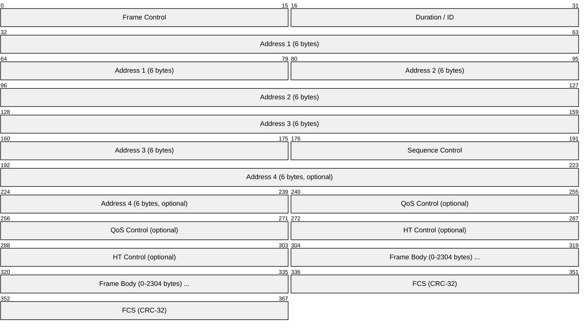
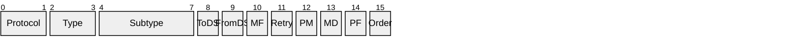
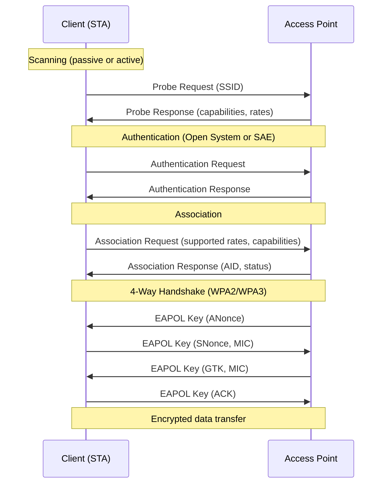
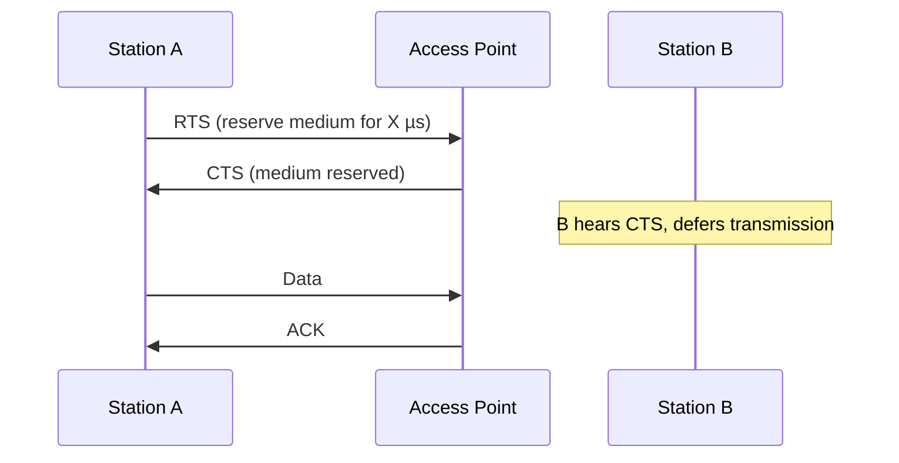
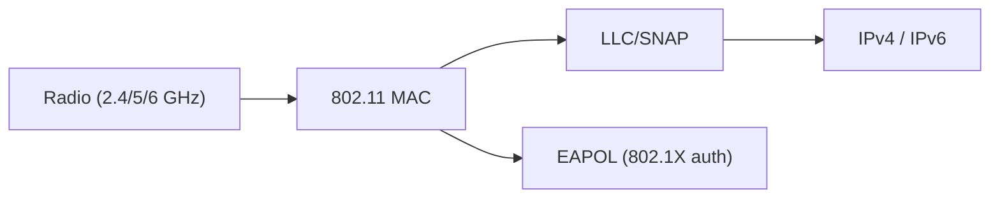

# IEEE 802.11 (Wi-Fi)

> **Standard:** [IEEE 802.11-2020](https://standards.ieee.org/standard/802_11-2020.html) | **Layer:** Data Link / Physical (Layers 1-2) | **Wireshark filter:** `wlan`

IEEE 802.11 defines wireless local area networking (Wi-Fi) — the most widely deployed wireless technology in the world. It specifies the MAC layer and multiple physical layers for wireless communication in the 2.4 GHz, 5 GHz, and 6 GHz bands. Wi-Fi supports infrastructure mode (clients connect to access points), ad-hoc mode (peer-to-peer), and mesh mode (802.11s). The Wi-Fi Alliance certifies interoperability and assigns marketing names (Wi-Fi 4, 5, 6, 6E, 7).

## Frame Format

## Frame Control Field

| Field | Size | Description |
|-------|------|-------------|
| Protocol Version | 2 bits | Always 0 |
| Type | 2 bits | Frame category (Management, Control, Data) |
| Subtype | 4 bits | Specific frame type within the category |
| To DS / From DS | 1 bit each | Direction relative to the Distribution System |
| More Fragments | 1 bit | More fragments follow |
| Retry | 1 bit | This is a retransmission |
| Power Management | 1 bit | Station entering power save |
| More Data | 1 bit | AP has buffered frames for this station |
| Protected Frame | 1 bit | Frame body is encrypted |
| Order | 1 bit | Strict ordering requested |

## Frame Types

### Management Frames (Type = 0)

| Subtype | Name | Description |
|---------|------|-------------|
| 0 | Association Request | Client requests to join the BSS |
| 1 | Association Response | AP accepts or rejects association |
| 4 | Probe Request | Client scans for networks |
| 5 | Probe Response | AP responds with network info |
| 8 | Beacon | AP periodically broadcasts (typically every 102.4 ms) |
| 10 | Disassociation | End association |
| 11 | Authentication | Pre-association authentication |
| 12 | Deauthentication | Force disconnect |
| 13 | Action | Various management actions (spectrum, BA, etc.) |

### Control Frames (Type = 1)

| Subtype | Name | Description |
|---------|------|-------------|
| 8 | Block Ack Request | Request block acknowledgment |
| 9 | Block Ack | Acknowledge multiple frames at once |
| 11 | RTS | Request to Send (collision avoidance) |
| 12 | CTS | Clear to Send |
| 13 | ACK | Acknowledge a single frame |

### Data Frames (Type = 2)

| Subtype | Name | Description |
|---------|------|-------------|
| 0 | Data | Standard data frame |
| 4 | Null | No data (power management signaling) |
| 8 | QoS Data | Data with QoS (802.11e) |
| 12 | QoS Null | QoS null (power management) |

## Address Fields

The meaning of the four address fields depends on To DS / From DS:

| ToDS | FromDS | Addr 1 (RA) | Addr 2 (TA) | Addr 3 | Addr 4 |
|------|--------|-------------|-------------|--------|--------|
| 0 | 0 | Destination | Source | BSSID | — |
| 0 | 1 | Destination | BSSID | Source | — |
| 1 | 0 | BSSID | Source | Destination | — |
| 1 | 1 | Receiver | Transmitter | Destination | Source |

ToDS=1, FromDS=1 is used in WDS (Wireless Distribution System) and mesh.

## Connection Flow

## Security

| Standard | Protocol | Encryption | Key Management | Status |
|----------|----------|-----------|----------------|--------|
| WEP | — | RC4 (broken) | Static keys | Deprecated |
| WPA | TKIP | RC4 (improved) | 802.1X or PSK | Deprecated |
| WPA2 | CCMP | AES-128-CCM | 802.1X or PSK | Current |
| WPA3 | CCMP/GCMP | AES-128/256 | SAE or 802.1X | Current (recommended) |

### WPA3 Improvements

| Feature | WPA2 | WPA3 |
|---------|------|------|
| Key exchange | 4-way handshake (PSK) | SAE (Dragonfly) — resistant to offline dictionary attacks |
| Forward secrecy | No | Yes |
| Open networks | Unencrypted | OWE (Opportunistic Wireless Encryption) |
| Enterprise | Optional 192-bit | Mandatory 192-bit mode (CNSA suite) |

## PHY Standards (Wi-Fi Generations)

| Generation | Amendment | Band | Max Rate | Channel Width | MIMO | Year |
|-----------|-----------|------|----------|---------------|------|------|
| — | 802.11a | 5 GHz | 54 Mbps | 20 MHz | — | 1999 |
| — | 802.11b | 2.4 GHz | 11 Mbps | 22 MHz | — | 1999 |
| — | 802.11g | 2.4 GHz | 54 Mbps | 20 MHz | — | 2003 |
| Wi-Fi 4 | 802.11n | 2.4/5 GHz | 600 Mbps | 40 MHz | 4×4 | 2009 |
| Wi-Fi 5 | 802.11ac | 5 GHz | 6.9 Gbps | 160 MHz | 8×8 MU-MIMO | 2013 |
| Wi-Fi 6 | 802.11ax | 2.4/5 GHz | 9.6 Gbps | 160 MHz | 8×8, OFDMA | 2020 |
| Wi-Fi 6E | 802.11ax | 6 GHz | 9.6 Gbps | 160 MHz | 8×8, OFDMA | 2021 |
| Wi-Fi 7 | 802.11be | 2.4/5/6 GHz | 46 Gbps | 320 MHz | 16×16, MLO | 2024 |

## Channel Access (CSMA/CA)

Wi-Fi uses Carrier Sense Multiple Access with Collision Avoidance:

1. **Listen** — check if the medium is idle for DIFS (DCF Interframe Space)
2. **Random backoff** — wait a random number of slot times
3. **Transmit** — send the frame
4. **ACK** — receiver sends ACK after SIFS (Short Interframe Space)
5. **Retry** — if no ACK, double the backoff window and retry

### RTS/CTS (optional, for hidden node problem)

## Encapsulation

## Standards

| Document | Title |
|----------|-------|
| [IEEE 802.11-2020](https://standards.ieee.org/standard/802_11-2020.html) | Wireless LAN MAC and PHY Specifications |
| [IEEE 802.11ax-2021](https://standards.ieee.org/standard/802_11ax-2021.html) | Wi-Fi 6 (High Efficiency WLAN) |
| [IEEE 802.11be](https://standards.ieee.org/standard/802_11be.html) | Wi-Fi 7 (Extremely High Throughput) |
| [Wi-Fi Alliance](https://www.wi-fi.org/) | Certification and marketing names |

## See Also

- [Ethernet](../link-layer/ethernet.md) — wired LAN counterpart
- [802.11s](80211s.md) — Wi-Fi mesh networking
- [RADIUS](../security/radius.md) — authentication for WPA Enterprise
- [ARP](../link-layer/arp.md) — address resolution on Wi-Fi networks
