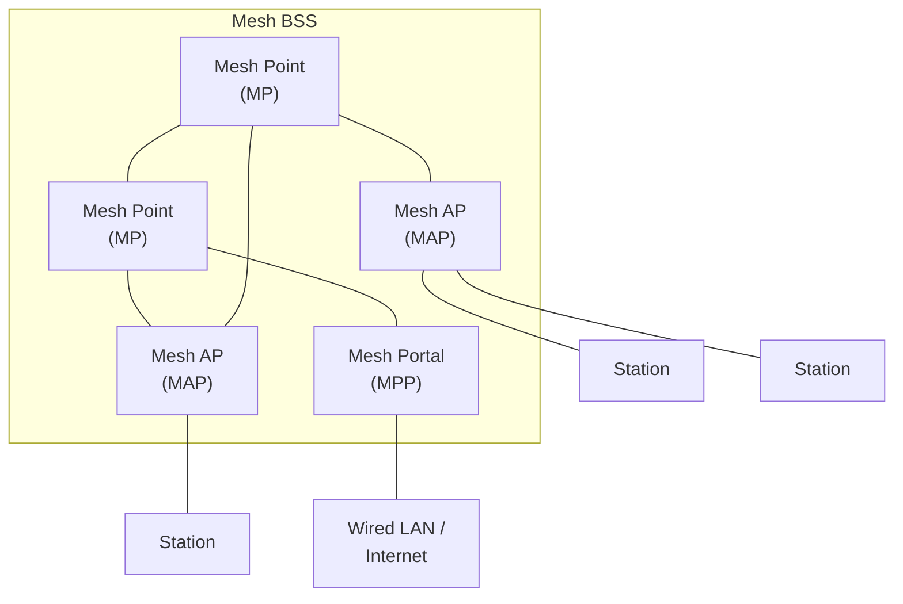
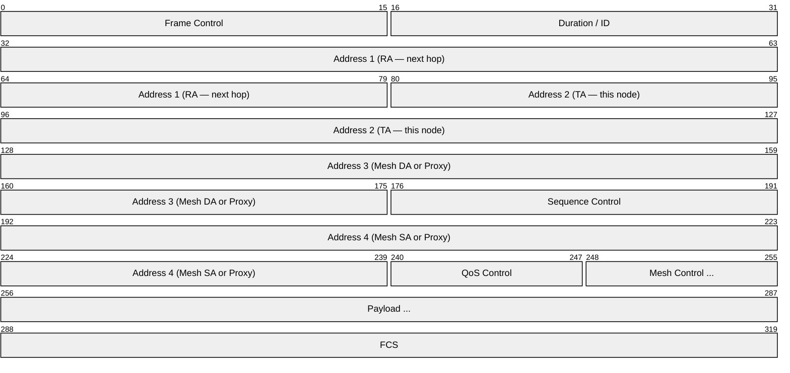
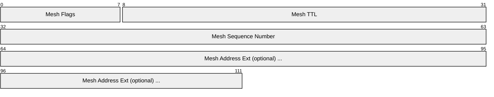
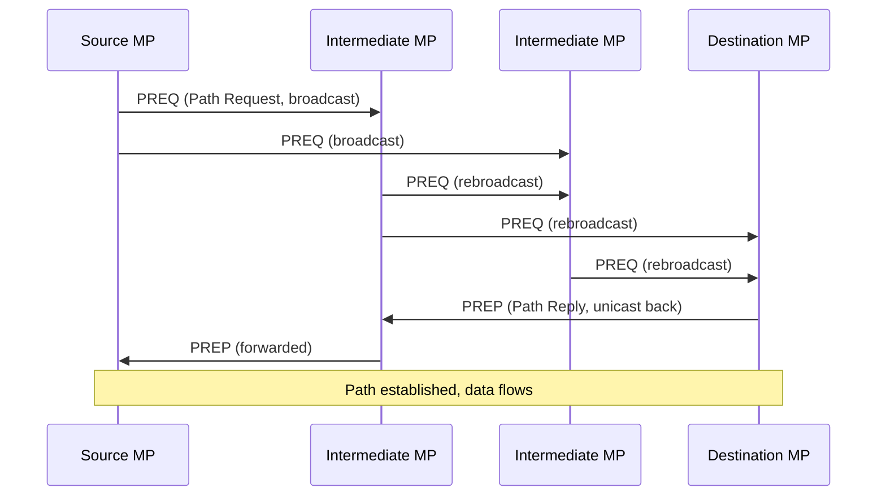
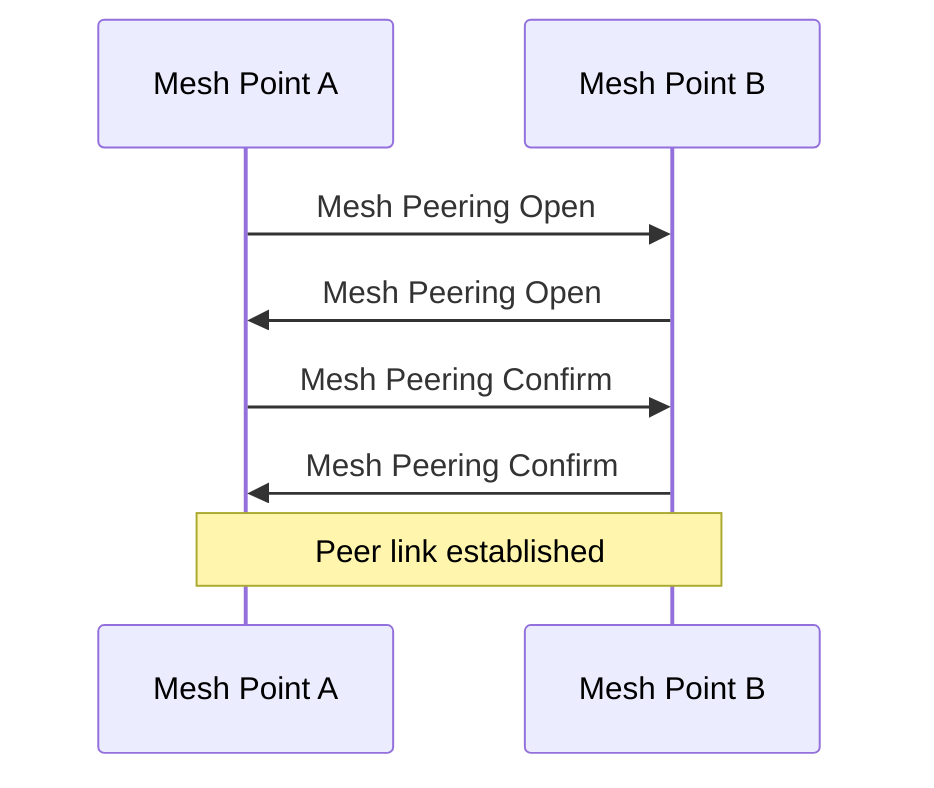

# IEEE 802.11s (Wi-Fi Mesh Networking)

> **Standard:** [IEEE 802.11-2020 (Section 14)](https://standards.ieee.org/standard/802_11-2020.html) | **Layer:** Data Link / Physical (Layer 2) | **Wireshark filter:** `wlan.mesh`

IEEE 802.11s defines a mesh networking extension for Wi-Fi, allowing wireless access points and stations to form a self-configuring, self-healing multi-hop mesh network at Layer 2. Unlike traditional Wi-Fi infrastructure (where all traffic routes through an AP), 802.11s mesh nodes forward frames for each other, extending coverage without wired backhaul to every node. Originally published as an amendment in 2011, it is now incorporated into the main IEEE 802.11-2020 standard.

## Architecture



### Node Types

| Type | Abbreviation | Description |
|------|-------------|-------------|
| Mesh Point | MP | Basic mesh node — forwards mesh traffic |
| Mesh AP | MAP | Mesh point + access point — serves regular Wi-Fi clients |
| Mesh Portal | MPP | Mesh point + bridge to external network (wired LAN, Internet) |
| Mesh STA | — | Any mesh-capable station |

## Mesh Frame Format

802.11s extends the standard Wi-Fi frame with a Mesh Control field and additional address fields for multi-hop forwarding:



### Mesh Control Field



| Field | Size | Description |
|-------|------|-------------|
| Mesh Flags | 8 bits | Address extension mode and flags |
| Mesh TTL | 8 bits | Hop limit (decremented at each mesh point) |
| Mesh Sequence Number | 32 bits | De-duplication and ordering |
| Address Extension | 0-12 bytes | Additional addresses for proxied or 6-address frames |

### Address Usage

In standard Wi-Fi, four addresses suffice. Mesh forwarding needs up to six:

| Address | Standard Wi-Fi | Mesh (multi-hop) |
|---------|---------------|------------------|
| Address 1 | Receiver | Next-hop receiver (RA) |
| Address 2 | Transmitter | This node (TA) |
| Address 3 | Destination or BSSID | Mesh destination (DA) |
| Address 4 | Source (in WDS) | Mesh source (SA) |
| Address 5 | — | Proxy destination (if proxied) |
| Address 6 | — | Proxy source (if proxied) |

Addresses 5 and 6 are carried in the Mesh Address Extension when a MAP proxies frames for associated non-mesh clients.

## Routing (HWMP)

802.11s specifies **HWMP (Hybrid Wireless Mesh Protocol)** as the default path selection protocol. It combines:

1. **On-demand routing** (reactive, AODV-like) — routes discovered when needed
2. **Proactive tree routing** — optional root-based tree for traffic to/from a mesh portal

### Path Discovery (On-Demand)



### HWMP Messages

| Message | Name | Description |
|---------|------|-------------|
| PREQ | Path Request | Broadcast to discover a route to a destination |
| PREP | Path Reply | Unicast reply with route back to the source |
| PERR | Path Error | Notification that a route has broken |
| RANN | Root Announcement | Periodic broadcast from the root mesh portal |

### Path Metric

802.11s uses the **Airtime Link Metric** by default:

```
cost = (O + Bt/r) × (1 / (1 - ef))
```

| Variable | Description |
|----------|-------------|
| O | Channel access overhead (constant) |
| Bt | Test frame length (8192 bits) |
| r | Data rate in Mbps |
| ef | Frame error rate |

Lower metric = better path. This accounts for both link speed and reliability.

## Peer Link Management

Mesh points establish peer links with neighbors through a three-way handshake:



## Mesh Configuration

| Parameter | Description |
|-----------|-------------|
| Mesh ID | Network name (like SSID, up to 32 bytes) |
| Mesh Profile | Identifies the path selection and metric protocol |
| Mesh Formation Info | Number of peers, connected to portal, etc. |
| Mesh Capability | Forwarding, MDA, power save support |

### Mesh Discovery

Mesh points discover each other through **Mesh Beacon** frames that include the Mesh ID and configuration. Nodes with matching Mesh ID and compatible configuration can peer.

## Security

802.11s uses **SAE (Simultaneous Authentication of Equals)** — the same protocol used in WPA3 — for peer authentication. This provides:
- Password-based authentication without transmitting the password
- Forward secrecy per session
- Resistance to offline dictionary attacks

After SAE, traffic is encrypted with **CCMP (AES-128-CCM)** or **GCMP** per peer link.

## 802.11s vs Other Mesh

| Feature | 802.11s | Zigbee Mesh | Z-Wave |
|---------|---------|-------------|--------|
| Frequency | 2.4/5/6 GHz | 2.4 GHz | Sub-GHz |
| Data rate | Mbps-Gbps | 250 kbps | 100 kbps |
| Range per hop | 50-100 m | 10-30 m | 30 m |
| Layer | L2 (MAC) | Full stack | Full stack |
| IP native | Yes (standard Wi-Fi) | No | No |
| Power | High (mains) | Low (battery) | Low (battery) |
| Use case | Coverage extension, backhaul | IoT sensors | Home automation |

## Standards

| Document | Title |
|----------|-------|
| [IEEE 802.11-2020](https://standards.ieee.org/standard/802_11-2020.html) | Wireless LAN MAC and PHY (includes mesh, Section 14) |
| [IEEE 802.11s-2011](https://standards.ieee.org/standard/802_11s-2011.html) | Mesh Networking amendment (now merged into 802.11-2020) |

## See Also

- [Ethernet](../link-layer/ethernet.md) — wired LAN that mesh portals bridge to
- [Zigbee](zigbee.md) — low-power mesh for IoT
- [Z-Wave](zwave.md) — sub-GHz home automation mesh
