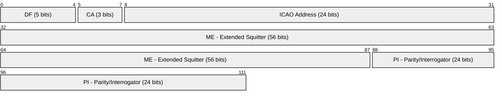
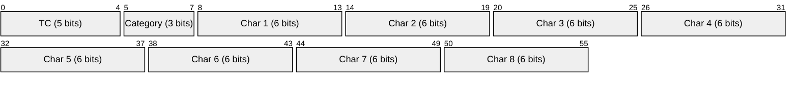
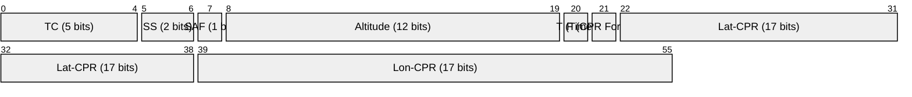
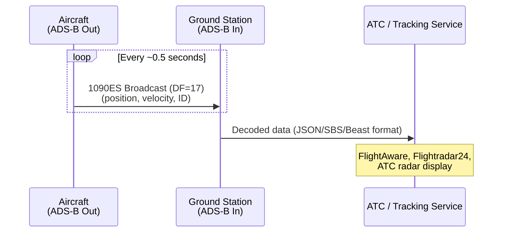
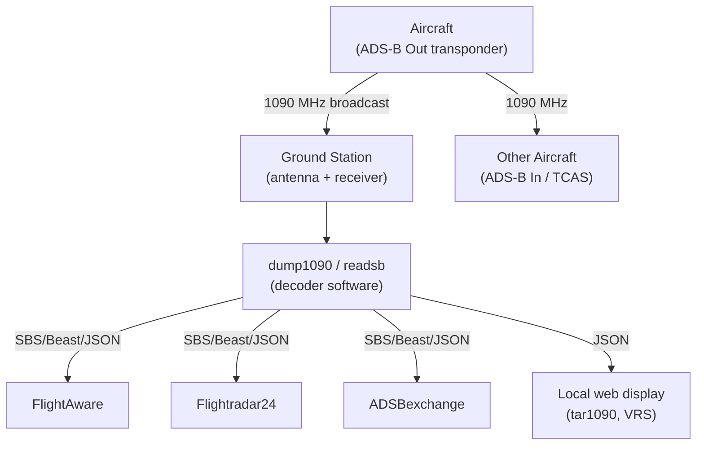

# ADS-B (Automatic Dependent Surveillance-Broadcast)

> **Standard:** [ICAO Annex 10 Vol IV](https://store.icao.int/en/annex-10-aeronautical-telecommunications-volume-iv-surveillance-and-collision-avoidance-systems) / [RTCA DO-260B](https://www.rtca.org/) | **Layer:** Physical / Data Link | **Wireshark filter:** N/A (radio protocol; decoded by dump1090, RTL-SDR tools)

ADS-B is a surveillance technology in which aircraft determine their position via GNSS (GPS) and periodically broadcast it along with identity, altitude, velocity, and other data. It is "Automatic" (no pilot or operator input required), "Dependent" (relies on onboard navigation), and "Surveillance-Broadcast" (transmits to anyone listening, not interrogated like radar). ADS-B Out has been mandatory in most controlled airspace worldwide since January 2020 (FAA in the US, EASA in Europe). Ground stations, other aircraft (ADS-B In), and services like FlightAware and Flightradar24 receive these broadcasts to provide real-time air traffic awareness.

## ADS-B Variants

| Variant | Frequency | Data Rate | Range | Region |
|---------|-----------|-----------|-------|--------|
| 1090ES (Extended Squitter) | 1090 MHz | 1 Mbps | ~250 NM | Worldwide (ICAO standard) |
| UAT (Universal Access Transceiver) | 978 MHz | 1 Mbps | ~150 NM | US only, below FL180 |

1090ES is the international standard and is required for all aircraft operating above FL180. UAT is a US-only alternative for general aviation at lower altitudes, also providing TIS-B (Traffic Information Service) and FIS-B (Flight Information Service) uplinks.

## 1090ES Message Structure (112 bits)

| Field | Size | Description |
|-------|------|-------------|
| DF (Downlink Format) | 5 bits | Message format; DF=17 for ADS-B, DF=18 for TIS-B/ADS-R |
| CA (Capability) | 3 bits | Transponder capability (0-7) |
| ICAO Address | 24 bits | Unique aircraft address (e.g., A0B2C3 for a US-registered aircraft) |
| ME (Message, Extended Squitter) | 56 bits | ADS-B payload (type code + data) |
| PI (Parity/Interrogator ID) | 24 bits | CRC-24 parity check overlaid with interrogator identifier |

## ME Field Type Codes

The first 5 bits of the ME field contain the Type Code (TC), which determines the message content:

| TC | Message Type | Description |
|----|-------------|-------------|
| 1-4 | Aircraft Identification | Callsign / flight ID (8 characters) |
| 5-8 | Surface Position | Position and ground speed for aircraft on the ground |
| 9-18 | Airborne Position (Baro Alt) | Lat/lon with barometric altitude |
| 19 | Airborne Velocity | Speed, heading, vertical rate |
| 20-22 | Airborne Position (GNSS Alt) | Lat/lon with GNSS (geometric) altitude |
| 23-27 | Reserved | Future use |
| 28 | Aircraft Status | Emergency/priority status, TCAS/ACAS RA |
| 29 | Target State and Status | Selected altitude, barometric setting, heading |
| 31 | Aircraft Operation Status | ADS-B version, NIC/NACp, SIL, antenna offset |

## Aircraft Identification (TC 1-4)

The callsign is encoded as 8 characters using ICAO 6-bit character encoding (48 bits):

| Character Code | Mapping |
|---------------|---------|
| 1-26 | A-Z |
| 32 | Space |
| 48-57 | 0-9 |

### Aircraft Category (TC 1-4)

| TC | Category | Examples |
|----|----------|----------|
| 1 | Reserved | -- |
| 2 | Surface emergency vehicle, service vehicle | |
| 3 | A0-A7: Light to heavy aircraft, rotorcraft | A5 = heavy (B747), A3 = large (B737) |
| 4 | A0-A7: No info to space vehicle | A1 = light, A2 = small |

## Airborne Position (TC 9-18)

| Field | Size | Description |
|-------|------|-------------|
| SS | 2 bits | Surveillance status (0 = no condition, 1 = permanent alert, 2 = temp alert, 3 = SPI) |
| SAF | 1 bit | Single antenna flag |
| Altitude | 12 bits | Barometric altitude (25-ft or 100-ft increments, Gillham coded) |
| T | 1 bit | UTC time synchronization flag |
| F | 1 bit | CPR format: 0 = even frame, 1 = odd frame |
| Lat-CPR | 17 bits | Compact Position Reporting latitude |
| Lon-CPR | 17 bits | Compact Position Reporting longitude |

### Compact Position Reporting (CPR)

CPR encodes latitude and longitude into 17 bits each by dividing the globe into zones. Decoding requires two messages (one even, one odd frame) received close together:

- **Global decoding**: uses both even and odd frames to compute an unambiguous position
- **Local decoding**: uses a single frame plus a known reference position (prior position or receiver location)

The CPR scheme achieves approximately 5-meter resolution with just 34 bits for a full position.

## Airborne Velocity (TC 19)

| Subtype | Description |
|---------|-------------|
| 1 | Ground speed (east/north components, subsonic) |
| 2 | Ground speed (east/north components, supersonic) |
| 3 | Airspeed and heading (subsonic) |
| 4 | Airspeed and heading (supersonic) |

Subtype 1 is by far the most common. It encodes east-west and north-south velocity components plus vertical rate and GNSS/baro altitude difference.

## ADS-B Reception

## ADS-B Ecosystem

### Common Decoder Output Formats

| Format | Description |
|--------|-------------|
| SBS (BaseStation) | CSV text format, one line per message |
| Beast binary | Raw binary with timestamp, signal level, and raw message bytes |
| AVR | Hex-encoded raw message (*MSG format) |
| JSON | Structured aircraft state (position, altitude, speed, callsign) |

## Receiver Hardware

| Device | Description |
|--------|-------------|
| RTL-SDR (R820T2) | Low-cost USB SDR dongle (~$25), 1090 MHz capable |
| FlightAware Pro Stick | Filtered, amplified RTL-SDR optimized for 1090 MHz |
| Mode-S Beast | High-performance dedicated receiver |
| Radarcape | Commercial-grade receiver with GPS timing |

## Integrity and Accuracy Parameters

| Parameter | Abbreviation | Description |
|-----------|-------------|-------------|
| Navigation Integrity Category | NIC | Position containment radius |
| Navigation Accuracy Category - Position | NACp | Estimated position uncertainty (95%) |
| Navigation Accuracy Category - Velocity | NACv | Estimated velocity uncertainty (95%) |
| Surveillance Integrity Level | SIL | Probability of exceeding NIC containment |
| Source Integrity Level | SIL Supplement | Per-hour or per-sample SIL basis |

## Standards

| Document | Title |
|----------|-------|
| [ICAO Annex 10 Vol IV](https://store.icao.int/) | Surveillance and Collision Avoidance Systems |
| [RTCA DO-260B](https://www.rtca.org/) | MOPS for 1090 MHz Extended Squitter ADS-B and TIS-B |
| [EUROCAE ED-102A](https://www.eurocae.net/) | European equivalent of DO-260B |
| [RTCA DO-282B](https://www.rtca.org/) | MOPS for UAT ADS-B |
| [FAA 14 CFR 91.225/227](https://www.ecfr.gov/) | US ADS-B Out equipment mandate |

## See Also

- [NFC](nfc.md) -- contactless technology using radio (different domain, similar broadcast concept)
- [Zigbee](zigbee.md) -- another wireless broadcast protocol (IoT domain)
- [Bluetooth](bluetooth.md) -- short-range wireless for comparison
