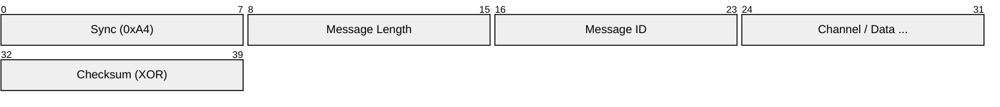
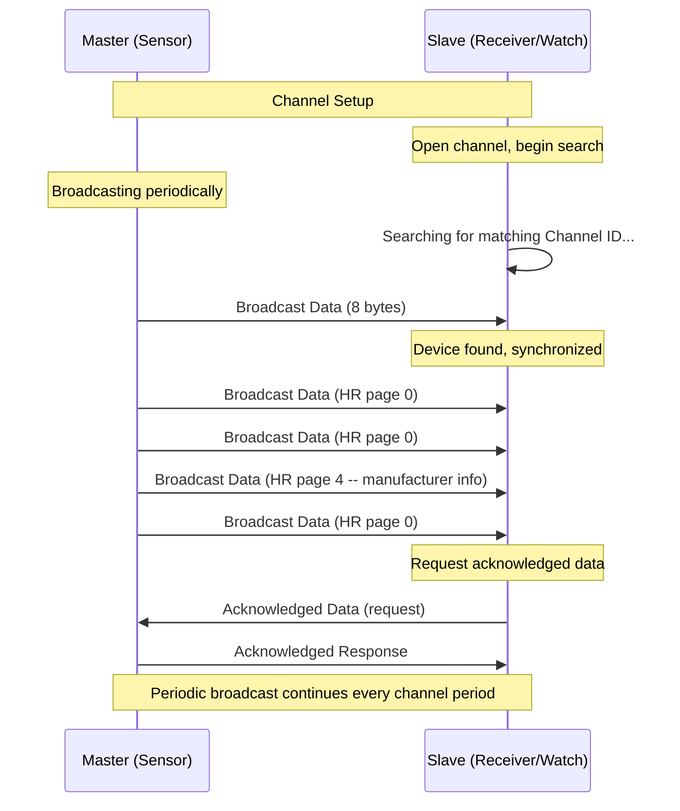
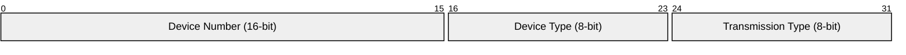
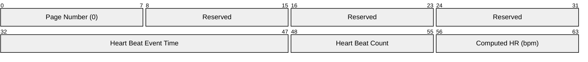
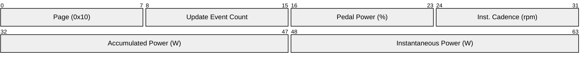

# ANT / ANT+

> **Standard:** [ANT Message Protocol (thisisant.com)](https://www.thisisant.com/developer/ant/ant-basics) / [ANT+ Device Profiles](https://www.thisisant.com/developer/ant-plus/ant-plus-basics) | **Layer:** Full stack (Physical through Application) | **Wireshark filter:** N/A (proprietary 2.4 GHz radio, not IP-based)

ANT is a low-power wireless sensor network protocol operating in the 2.4 GHz ISM band, designed by Dynastream Innovations (a Garmin subsidiary). It provides a simple, reliable channel-based communication model for personal area networks. ANT+ is an interoperability layer built on ANT that defines standardized device profiles for fitness, health, and sport applications -- heart rate monitors, power meters, speed/cadence sensors, and fitness equipment. ANT is embedded in Garmin devices, many smartphones, and fitness equipment worldwide.

## ANT Message Structure

All ANT communication between a host processor and the ANT radio chip uses a serial message format:

### Message Fields

| Field | Size | Description |
|-------|------|-------------|
| Sync | 1 byte | Always 0xA4 (indicates start of ANT message) |
| Message Length | 1 byte | Number of bytes in the content field (0-9 for standard messages) |
| Message ID | 1 byte | Identifies the message type (configuration, data, event) |
| Content | 0-9 bytes | Channel number and/or data payload (varies by message type) |
| Checksum | 1 byte | XOR of all preceding bytes (Sync through last content byte) |

## ANT Message IDs

### Configuration Messages (Host to ANT)

| Message ID | Name | Description |
|------------|------|-------------|
| 0x42 | Assign Channel | Assign a channel type (bidirectional, shared, etc.) |
| 0x51 | Set Channel ID | Set device number, device type, transmission type |
| 0x43 | Set Channel Period | Set message period (counts of 32768 Hz clock) |
| 0x45 | Set Channel RF Frequency | Set radio frequency offset from 2400 MHz |
| 0x46 | Set Channel Search Timeout | Set search timeout before giving up |
| 0x47 | Set Channel Low Priority Search Timeout | Extended low-priority search |
| 0x44 | Set Network Key | Set the 8-byte network key for a network |
| 0x4B | Open Channel | Open a configured channel for communication |
| 0x4C | Close Channel | Close an open channel |
| 0x41 | Unassign Channel | Release a channel assignment |
| 0x4A | Request Message | Request a specific information message |
| 0x6E | Set Search Waveform | Optimize search for specific applications |

### Data Messages

| Message ID | Name | Description |
|------------|------|-------------|
| 0x4E | Broadcast Data | Send/receive 8-byte broadcast (unreliable, periodic) |
| 0x4F | Acknowledged Data | Send/receive 8-byte acknowledged (reliable, single) |
| 0x50 | Burst Data | Send/receive 8-byte burst packet (reliable, high-throughput) |
| 0x72 | Advanced Burst Data | Extended burst with larger packets |

### Channel Event / Response Messages (ANT to Host)

| Message ID | Name | Description |
|------------|------|-------------|
| 0x40 | Channel Response / Event | Response to a command or channel event notification |

### Common Channel Events (via 0x40)

| Event Code | Name | Description |
|------------|------|-------------|
| 0x00 | RESPONSE_NO_ERROR | Command completed successfully |
| 0x01 | EVENT_RX_SEARCH_TIMEOUT | Search timeout -- no device found |
| 0x02 | EVENT_RX_FAIL | Expected message not received |
| 0x03 | EVENT_TX | Broadcast message transmitted successfully |
| 0x05 | EVENT_TRANSFER_TX_COMPLETED | Acknowledged/burst transfer completed |
| 0x06 | EVENT_TRANSFER_TX_FAILED | Acknowledged/burst transfer failed |
| 0x07 | EVENT_CHANNEL_CLOSED | Channel has been closed |
| 0x0A | EVENT_RX_FAIL_GO_TO_SEARCH | Too many missed messages, returning to search |

### Information Messages

| Message ID | Name | Description |
|------------|------|-------------|
| 0x52 | Channel ID | Response: device number, device type, transmission type |
| 0x54 | ANT Version | ANT firmware version string |
| 0x61 | Capabilities | Supported features and number of channels |
| 0x69 | Serial Number | Device serial number |

## Channel Types

| Type | Value | Description |
|------|-------|-------------|
| Bidirectional Slave | 0x00 | Receives broadcast, can send acknowledged data back |
| Bidirectional Master | 0x10 | Transmits broadcast data, receives acknowledged responses |
| Shared Bidirectional Slave | 0x20 | Multiple slaves share one master's channel |
| Shared Bidirectional Master | 0x30 | Master communicates with multiple slaves |
| Slave Receive Only | 0x40 | Receive-only mode (no transmission capability) |

### Channel Communication

## Channel ID

Every ANT device is identified by a Channel ID used for pairing:

| Field | Size | Description |
|-------|------|-------------|
| Device Number | 16 bits | Unique device number (0 = wildcard for search) |
| Device Type | 8 bits | Type of device (defines ANT+ profile) |
| Transmission Type | 8 bits | Encoding of transmission characteristics |

Setting any field to 0 during search acts as a wildcard, matching any value.

## ANT+ Device Profiles

ANT+ defines standardized device profiles that ensure interoperability between manufacturers:

### Common ANT+ Profiles

| Device Type | Hex | Profile | Channel Period | RF Freq |
|-------------|-----|---------|----------------|---------|
| 120 | 0x78 | Heart Rate | 8070 (4.06 Hz) | 57 (2457 MHz) |
| 121 | 0x79 | Speed & Cadence (combined) | 8086 (4.05 Hz) | 57 |
| 122 | 0x7A | Speed (standalone) | 8118 (4.03 Hz) | 57 |
| 123 | 0x7B | Cadence (standalone) | 8102 (4.04 Hz) | 57 |
| 11 | 0x0B | Bicycle Power | 8182 (4.00 Hz) | 57 |
| 17 | 0x11 | Fitness Equipment | 8192 (4.00 Hz) | 57 |
| 25 | 0x19 | Environment (temperature/humidity) | 65535 (0.50 Hz) | 57 |
| 119 | 0x77 | Weight Scale | 8192 (4.00 Hz) | 57 |
| 18 | 0x12 | Blood Pressure | 8192 (4.00 Hz) | 57 |
| 124 | 0x7C | Multi-Sport Speed & Distance (Footpod) | 8134 (4.02 Hz) | 57 |
| 12 | 0x0C | Geocache | 8192 (4.00 Hz) | 57 |
| 16 | 0x10 | LEV (Light Electric Vehicle) | 8192 (4.00 Hz) | 57 |

### Heart Rate Data Page 0 (Standard)

| Field | Size | Description |
|-------|------|-------------|
| Page Number | 8 bits | Data page identifier (0 = default) |
| Heart Beat Event Time | 16 bits | Time of last heartbeat (1/1024 s resolution) |
| Heart Beat Count | 8 bits | Rolling heartbeat counter |
| Computed Heart Rate | 8 bits | Instantaneous heart rate in BPM (0-255) |

### Bicycle Power Data Page 0x10 (Standard Power Only)

### Common Data Pages (All Profiles)

| Page | Name | Description |
|------|------|-------------|
| 0x50 (80) | Manufacturer ID | Hardware manufacturer and model |
| 0x51 (81) | Product Information | SW revision, serial number |
| 0x52 (82) | Battery Status | Battery voltage, status, operating time |

## Radio Parameters

| Parameter | Value |
|-----------|-------|
| Frequency band | 2.4 GHz ISM (2400-2524 MHz) |
| Number of channels | 125 (1 MHz spacing) |
| Default ANT+ frequency | 2457 MHz (offset 57) |
| Data rate | 1 Mbps |
| Modulation | GFSK |
| Transmit power | 0 dBm typical (configurable, up to +4 dBm) |
| Range | 5-30 m typical (line of sight) |
| Message payload | 8 bytes per message (broadcast/acknowledged) |
| Channel period | Application-dependent (typically 4 Hz for fitness) |
| Latency | ~1 channel period (250 ms at 4 Hz) |

## Network Key

ANT channels use an 8-byte network key for authentication. Devices must share the same network key to communicate:

| Network | Key | Description |
|---------|-----|-------------|
| ANT+ | Managed by Garmin/Dynastream | Public ANT+ network key (available to ANT+ adopters) |
| ANT-FS | Application-specific | File transfer network |
| Custom | User-defined | Private application networks |

The ANT+ network key provides a basic level of access control -- only devices programmed with the key can join the ANT+ network. It does not provide encryption.

## ANT vs Bluetooth LE vs Zigbee

| Feature | ANT / ANT+ | Bluetooth LE | Zigbee |
|---------|-----------|--------------|--------|
| Frequency | 2.4 GHz | 2.4 GHz | 2.4 GHz |
| Data rate | 1 Mbps | 1-2 Mbps | 250 kbps |
| Payload | 8 bytes | 20-244 bytes | ~100 bytes |
| Topology | Star, mesh, tree | Point-to-point, star | Mesh, star, tree |
| Power | Ultra-low (coin cell years) | Very low | Low |
| Range | 5-30 m | 10-100 m | 10-30 m |
| Coexistence | Adaptive frequency hopping | Adaptive frequency hopping | DSSS, channel selection |
| Primary use | Sports/fitness sensors | General IoT, audio, fitness | Home automation, industrial |
| Smartphone support | Limited (some Android, Garmin) | Universal | Rare (hub required) |
| Bidirectional | Yes | Yes | Yes |
| Multi-device | Yes (concurrent channels) | Limited connections | Up to 65,000 nodes |

## Encapsulation

ANT uses a proprietary radio protocol. USB ANT sticks (e.g., Garmin ANT+ USB stick) bridge ANT radio to host computers via USB serial. The host communicates with the ANT chip using the serial message format described above.

## Standards

| Document | Title |
|----------|-------|
| [ANT Message Protocol](https://www.thisisant.com/developer/ant/ant-basics) | ANT Message Protocol and Usage specification |
| [ANT+ Device Profiles](https://www.thisisant.com/developer/ant-plus/ant-plus-basics) | Managed device profiles for interoperability |
| [ANT-FS](https://www.thisisant.com/) | ANT File Share protocol for bulk data transfer |
| [D52 Module Datasheet](https://www.thisisant.com/) | ANT SoC / module reference (nRF52-based) |

## See Also

- [Bluetooth / BLE](ble.md) -- competing low-power wireless (broader ecosystem)
- [Zigbee](zigbee.md) -- mesh wireless for home automation and industrial
