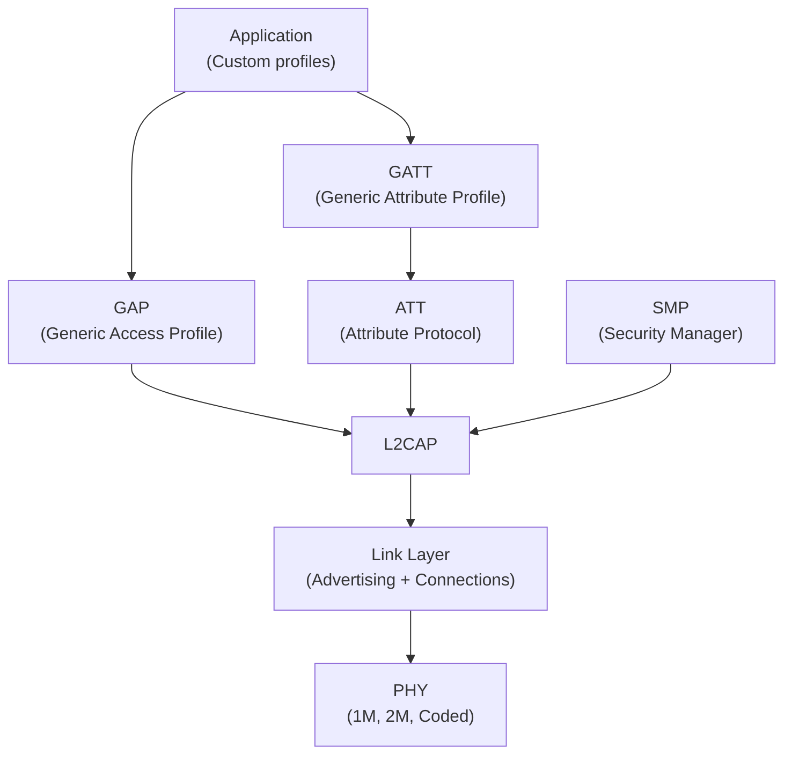
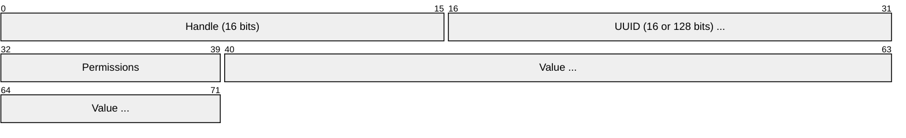
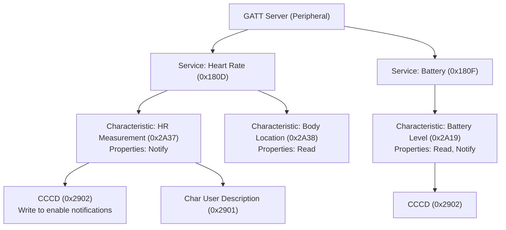
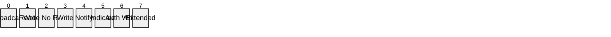
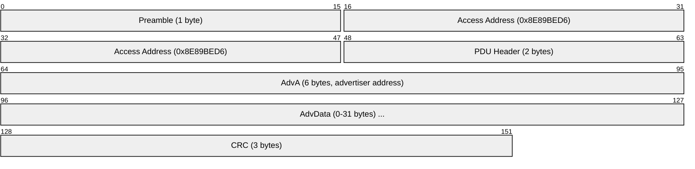
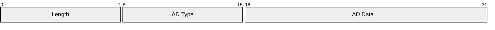
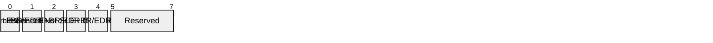
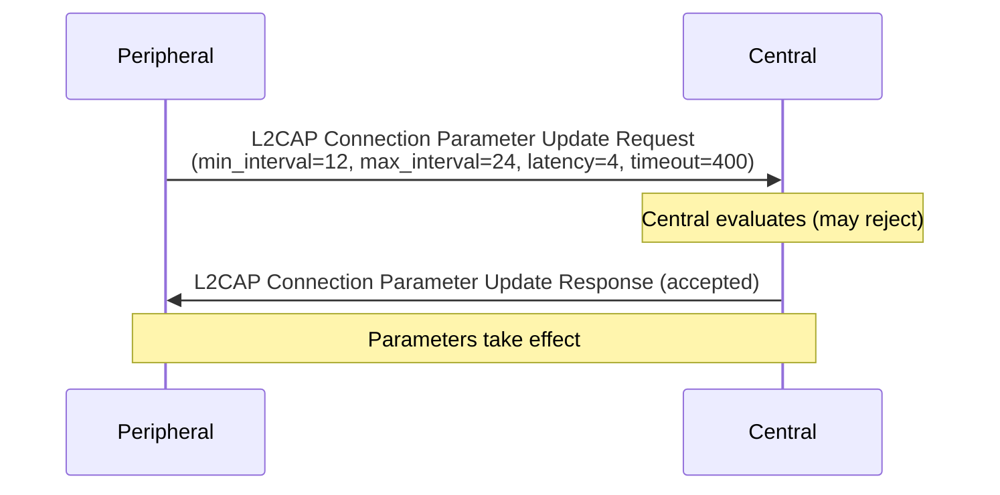
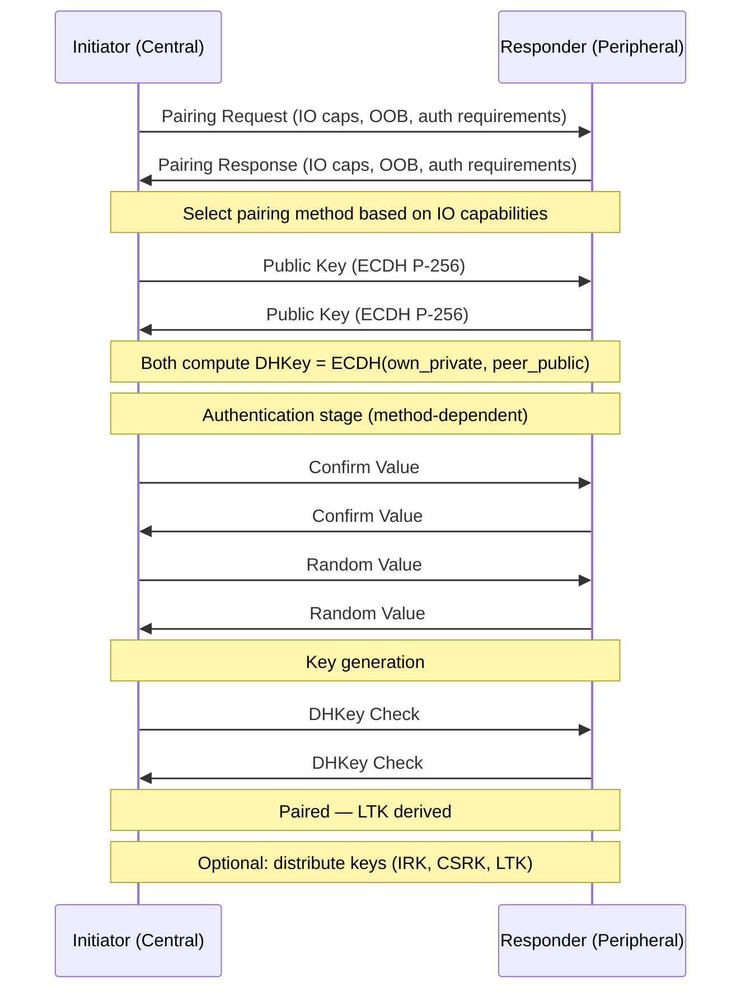
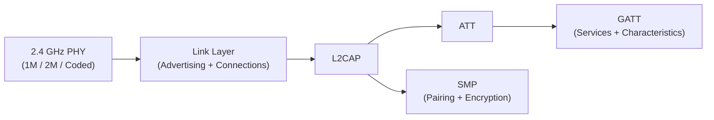

# BLE (Bluetooth Low Energy)

> **Standard:** [Bluetooth Core Specification (bluetooth.com)](https://www.bluetooth.com/specifications/specs/core-specification/) | **Layer:** Full stack (Physical through Application) | **Wireshark filter:** `btle` or `btatt` or `btl2cap`

BLE (Bluetooth Low Energy, originally "Bluetooth Smart") is a wireless protocol optimized for short bursts of data from battery-powered devices. Introduced in Bluetooth 4.0 (2010), BLE shares the 2.4 GHz band with Classic Bluetooth but uses a completely different stack — different PHY, different link layer, and the GATT/ATT attribute model that defines how all BLE data is exposed. This page covers the details embedded developers work with daily: GATT attributes, advertising data format, connection parameters, and the security model.

## Protocol Stack



## GATT (Generic Attribute Profile)

GATT defines how BLE devices expose data as a hierarchy of **Services**, **Characteristics**, and **Descriptors** — all stored as **Attributes** in an attribute table.

### Attribute Table

Every piece of data on a BLE device is an attribute:



| Field | Size | Description |
|-------|------|-------------|
| Handle | 16 bits | Unique index in the attribute table (0x0001-0xFFFF) |
| UUID | 16 or 128 bits | Attribute type identifier |
| Permissions | Flags | Read, write, encrypt, authenticate |
| Value | Variable | The attribute data (up to 512 bytes, negotiable via MTU) |

### GATT Hierarchy



### Service Declaration (Attribute)

| Handle | UUID | Value |
|--------|------|-------|
| 0x0001 | 0x2800 (Primary Service) | 0x180D (Heart Rate Service UUID) |

### Characteristic Declaration (Attribute)

| Handle | UUID | Value |
|--------|------|-------|
| 0x0002 | 0x2803 (Characteristic) | Properties + Value Handle + Char UUID |

### Characteristic Properties (1 byte)



| Bit | Property | Description |
|-----|----------|-------------|
| 0 | Broadcast | Value can be broadcast in advertising |
| 1 | Read | Value can be read |
| 2 | Write Without Response | Value can be written without acknowledgment |
| 3 | Write | Value can be written with acknowledgment |
| 4 | Notify | Server can send value without acknowledgment |
| 5 | Indicate | Server can send value with acknowledgment |
| 6 | Authenticated Signed Writes | Signed write support |
| 7 | Extended Properties | Additional properties in Extended Properties descriptor |

### CCCD (Client Characteristic Configuration Descriptor — 0x2902)

The most important descriptor — the client writes to it to enable notifications or indications:

| Value | Meaning |
|-------|---------|
| 0x0000 | Notifications and indications disabled |
| 0x0001 | Notifications enabled |
| 0x0002 | Indications enabled |
| 0x0003 | Both enabled |

### Common Standard UUIDs

#### Services

| UUID | Service |
|------|---------|
| 0x1800 | Generic Access |
| 0x1801 | Generic Attribute |
| 0x180A | Device Information |
| 0x180D | Heart Rate |
| 0x180F | Battery Service |
| 0x1810 | Blood Pressure |
| 0x1816 | Cycling Speed and Cadence |
| 0x181A | Environmental Sensing |
| 0x181C | User Data |
| 0x1822 | Pulse Oximeter |

#### Characteristics

| UUID | Characteristic |
|------|----------------|
| 0x2A00 | Device Name |
| 0x2A01 | Appearance |
| 0x2A04 | Peripheral Preferred Connection Parameters |
| 0x2A19 | Battery Level |
| 0x2A23 | System ID |
| 0x2A24 | Model Number String |
| 0x2A25 | Serial Number String |
| 0x2A26 | Firmware Revision |
| 0x2A28 | Software Revision |
| 0x2A29 | Manufacturer Name |
| 0x2A37 | Heart Rate Measurement |
| 0x2A6E | Temperature |
| 0x2A6F | Humidity |

#### Descriptors

| UUID | Descriptor |
|------|-----------|
| 0x2900 | Characteristic Extended Properties |
| 0x2901 | Characteristic User Description |
| 0x2902 | Client Characteristic Configuration (CCCD) |
| 0x2903 | Server Characteristic Configuration |
| 0x2904 | Characteristic Presentation Format |

### Custom UUIDs (128-bit)

Vendor-specific services use full 128-bit UUIDs. The Bluetooth Base UUID is:

```
XXXXXXXX-0000-1000-8000-00805F9B34FB
```

Standard 16-bit UUIDs are shorthand: `0x180D` → `0000180D-0000-1000-8000-00805F9B34FB`

Custom services use random 128-bit UUIDs, e.g., Nordic UART Service: `6E400001-B5A3-F393-E0A9-E50E24DCCA9E`

## ATT Protocol Operations

| Opcode | Name | Direction | Description |
|--------|------|-----------|-------------|
| 0x02 | Exchange MTU Request | C→S | Negotiate ATT MTU (default 23, max 517) |
| 0x03 | Exchange MTU Response | S→C | Server's MTU |
| 0x04 | Find Information Request | C→S | Discover attribute handles and UUIDs |
| 0x08 | Read By Type Request | C→S | Read attributes by UUID (service/char discovery) |
| 0x0A | Read Request | C→S | Read an attribute value by handle |
| 0x0B | Read Response | S→C | Return attribute value |
| 0x12 | Write Request | C→S | Write with acknowledgment |
| 0x13 | Write Response | S→C | Write acknowledged |
| 0x1B | Handle Value Notification | S→C | Server pushes value (no ACK) |
| 0x1D | Handle Value Indication | S→C | Server pushes value (ACK required) |
| 0x1E | Handle Value Confirmation | C→S | ACK for indication |
| 0x52 | Write Command | C→S | Write without acknowledgment |

### ATT MTU and Data Length

| Parameter | Default | Maximum | Effect |
|-----------|---------|---------|--------|
| ATT MTU | 23 bytes | 517 bytes | Max attribute value per ATT operation |
| ATT payload | 20 bytes | 514 bytes | MTU minus 3-byte ATT header |
| LE Data Length | 27 bytes | 251 bytes | Max Link Layer payload (BLE 4.2+) |
| Throughput (1M PHY) | ~2.5 KB/s | ~65 KB/s | Larger MTU + DLE dramatically improve speed |

## Advertising

### Advertising PDU Format



### Advertising Data (AD) Structures

AdvData contains one or more AD structures, each with Length + Type + Data:



### Common AD Types

| Type | Name | Description |
|------|------|-------------|
| 0x01 | Flags | Discoverable mode, BR/EDR support |
| 0x02 | Incomplete 16-bit UUIDs | Partial list of service UUIDs |
| 0x03 | Complete 16-bit UUIDs | Full list of service UUIDs |
| 0x06 | Incomplete 128-bit UUIDs | Partial list of custom service UUIDs |
| 0x07 | Complete 128-bit UUIDs | Full list of custom service UUIDs |
| 0x08 | Shortened Local Name | Device name (truncated) |
| 0x09 | Complete Local Name | Full device name |
| 0x0A | TX Power Level | Transmit power in dBm |
| 0xFF | Manufacturer Specific Data | Vendor data (first 2 bytes = company ID) |
| 0x16 | Service Data (16-bit UUID) | UUID + data payload |
| 0x20 | Service Data (32-bit UUID) | UUID + data payload |
| 0x21 | Service Data (128-bit UUID) | UUID + data payload |
| 0x14 | List of 16-bit Solicitation UUIDs | Services the peripheral wants to use |

### Flags (AD Type 0x01)



Typical BLE-only device: `0x06` (General Discoverable + BR/EDR Not Supported)

### Advertising Channels

| Channel | Frequency | Purpose |
|---------|-----------|---------|
| 37 | 2402 MHz | Advertising |
| 38 | 2426 MHz | Advertising |
| 39 | 2480 MHz | Advertising |
| 0-36 | 2404-2478 MHz | Data channels (adaptive frequency hopping) |

### Advertising Types

| PDU Type | Name | Connectable | Scannable | Directed |
|----------|------|-------------|-----------|----------|
| ADV_IND | Connectable Undirected | Yes | Yes | No |
| ADV_DIRECT_IND | Connectable Directed | Yes | No | Yes |
| ADV_NONCONN_IND | Non-connectable | No | No | No |
| ADV_SCAN_IND | Scannable Undirected | No | Yes | No |

### Extended Advertising (BLE 5.0+)

| Feature | Legacy | Extended |
|---------|--------|----------|
| Adv data size | 31 bytes | 254 bytes (chained up to ~1650) |
| Channels | 37, 38, 39 only | Adv on 37-39, data on any channel |
| Coded PHY | No | Yes (long range) |
| Multiple adv sets | No | Yes (concurrent) |
| Periodic advertising | No | Yes (synchronized broadcasts) |

## Connection Parameters

After `CONNECT_IND`, the link layer uses these parameters:

| Parameter | Range | Default | Description |
|-----------|-------|---------|-------------|
| Connection Interval | 7.5ms - 4s | 30-50ms typical | Time between connection events |
| Slave Latency | 0-499 | 0 | Number of connection events the peripheral can skip |
| Supervision Timeout | 100ms - 32s | 4-6s | Time before declaring connection lost |
| CE Length | 0 - conn interval | — | Minimum/maximum connection event length |

### Throughput Estimation

```
Throughput ≈ (ATT_payload × packets_per_interval) / connection_interval
```

| Scenario | Interval | MTU | PHY | Approx Throughput |
|----------|----------|-----|-----|-------------------|
| Conservative | 30ms | 23 | 1M | ~5 KB/s |
| Typical | 15ms | 247 | 1M | ~65 KB/s |
| Maximum | 7.5ms | 247 | 2M | ~170 KB/s |

### Connection Parameter Update



## Security (SMP — Security Manager Protocol)

### Pairing Methods

| Method | MITM Protection | User Interaction | Use Case |
|--------|----------------|-----------------|----------|
| Just Works | No | None | Headsets, mice (no display/keyboard) |
| Passkey Entry | Yes | Enter 6-digit code | Keyboard devices |
| Numeric Comparison | Yes | Confirm 6-digit number on both | Phones, watches (BLE 4.2+) |
| Out of Band (OOB) | Yes | NFC tap, QR code scan | High security, easy pairing |

### Pairing Flow (LE Secure Connections — BLE 4.2+)



### Security Keys

| Key | Name | Purpose |
|-----|------|---------|
| LTK | Long Term Key | Encryption key (stored for bonding) |
| IRK | Identity Resolving Key | Resolve random addresses to identity |
| CSRK | Connection Signature Resolving Key | Verify signed data |
| EDIV + Rand | Encrypted Diversifier + Random | Identify the LTK during reconnection (Legacy only) |

### Address Types

| Type | Format | Description |
|------|--------|-------------|
| Public | IEEE-assigned | Fixed, globally unique (like a MAC) |
| Random Static | 11:xx:xx:xx:xx:xx | Fixed per boot (or permanent), locally assigned |
| Random Private Resolvable | 01:xx:xx:xx:xx:xx | Changes periodically, resolvable with IRK |
| Random Private Non-Resolvable | 00:xx:xx:xx:xx:xx | Changes periodically, not resolvable (rare) |

Resolvable Private Addresses (RPAs) are the default in modern BLE — they rotate every ~15 minutes to prevent tracking, but bonded devices can resolve them using the stored IRK.

### Security Levels

| Level | Mode | Description |
|-------|------|-------------|
| 1 | No Security | No encryption, no authentication |
| 2 | Unauthenticated Encryption | Encrypted (Just Works pairing) |
| 3 | Authenticated Encryption | Encrypted + MITM protection (Passkey/Numeric Comparison) |
| 4 | LE Secure Connections + Authenticated | ECDH-based + MITM protection (highest) |

## PHY Options (BLE 5.0+)

| PHY | Data Rate | Range | Use Case |
|-----|-----------|-------|----------|
| LE 1M | 1 Mbps | ~100m | Default, backward compatible |
| LE 2M | 2 Mbps | ~80m | Higher throughput, lower power per bit |
| LE Coded (S=2) | 500 kbps | ~200m | Extended range |
| LE Coded (S=8) | 125 kbps | ~400m | Maximum range |

## Common BLE Profiles

| Profile | Description | Example Devices |
|---------|-------------|-----------------|
| HRP (Heart Rate) | Heart rate monitoring | Fitness bands, chest straps |
| BLP (Blood Pressure) | Blood pressure measurement | BP monitors |
| GLP (Glucose) | Glucose readings | Glucose meters |
| HOGP (HID over GATT) | Keyboards, mice, gamepads | BLE peripherals |
| PXP (Proximity) | Proximity detection | Key finders, asset tags |
| FMP (Find Me) | Alert when out of range | Tile-like trackers |
| ESP (Environmental Sensing) | Temperature, humidity, pressure | Weather stations |
| CGM (Continuous Glucose) | Continuous glucose monitoring | CGM devices |

## Encapsulation



## Standards

| Document | Title |
|----------|-------|
| [Bluetooth Core 6.0](https://www.bluetooth.com/specifications/specs/core-specification/) | Core Specification (Vol 1-6 cover BLE) |
| [Bluetooth GATT Specs](https://www.bluetooth.com/specifications/gatt/) | Services, Characteristics, Descriptors |
| [Bluetooth Assigned Numbers](https://www.bluetooth.com/specifications/assigned-numbers/) | UUIDs, company IDs, AD types |
| [Bluetooth Mesh](https://www.bluetooth.com/specifications/specs/mesh-protocol/) | BLE Mesh Protocol |

## See Also

- [Bluetooth](bluetooth.md) — overview covering both Classic and BLE
- [Zigbee](zigbee.md) — alternative low-power wireless mesh
- [NFC](nfc.md) — very short range, sometimes used for BLE OOB pairing
- [I2C](../bus/i2c.md) — BLE sensor modules often connect to MCUs via I2C/SPI
