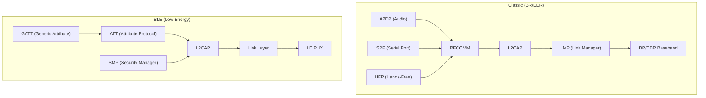
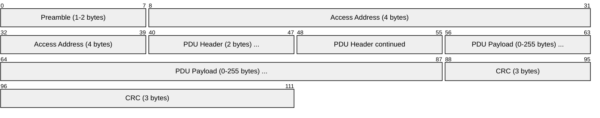
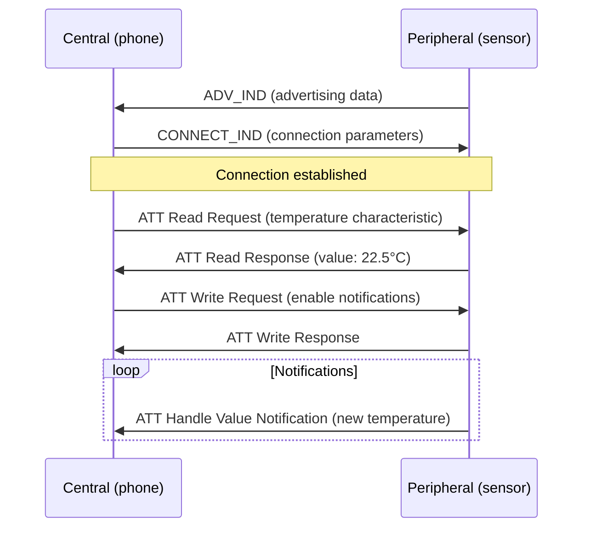
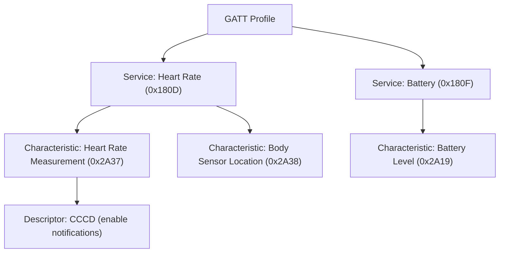

# Bluetooth / BLE (Bluetooth Low Energy)

> **Standard:** [Bluetooth Core Specification (bluetooth.com)](https://www.bluetooth.com/specifications/specs/core-specification/) | **Layer:** Full stack (Physical through Application) | **Wireshark filter:** `bthci_evt` or `btle` or `btatt`

Bluetooth is a short-range wireless technology for exchanging data between devices in the 2.4 GHz ISM band. Bluetooth Classic (BR/EDR) provides continuous streaming connections for audio (headphones, speakers) and serial data. Bluetooth Low Energy (BLE), introduced in Bluetooth 4.0 (2010), is optimized for intermittent data transfer from battery-powered devices — fitness trackers, sensors, beacons, smart home, and medical devices. Modern Bluetooth 5.x supports both Classic and BLE, with recent versions adding mesh networking and LE Audio.

## Protocol Stack

## BLE Link Layer Packet

### PDU Header

## Key Fields (BLE)

| Field | Size | Description |
|-------|------|-------------|
| Preamble | 1-2 bytes | Synchronization (0xAA or 0x55 pattern) |
| Access Address | 4 bytes | 0x8E89BED6 for advertising; random for data channels |
| PDU Type | 4 bits | Advertising or data PDU type |
| TxAdd/RxAdd | 1 bit each | Address type: 0 = public, 1 = random |
| Length | 8 bits | Payload length |
| CRC | 3 bytes | CRC-24 |

## BLE Advertising PDU Types

| Type | Name | Description |
|------|------|-------------|
| 0 | ADV_IND | Connectable undirected advertising |
| 1 | ADV_DIRECT_IND | Connectable directed advertising |
| 2 | ADV_NONCONN_IND | Non-connectable (beacon) |
| 3 | SCAN_REQ | Active scan request |
| 4 | SCAN_RSP | Scan response (additional data) |
| 5 | CONNECT_IND | Connection request |
| 6 | ADV_SCAN_IND | Scannable undirected advertising |

## BLE Connection

## GATT (Generic Attribute Profile)

GATT defines how BLE devices expose data as a hierarchy of services and characteristics:

### Common GATT Services

| UUID | Service | Description |
|------|---------|-------------|
| 0x1800 | Generic Access | Device name, appearance |
| 0x1801 | Generic Attribute | Service changed indication |
| 0x180A | Device Information | Manufacturer, model, firmware version |
| 0x180D | Heart Rate | Heart rate measurement |
| 0x180F | Battery Service | Battery level percentage |
| 0x1810 | Blood Pressure | Blood pressure measurement |
| 0x181A | Environmental Sensing | Temperature, humidity, pressure |
| 0x181C | User Data | User profile data |

## Radio Parameters

| Parameter | Classic (BR/EDR) | BLE |
|-----------|-----------------|-----|
| Frequency | 2.4 GHz ISM | 2.4 GHz ISM |
| Channels | 79 × 1 MHz | 40 × 2 MHz (3 advertising, 37 data) |
| Data rate | 1 Mbps (BR), 2-3 Mbps (EDR) | 1 Mbps (LE 1M), 2 Mbps (LE 2M) |
| Range | ~10-100 m | ~10-100 m (400 m with LE Coded) |
| Hopping | FHSS, 1600 hops/sec | Adaptive frequency hopping |
| Transmit power | 0-20 dBm (class dependent) | -20 to +20 dBm |
| Connection interval | — | 7.5 ms - 4 sec |
| Latency | ~100 ms | ~6 ms (BLE 5.0) |

## Bluetooth Versions

| Version | Year | Key Features |
|---------|------|-------------|
| 1.0 | 1999 | Initial release |
| 2.0 + EDR | 2004 | Enhanced Data Rate (3 Mbps) |
| 3.0 + HS | 2009 | High Speed (Wi-Fi for bulk transfer) |
| 4.0 | 2010 | Bluetooth Low Energy (BLE) introduced |
| 4.2 | 2014 | Larger packets, LE Data Length Extension, IPv6 (6LoWPAN) |
| 5.0 | 2016 | 2× speed, 4× range, advertising extensions |
| 5.1 | 2019 | Direction finding (AoA/AoD) |
| 5.2 | 2020 | LE Audio (LC3 codec), Isochronous Channels |
| 5.3 | 2021 | Connection subrating, periodic advertising enhancement |
| 5.4 | 2023 | PAwR (Periodic Advertising with Responses) |
| 6.0 | 2024 | Channel sounding (cm-level ranging) |

## Security

| Feature | Classic | BLE |
|---------|---------|-----|
| Pairing | PIN, Numeric Comparison, Passkey | Just Works, Passkey, Numeric Comparison, OOB |
| Encryption | E0 (legacy), AES-CCM (Secure Connections) | AES-CCM |
| Authentication | HMAC-SHA-256 | AES-CMAC |
| MITM protection | Numeric Comparison, OOB | Numeric Comparison, Passkey, OOB |
| LE Secure Connections | — | ECDH P-256 key exchange (BLE 4.2+) |

## Standards

| Document | Title |
|----------|-------|
| [Bluetooth Core Spec 6.0](https://www.bluetooth.com/specifications/specs/core-specification/) | Bluetooth Core Specification |
| [Bluetooth GATT](https://www.bluetooth.com/specifications/gatt/) | GATT Specifications (services, characteristics) |
| [Bluetooth Mesh](https://www.bluetooth.com/specifications/specs/mesh-protocol/) | Bluetooth Mesh Protocol |

## See Also

- [NFC](nfc.md) — very short range, used for pairing and payments
- [Zigbee](zigbee.md) — alternative low-power wireless (mesh-focused)
- [Z-Wave](zwave.md) — alternative home automation wireless
- [802.11 (Wi-Fi)](80211.md) — higher-bandwidth wireless LAN
