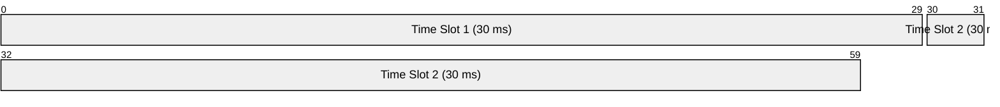
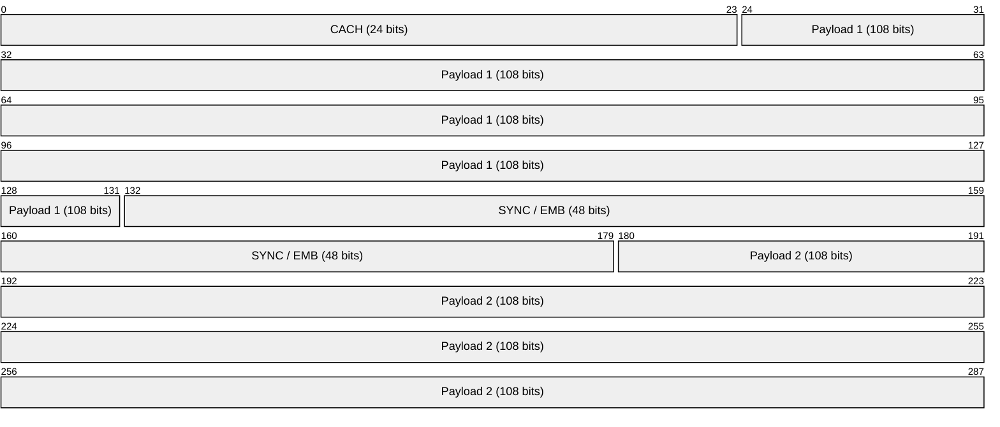
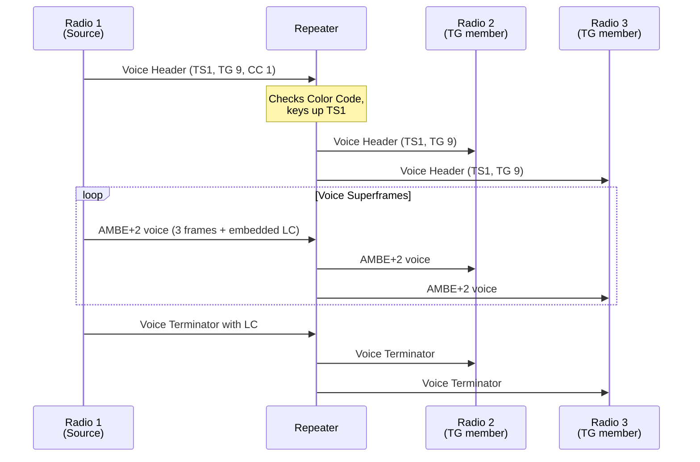

# DMR (Digital Mobile Radio)

> **Standard:** [ETSI TS 102 361](https://www.etsi.org/deliver/etsi_ts/102300_102399/10236101/) | **Layer:** Full stack (Physical through Application) | **Wireshark filter:** `dmr` (with DSD+/op25/SDR decoders)

DMR is an open digital two-way radio standard developed by ETSI for professional mobile radio (PMR) and amateur radio use. Its key innovation is TDMA (Time Division Multiple Access) -- splitting a single 12.5 kHz channel into two independent time slots, effectively doubling the capacity of a frequency allocation. DMR uses 4FSK modulation and the AMBE+2 voice codec, delivering clear digital audio with better spectral efficiency than analog FM. DMR has seen massive adoption in commercial, industrial, and amateur radio through manufacturers like Motorola, Hytera, and Tait, and through global amateur networks like Brandmeister and DMR-MARC.

## DMR Tiers

| Tier | Name | Description | Licensing |
|------|------|-------------|-----------|
| Tier I | Unlicensed | Low power (0.5 W), FDMA, 446 MHz (Europe) | License-free (dPMR446) |
| Tier II | Conventional | Licensed, repeater-based, TDMA 2-slot | Licensed PMR / amateur |
| Tier III | Trunked | Licensed, multi-site trunked with dynamic channel assignment | Licensed PMR |

Tier II is by far the most widely deployed for both commercial and amateur radio use.

## TDMA Frame Structure

DMR divides a 12.5 kHz channel into two time slots of 30 ms each, yielding a 60 ms TDMA frame:



Each time slot carries an independent conversation, effectively giving two logical channels per physical frequency.

## Burst Structure (Per Time Slot)

Each 30 ms time slot contains a single burst of 264 bits at 4800 symbols/s (9600 bps):



| Field | Size | Description |
|-------|------|-------------|
| CACH | 24 bits | Common Announcement Channel -- short LC fragments, slot type |
| Payload 1 | 108 bits | First half of voice or data payload |
| SYNC / EMB | 48 bits | Synchronization pattern (voice/data/RC sync) or Embedded signaling |
| Payload 2 | 108 bits | Second half of voice or data payload |

### CACH (Common Announcement Channel)

The 24-bit CACH is present in every burst and carries:
- TACT (Trunk Announcement) bits for Tier III
- Short LC fragments (assembled from 4 consecutive bursts to form a 12-byte Short LC)
- The Short LC contains source ID, destination ID, and group/private call flag

## SYNC Patterns

| Pattern | Description |
|---------|-------------|
| BS Voice | Base station voice sync |
| BS Data | Base station data sync |
| MS Voice | Mobile station voice sync |
| MS Data | Mobile station data sync |
| RC Sync | Reverse channel sync |
| Direct Voice TS1/TS2 | Direct mode (simplex) voice |
| Direct Data TS1/TS2 | Direct mode data |

## Link Control (LC)

Full Link Control is 96 bits total (72 bits of LC data + 24 bits of CRC) and is embedded across multiple voice bursts using the EMB field. It carries:

| Field | Description |
|-------|-------------|
| Protect Flag | 0 = clear, 1 = encrypted |
| FLCO | Full LC Opcode (group voice, unit-to-unit voice, GPS, talker alias) |
| Feature Set ID | 0 = standard, others vendor-specific |
| Service Options | Emergency, privacy, broadcast |
| Destination ID | 24-bit talkgroup or radio ID |
| Source ID | 24-bit originating radio ID |

## Data Types

| Type | Description |
|------|-------------|
| Voice | AMBE+2 encoded voice frames (3 frames per superframe) |
| Voice + Embedded LC | Voice with Link Control in EMB fields |
| PI Header | Privacy (encryption) indicator header |
| Data Header | Start of a data transmission |
| Rate 1/2 Data | FEC-protected data (confirmed or unconfirmed) |
| Rate 3/4 Data | Less FEC, higher throughput |
| Rate 1 Data | No FEC, maximum throughput |
| CSBK | Control Signaling Block -- standalone signaling (preamble, aloha, etc.) |
| MBC | Multi-Block Control -- extended signaling |
| Idle | Idle burst (no traffic) |

## Voice Codec

| Parameter | Value |
|-----------|-------|
| Codec | AMBE+2 (Digital Voice Systems Inc.) |
| Bit rate | 3600 bps (voice) + 2400 bps (FEC) = 6000 bps per time slot |
| Frame duration | 60 ms (3 voice frames of 20 ms each per superframe) |
| Audio bandwidth | ~300-3400 Hz |

## Modulation and RF

| Parameter | Value |
|-----------|-------|
| Modulation | 4FSK (4-level Frequency Shift Keying) |
| Symbol rate | 4800 symbols/s |
| Bit rate | 9600 bps (2 bits per symbol) |
| Channel spacing | 12.5 kHz |
| Deviation | +/- 1944 Hz (outer), +/- 648 Hz (inner) |
| Frequency bands | VHF (136-174 MHz), UHF (403-527 MHz) |

## Color Codes

Color Codes (0-15) serve a function similar to CTCSS/DCS tones in analog radio -- they prevent a radio from receiving traffic from an unintended repeater on the same frequency. Both the radio and repeater must be set to the same Color Code for communication. The Color Code is carried in the CACH and EMB fields.

## Addressing

| Address | Range | Description |
|---------|-------|-------------|
| Radio ID | 1 - 16,776,415 | Individual radio identifier (24-bit) |
| Talkgroup | 1 - 16,776,415 | Group call identifier (24-bit) |
| All Call | 16,777,215 | Broadcast to all radios |

## Group Call Flow



## IP Site Connect (IPSC)

IPSC links multiple DMR repeaters over IP networks, extending talkgroup coverage across sites:

```mermaid
graph TD
  R1["Repeater 1<br/>(Site A)"] -->|IP Network<br/>(UDP)| Master["IPSC Master<br/>or c-Bridge"]
  R2["Repeater 2<br/>(Site B)"] -->|IP Network| Master
  R3["Repeater 3<br/>(Site C)"] -->|IP Network| Master
  Master -->|Internet| BM["Brandmeister<br/>Network"]
  Master -->|Internet| MARC["DMR-MARC<br/>Network"]
```

### Amateur DMR Networks

| Network | Description |
|---------|-------------|
| Brandmeister | Largest global amateur DMR network, supports hotspots, multi-protocol |
| DMR-MARC | DMR-Mobile Amateur Radio Club, curated talkgroup system |
| TGIF | Community-driven, simplified talkgroup structure |
| FreeDMR | Open-source alternative network |

### Hotspots

Low-power personal DMR gateways (MMDVM-based) connect a single radio to DMR networks via the internet, enabling global reach from home:

Radio -> Hotspot (MMDVM + Pi-Star/WPSD) -> Internet -> Brandmeister -> World

## Encryption

| Type | Description |
|------|-------------|
| Basic Privacy | XOR-based scrambling (40-bit key), easily broken |
| Enhanced Privacy | AES-128 or AES-256 encryption (Tier II/III) |
| Hytera End-to-End | Proprietary E2E encryption (vendor-specific) |

Note: Amateur radio use of DMR prohibits encryption in most jurisdictions.

## Standards

| Document | Title |
|----------|-------|
| [ETSI TS 102 361-1](https://www.etsi.org/deliver/etsi_ts/102300_102399/10236101/) | Air Interface (AI) protocol |
| [ETSI TS 102 361-2](https://www.etsi.org/deliver/etsi_ts/102300_102399/10236102/) | Voice and Generic Services and Facilities |
| [ETSI TS 102 361-3](https://www.etsi.org/deliver/etsi_ts/102300_102399/10236103/) | Data Protocol |
| [ETSI TS 102 361-4](https://www.etsi.org/deliver/etsi_ts/102300_102399/10236104/) | Trunking Protocol (Tier III) |

## See Also

- [TETRA](tetra.md) -- European emergency services digital radio (4-slot TDMA)
- [Bluetooth](bluetooth.md) -- short-range wireless for comparison
- [Zigbee](zigbee.md) -- low-power wireless mesh
