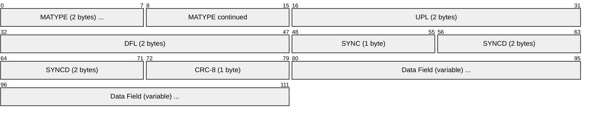
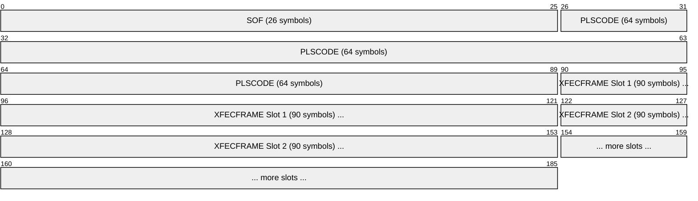
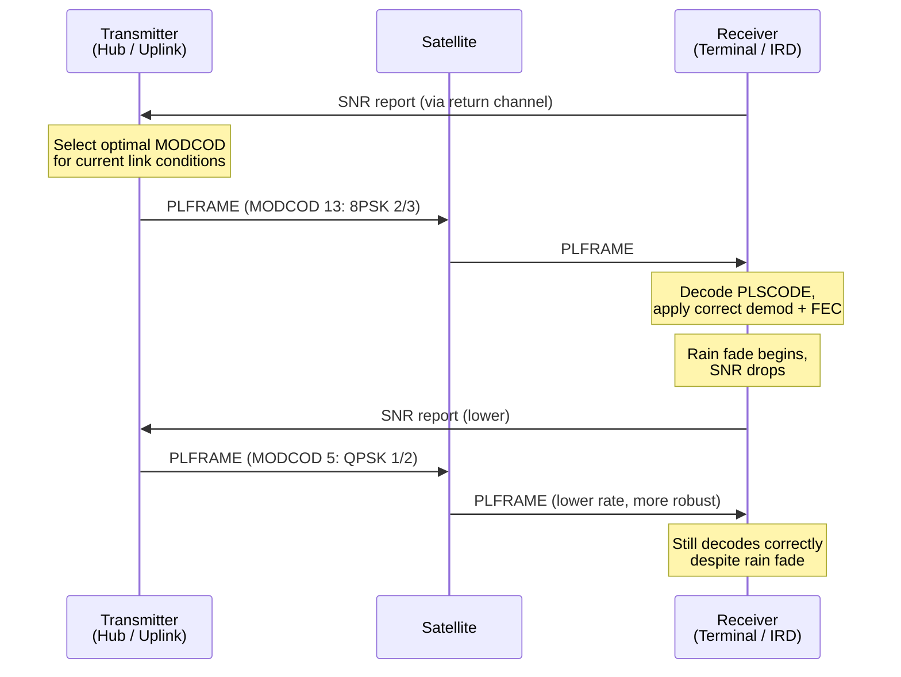
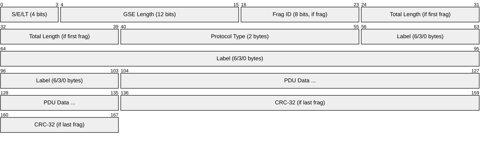
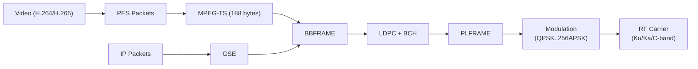

# DVB-S / DVB-S2 / DVB-S2X (Digital Video Broadcasting - Satellite)

> **Standard:** [ETSI EN 302 307](https://www.etsi.org/deliver/etsi_en/302300_302399/302307/) (DVB-S2) / [ETSI EN 302 307-2](https://www.etsi.org/deliver/etsi_en/302300_302399/30230702/) (DVB-S2X) | **Layer:** Physical / Data Link | **Wireshark filter:** `dvb-s2` or `mp2t` (MPEG Transport Stream)

DVB-S, DVB-S2, and DVB-S2X are the successive generations of the Digital Video Broadcasting standard for satellite transmission. DVB-S (1994) established digital satellite TV using QPSK modulation. DVB-S2 (2005) introduced Adaptive Coding and Modulation (ACM) and LDPC/BCH forward error correction, roughly doubling spectral efficiency. DVB-S2X (2014) further extended the standard with finer granularity MODCODs, higher-order modulation up to 256APSK, and smaller roll-off factors. These standards carry the majority of the world's satellite television (Sky, DirecTV, Freesat, Canal+), satellite internet (VSAT), contribution/distribution feeds, and professional video links.

## DVB-S / DVB-S2 / DVB-S2X Comparison

| Feature | DVB-S | DVB-S2 | DVB-S2X |
|---------|-------|--------|---------|
| Year | 1994 | 2005 | 2014 |
| Modulation | QPSK | QPSK, 8PSK, 16APSK, 32APSK | + 64APSK, 128APSK, 256APSK |
| FEC | Convolutional + Reed-Solomon | LDPC + BCH | LDPC + BCH (finer rates) |
| Roll-off factors | 0.35 | 0.35, 0.25, 0.20 | + 0.15, 0.10, 0.05 |
| Spectral efficiency | ~2 bps/Hz max | ~3-4 bps/Hz | ~5 bps/Hz |
| ACM support | No (CCM only) | Yes (ACM/VCM) | Yes (enhanced) |
| MODCODs | 1 (QPSK + rate) | 28 | 116+ |
| Transport | MPEG-TS only | MPEG-TS or GSE | MPEG-TS, GSE, or super-frame |
| Gain over DVB-S | Baseline | ~30% capacity | ~5-20% over DVB-S2 |

## System Architecture

## Baseband Frame (BBFRAME)

The BBFRAME is the fundamental data unit in DVB-S2. The modulator receives BBFRAMEs, applies FEC coding, modulation, and physical layer framing.

| Field | Size | Description |
|-------|------|-------------|
| MATYPE | 2 bytes | Mode adaptation type: TS/GS input, SIS/MIS, CCM/ACM/VCM, ISSYI, NPD, roll-off |
| UPL | 16 bits | User Packet Length (188 x 8 = 1504 for MPEG-TS) |
| DFL | 16 bits | Data Field Length in bits |
| SYNC | 8 bits | User packet sync byte (0x47 for MPEG-TS) |
| SYNCD | 16 bits | Distance in bits from start of BBFRAME data to first UP sync |
| CRC-8 | 8 bits | CRC of the BBHEADER (10 bytes) |
| Data Field | Variable | User packets (MPEG-TS or generic stream) |

### MATYPE Field

| Bits | Field | Description |
|------|-------|-------------|
| 0-1 | TS/GS | 11 = Transport Stream, 00 = Generic Packetized, 01 = Generic Continuous, 10 = Reserved |
| 2 | SIS/MIS | 1 = Single Input Stream, 0 = Multiple Input Streams |
| 3 | CCM/ACM | 1 = Constant Coding and Modulation, 0 = Adaptive |
| 4 | ISSYI | Input Stream Synchronization Indicator |
| 5 | NPD | Null Packet Deletion (efficiency for sparse TS) |
| 6-7 | Roll-off | 00 = 0.35, 01 = 0.25, 10 = 0.20 (DVB-S2X adds 0.15, 0.10, 0.05) |

## Physical Layer Frame (PLFRAME)

| Field | Size | Description |
|-------|------|-------------|
| PLHEADER | 90 symbols | SOF (26 symbols) + PLSCODE (64 symbols) |
| XFECFRAME | Variable | FEC-encoded data (16200 or 64800 bits, depending on frame size) |
| Pilot blocks | 36 symbols | Inserted every 16 slots (optional, for synchronization) |

### PLSCODE

The 64-symbol PLSCODE encodes the MODCOD (5 bits for modulation + FEC rate) and frame type (normal or short), enabling the receiver to identify how to demodulate each frame -- essential for ACM operation where every frame can use a different MODCOD.

## FEC (Forward Error Correction)

### DVB-S

| Stage | Code | Description |
|-------|------|-------------|
| Inner | Convolutional | Rates 1/2, 2/3, 3/4, 5/6, 7/8 |
| Outer | Reed-Solomon (204,188) | Corrects up to 8 byte errors per packet |

### DVB-S2 / DVB-S2X

| Stage | Code | Block Size | Description |
|-------|------|-----------|-------------|
| Inner | LDPC | 64800 (normal) or 16200 (short) bits | Low-Density Parity-Check: near-Shannon-limit performance |
| Outer | BCH | Variable | Bose-Chaudhuri-Hocquenghem: catches residual errors |

LDPC + BCH operates within 0.7-1.0 dB of the Shannon limit, a significant improvement over convolutional + Reed-Solomon.

## MODCOD (Modulation and Coding)

Each MODCOD defines a combination of modulation scheme and FEC code rate. The receiver reports its current signal-to-noise ratio (SNR), and the modulator selects the best MODCOD for the conditions.

### DVB-S2 MODCODs (Selection)

| Modulation | Code Rates | Approx. Spectral Efficiency | Min Es/N0 |
|------------|------------|------------------------------|-----------|
| QPSK | 1/4, 1/3, 2/5, 1/2, 3/5, 2/3, 3/4, 4/5, 5/6, 8/9, 9/10 | 0.49 - 1.79 bps/Hz | -2.35 to 6.42 dB |
| 8PSK | 3/5, 2/3, 3/4, 5/6, 8/9, 9/10 | 1.78 - 2.68 bps/Hz | 5.50 to 10.69 dB |
| 16APSK | 2/3, 3/4, 4/5, 5/6, 8/9, 9/10 | 2.64 - 3.57 bps/Hz | 8.97 to 13.13 dB |
| 32APSK | 3/4, 4/5, 5/6, 8/9, 9/10 | 3.70 - 4.45 bps/Hz | 12.73 to 16.05 dB |

### DVB-S2X Additional Modulations

DVB-S2X adds 64APSK, 128APSK, and 256APSK for very high SNR links (e.g., spot beams, short hops), as well as very low SNR MODCODs (QPSK 2/9, 13/45) for mobile and low-margin links.

## Adaptive Coding and Modulation (ACM)

ACM allows the system to continuously optimize throughput per receiver. During clear sky, high-order modulation maximizes capacity; during rain fade, the system falls back to robust lower-order modulation, maintaining the link without outage.

### Coding Modes

| Mode | Abbreviation | Description |
|------|-------------|-------------|
| Constant Coding and Modulation | CCM | Single MODCOD for all frames (broadcast) |
| Variable Coding and Modulation | VCM | Different MODCODs per stream, fixed per stream |
| Adaptive Coding and Modulation | ACM | MODCOD adapts per-frame based on receiver feedback |

## Transport Mechanisms

### MPEG Transport Stream (TS)

| Parameter | Value |
|-----------|-------|
| Packet size | 188 bytes (fixed) |
| Sync byte | 0x47 |
| PID | 13-bit Packet Identifier (routes to decoder) |
| Payload | PES (video/audio) or PSI/SI (tables) |
| Null packets | PID 0x1FFF (padding for CBR) |

MPEG-TS is the traditional transport, designed for broadcast TV. Each 188-byte packet carries a fragment of an elementary stream (video, audio, subtitles) identified by its PID.

### Generic Stream Encapsulation (GSE)

GSE encapsulates IP packets directly into DVB-S2 baseband frames, avoiding the overhead of MPEG-TS for data services:

| Feature | MPEG-TS | GSE |
|---------|---------|-----|
| Overhead | ~5% (headers + null packets) | ~1-3% |
| IP encapsulation | IP -> ULE -> TS -> BBFRAME | IP -> GSE -> BBFRAME |
| Fragmentation | Fixed 188-byte packets | Variable-length PDUs, direct fragmentation |
| Best for | Broadcast TV | Satellite internet, unicast IP data |

## Typical Deployment Parameters

| Application | Standard | Frequency Band | Transponder BW | Typical Bit Rate |
|-------------|----------|---------------|----------------|-----------------|
| Satellite TV (DTH) | DVB-S2 | Ku-band (10.7-12.75 GHz) | 36 MHz | 40-60 Mbps |
| HD/UHD broadcast | DVB-S2X | Ku/Ka-band | 36 MHz | 50-80 Mbps |
| VSAT (internet) | DVB-S2/S2X | Ku/Ka-band | Variable | 1-50 Mbps per beam |
| Contribution feed | DVB-S2 | C-band (3.4-4.2 GHz) | 36 MHz | 40-60 Mbps |
| SNG (Satellite News Gathering) | DVB-S2 | Ku-band | 9-18 MHz | 5-20 Mbps |
| Maritime/Aero | DVB-S2X | Ku/Ka-band | Shared | 1-10 Mbps |

## Encapsulation

## Standards

| Document | Title |
|----------|-------|
| [ETSI EN 300 421](https://www.etsi.org/deliver/etsi_en/300400_300499/300421/) | DVB-S (first generation satellite) |
| [ETSI EN 302 307-1](https://www.etsi.org/deliver/etsi_en/302300_302399/30230701/) | DVB-S2 second generation framing, coding, and modulation |
| [ETSI EN 302 307-2](https://www.etsi.org/deliver/etsi_en/302300_302399/30230702/) | DVB-S2X extensions |
| [ETSI TS 102 606](https://www.etsi.org/deliver/etsi_ts/102600_102699/10260601/) | Generic Stream Encapsulation (GSE) |
| [ISO/IEC 13818-1](https://www.iso.org/standard/74427.html) | MPEG-2 Transport Stream |
| [ETSI EN 301 545](https://www.etsi.org/deliver/etsi_en/301500_301599/30154502/) | DVB-RCS2 (return channel via satellite) |

## See Also

- [Ethernet](../link-layer/ethernet.md) -- terrestrial equivalent data link framing
- [RTP](../voip/rtp.md) -- real-time media transport (often carried over DVB-S2)
