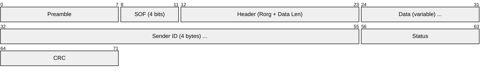
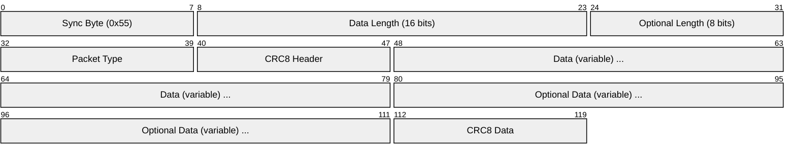
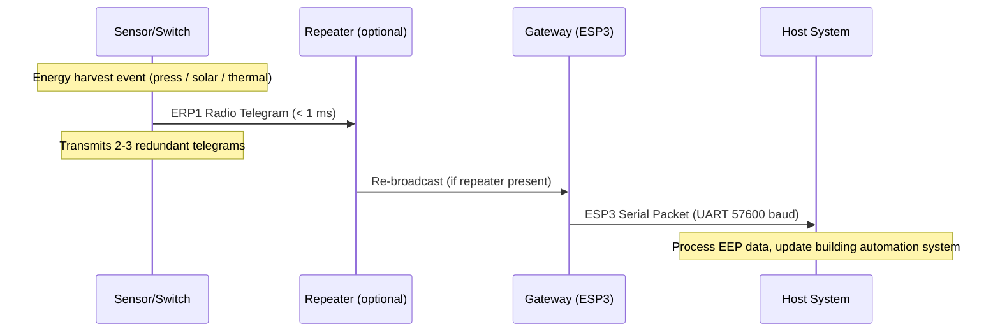

# EnOcean

> **Standard:** [ISO/IEC 14543-3-10](https://www.iso.org/standard/59865.html) / [EnOcean Alliance](https://www.enocean-alliance.org/) | **Layer:** Full stack (Physical through Application) | **Wireshark filter:** N/A (proprietary radio; ESP3 serial protocol can be captured via serial port sniffers)

EnOcean is an energy-harvesting wireless protocol designed for batteryless sensors, switches, and actuators. Devices harvest energy from their environment — piezoelectric generators in switches, solar cells in sensors, Peltier elements from thermal gradients — and transmit ultra-short radio telegrams (under 1 ms) at sub-1 GHz frequencies. This makes EnOcean uniquely maintenance-free: no batteries to replace, ever. It is widely used in building automation, smart homes, and industrial monitoring where wiring and battery maintenance are impractical.

## Radio Parameters

| Parameter | Value |
|-----------|-------|
| Frequency (Europe) | 868.3 MHz |
| Frequency (North America) | 902 MHz |
| Frequency (Japan) | 928 MHz |
| Modulation | ASK (Amplitude Shift Keying) |
| Data rate | 125 kbps |
| Telegram duration | < 1 ms |
| Range (indoor) | ~30 m |
| Range (outdoor) | ~300 m |
| Transmit power | ~10 mW (10 dBm) |
| Channel bandwidth | 280 kHz |

The sub-1 GHz frequencies provide better wall penetration and range than 2.4 GHz protocols (Zigbee, BLE, Thread), while the extremely short telegram duration minimizes energy consumption and collision probability.

## EnOcean Radio Protocol 1 (ERP1) Telegram

The over-the-air telegram structure for ERP1:

### Telegram Fields

| Field | Size | Description |
|-------|------|-------------|
| Preamble | 9 bits | Synchronization (alternating 1/0 pattern) |
| Start of Frame (SOF) | 4 bits | Frame delimiter |
| R-ORG (Radio Organization) | 8 bits | Telegram type identifier |
| Data | Variable | Payload (1-4 bytes depending on R-ORG) |
| Sender ID | 32 bits | Unique transmitter address (factory-programmed) |
| Status | 8 bits | Repeater count, T21/NU flags |
| CRC | 8 bits | CRC-8 of the telegram |

### R-ORG Types (Telegram Types)

| R-ORG | Name | Data Size | Description |
|-------|------|-----------|-------------|
| 0xF6 | RPS (Repeated Switch) | 1 byte | Rocker switches, push buttons |
| 0xD5 | 1BS (1 Byte Sensor) | 1 byte | Single-contact sensors (door/window) |
| 0xA5 | 4BS (4 Byte Sensor) | 4 bytes | Temperature, humidity, illumination, occupancy |
| 0xD2 | VLD (Variable Length Data) | 1-14 bytes | Bidirectional, multi-function actuators/sensors |
| 0xD4 | UTE (Universal Teach-In) | Variable | Teach-in for bidirectional devices |

## EnOcean Serial Protocol 3 (ESP3)

Gateways and USB dongles communicate with host systems using ESP3 over a serial interface (typically UART at 57600 baud):

### ESP3 Fields

| Field | Size | Description |
|-------|------|-------------|
| Sync Byte | 1 byte | Always 0x55 — frame synchronization |
| Data Length | 2 bytes | Length of the data field |
| Optional Length | 1 byte | Length of optional data field |
| Packet Type | 1 byte | Type of ESP3 packet |
| CRC8 Header | 1 byte | CRC-8 of header (Data Length + Optional Length + Packet Type) |
| Data | Variable | Payload (content depends on packet type) |
| Optional Data | Variable | Additional data (SubTelNum, RSSI, etc.) |
| CRC8 Data | 1 byte | CRC-8 of Data + Optional Data |

### ESP3 Packet Types

| Type | Value | Name | Description |
|------|-------|------|-------------|
| 0x01 | 1 | Radio Telegram | ERP1 radio telegram received or to transmit |
| 0x02 | 2 | Response | Response to a command |
| 0x03 | 3 | Radio Sub Telegram | ERP2 radio telegram |
| 0x04 | 4 | Event | Asynchronous event from the transceiver |
| 0x05 | 5 | Common Command | Configuration and management commands |
| 0x06 | 6 | Smart Ack Command | Smart Acknowledge (mailbox) commands |
| 0x07 | 7 | Remote Man Command | Remote management |
| 0x09 | 9 | Radio Message | Extended radio telegram |
| 0x0A | 10 | Radio ERP2 | ERP2 protocol telegram |

### ESP3 Response Codes

| Code | Meaning |
|------|---------|
| 0x00 | OK — command executed successfully |
| 0x01 | Error — general failure |
| 0x02 | Not supported |
| 0x03 | Wrong parameter |
| 0x04 | Operation denied |
| 0x05 | Lock set (device locked) |
| 0x82 | Buffer too small |
| 0x83 | No free buffer |

## EnOcean Equipment Profiles (EEPs)

EEPs define the data encoding for each device type. The format is `R-ORG`-`Function`-`Type`:

| EEP | Name | Description |
|-----|------|-------------|
| F6-02-01 | Rocker Switch, 2 Rocker | Light switch (2-button, EU style) |
| F6-02-02 | Rocker Switch, 2 Rocker | Light switch (2-button, US style) |
| F6-10-00 | Window Handle | Handle position (open/closed/tilted) |
| D5-00-01 | Single Input Contact | Door/window sensor (open/closed) |
| A5-02-05 | Temperature Sensor | Range 0-40 C, 8-bit resolution |
| A5-04-01 | Temp + Humidity | Temperature and relative humidity |
| A5-06-01 | Light Sensor | Illumination 300-60,000 lux |
| A5-07-03 | Occupancy Sensor | PIR with illumination and supply voltage |
| A5-08-01 | Light/Temp/Occupancy | Multi-function room sensor |
| D2-01-01 | Electronic Switch | Bidirectional relay actuator |
| D2-05-00 | Blind Control | Bidirectional blinds/shutter actuator |

## Energy Harvesting Sources

| Source | Mechanism | Typical Application |
|--------|-----------|---------------------|
| Piezoelectric | Mechanical press generates voltage spike | Rocker switches, push buttons |
| Solar (photovoltaic) | Indoor light charges buffer capacitor | Temperature, humidity, illumination sensors |
| Thermal (Peltier) | Temperature differential generates current | Radiator valve sensors, pipe monitors |
| Kinetic | Motion/vibration harvesting | Machine-mounted sensors |

### Energy Budget

| Component | Typical Energy |
|-----------|---------------|
| Single switch press (piezo) | ~120 uJ harvested |
| Telegram transmission | ~50 uJ consumed |
| Telegrams per press | 2-3 (redundant transmissions) |
| Solar sensor cycle | Measure + transmit every 100 seconds |
| Buffer capacitor | Stores energy for operation in darkness (hours to days) |

## Communication Model

EnOcean uses a unidirectional model for most sensors (transmit-only, no acknowledgment) to minimize energy consumption. Bidirectional communication (VLD profiles, D2-xx) is available for actuators that have mains power.

### Repeaters

| Level | Description |
|-------|-------------|
| No repeater | Direct sensor-to-gateway (30 m indoor range) |
| 1-hop repeater | Extends range to ~60 m indoor |
| 2-hop maximum | Maximum two repeater hops per telegram (status byte tracks count) |

## Teach-In Process

Devices are paired with receivers through a teach-in process:

| Method | Description |
|--------|-------------|
| Push-button teach-in | Press the learn button on the sensor; gateway captures Sender ID and EEP |
| UTE (Universal Teach-In) | D4 telegram with full EEP information, bidirectional confirmation |
| Smart Ack | Mailbox-based teach-in for energy-constrained bidirectional devices |
| Manual | Enter Sender ID and EEP into the gateway configuration |

## EnOcean vs Other Wireless Protocols

| Feature | EnOcean | Zigbee | Z-Wave | BLE | Thread |
|---------|---------|--------|--------|-----|--------|
| Frequency | Sub-1 GHz | 2.4 GHz | Sub-1 GHz | 2.4 GHz | 2.4 GHz |
| Battery | None (energy harvesting) | Yes (years) | Yes (years) | Yes (months-years) | Yes (years) |
| Data rate | 125 kbps | 250 kbps | 100 kbps | 1 Mbps | 250 kbps |
| Range (indoor) | 30 m | 10-30 m | 30 m | 10 m | 10-30 m |
| Mesh | No (repeaters only) | Yes | Yes | No (scatternet) | Yes |
| Telegram size | Tiny (< 1 ms) | Medium | Medium | Variable | Medium |
| IP-based | No | No | No | No | Yes (IPv6) |
| Bidirectional | Optional (VLD) | Yes | Yes | Yes | Yes |
| Best for | Maintenance-free sensors/switches | Complex automation | Home automation | Wearables, beacons | IP-connected IoT |

## Standards

| Document | Title |
|----------|-------|
| [ISO/IEC 14543-3-10](https://www.iso.org/standard/59865.html) | EnOcean Radio Protocol |
| [ISO/IEC 14543-3-11](https://www.iso.org/standard/65244.html) | EnOcean Radio Protocol (2.4 GHz) |
| [EnOcean Alliance](https://www.enocean-alliance.org/) | EnOcean Equipment Profiles (EEP), ESP3 specification |
| [EnOcean EEP Specification](https://www.enocean-alliance.org/eep/) | Equipment Profile definitions |

## See Also

- [Zigbee](zigbee.md) — 2.4 GHz mesh protocol for home/building automation
- [Z-Wave](zwave.md) — sub-GHz mesh protocol for smart home
- [BLE](ble.md) — Bluetooth Low Energy for short-range wireless
- [Thread](thread.md) — IPv6-based mesh for IoT
- [KNX](knx.md) — wired (and wireless) building automation standard
