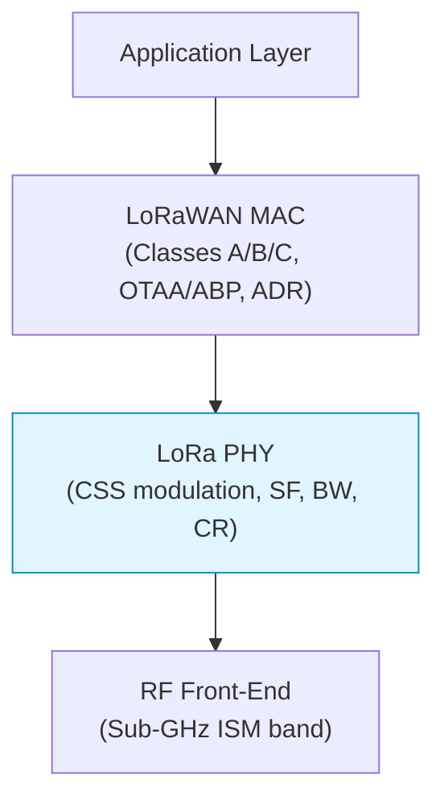
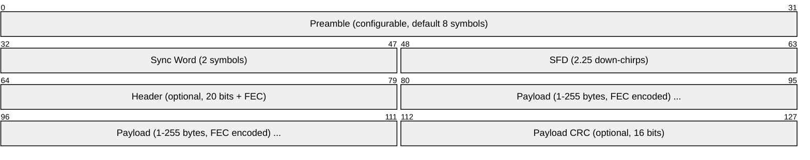
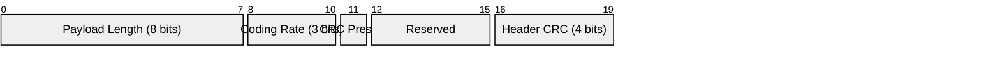
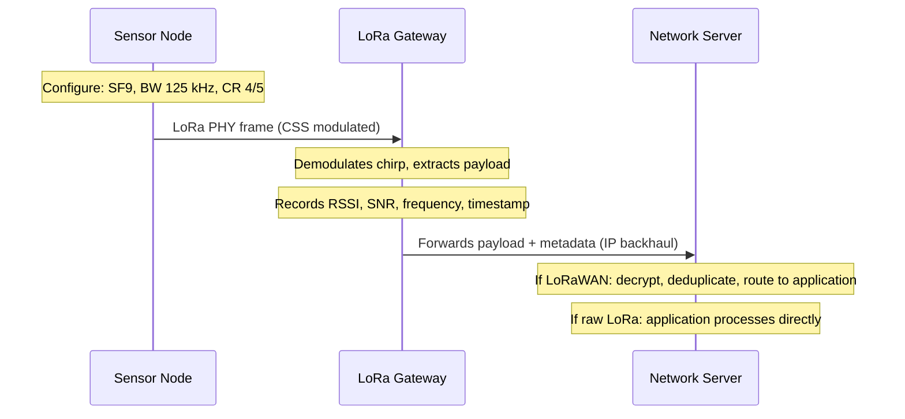
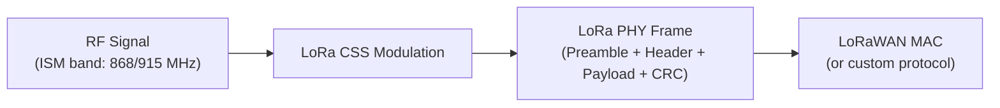

# LoRa PHY (Long Range Physical Layer)

> **Standard:** [Semtech LoRa Documentation](https://www.semtech.com/lora) / [LoRa Alliance](https://lora-alliance.org/) | **Layer:** Physical (Layer 1) | **Wireshark filter:** N/A (radio layer — LoRaWAN decoders exist: `lorawan`)

LoRa is a proprietary Chirp Spread Spectrum (CSS) radio modulation technique developed by Semtech for long-range, low-power wireless communication. It operates in unlicensed sub-GHz ISM bands and achieves links of 5-15 km (rural) or 2-5 km (urban) with milliwatt transmit power. LoRa is strictly the **physical layer** — the radio modulation that encodes bits into chirp signals. LoRaWAN is the separate network protocol (MAC layer, device classes, join procedures) built on top of LoRa PHY. This page covers the radio modulation, framing, spreading factors, and link budget.

## LoRa PHY vs LoRaWAN



| Aspect | LoRa PHY | LoRaWAN |
|--------|----------|---------|
| Scope | Radio modulation | Network protocol |
| Defines | Chirp encoding, spreading factor, bandwidth, coding rate | Device classes, join, ADR, MAC commands, encryption |
| Analogy | Like Wi-Fi's OFDM modulation | Like the 802.11 MAC + IP stack on top |
| Proprietary | Yes (Semtech patent) | Open specification (LoRa Alliance) |
| Point-to-point | Yes (can be used standalone) | Star-of-stars topology with gateways |

## Chirp Spread Spectrum (CSS)

LoRa encodes data by sweeping the carrier frequency across the entire bandwidth — an **up-chirp** sweeps from the lowest to the highest frequency, and a **down-chirp** sweeps from highest to lowest. Each symbol is a chirp whose starting frequency encodes the data value. With spreading factor SF, each symbol carries SF bits and the chirp has 2^SF frequency steps.

| Property | Description |
|----------|-------------|
| Up-chirp | Frequency increases linearly over the symbol period |
| Down-chirp | Frequency decreases linearly (used in preamble sync) |
| Symbol value | Encoded as the initial frequency offset of the chirp |
| Chips per symbol | 2^SF (e.g., SF7 = 128 chips, SF12 = 4096 chips) |
| Processing gain | Higher SF = more chips = more noise resilience = longer range |
| Orthogonality | Different SFs are quasi-orthogonal (can coexist on the same channel) |

## LoRa PHY Frame



## Key Fields

| Field | Size | Description |
|-------|------|-------------|
| Preamble | 6-65535 symbols (default 8) | Sequence of unmodulated up-chirps for receiver detection and synchronization |
| Sync Word | 2 symbols | Network identifier — distinguishes overlapping networks (0x12 = private, 0x34 = LoRaWAN) |
| SFD (Start Frame Delimiter) | 2.25 symbols | Down-chirps marking the end of preamble and start of data |
| Header | 20 bits + CR 4/8 FEC | Payload length, coding rate, CRC presence (explicit mode only) |
| Payload | 1-255 bytes | Application data, encoded with the configured coding rate |
| Payload CRC | 16 bits | CRC-16 over the payload (optional, indicated in header) |

## Explicit vs Implicit Header Mode

| Mode | Header Present | Use Case |
|------|---------------|----------|
| Explicit | Yes — payload length, CR, CRC flag are transmitted in the header | Default mode; receiver does not need to know parameters in advance |
| Implicit | No — all parameters must be pre-configured on both sides | Saves airtime; used when payload size and coding rate are fixed (e.g., beacons) |

### Header Fields (Explicit Mode)



| Field | Size | Description |
|-------|------|-------------|
| Payload Length | 8 bits | Number of payload bytes (1-255) |
| Coding Rate | 3 bits | FEC coding rate used for payload |
| CRC Present | 1 bit | Whether the payload CRC-16 is appended |
| Header CRC | 4 bits | CRC protecting the header itself |

The header is always transmitted at CR 4/8 (maximum redundancy) regardless of the payload coding rate, ensuring reliable decoding of frame parameters.

## Spreading Factor (SF)

The spreading factor determines how many chips encode each data bit. Higher SF increases range and noise immunity at the cost of data rate and airtime.

| SF | Chips/Symbol | Bits/Symbol | Sensitivity (125 kHz) | Approx Range (rural) | Relative Airtime |
|----|-------------|-------------|----------------------|---------------------|-----------------|
| SF7 | 128 | 7 | -123 dBm | 2-5 km | 1x (baseline) |
| SF8 | 256 | 8 | -126 dBm | 4-8 km | 2x |
| SF9 | 512 | 9 | -129 dBm | 5-10 km | 4x |
| SF10 | 1024 | 10 | -132 dBm | 8-13 km | 8x |
| SF11 | 2048 | 11 | -134.5 dBm | 10-15 km | 16x |
| SF12 | 4096 | 12 | -137 dBm | 15+ km | 32x |

Each step up in SF roughly doubles the airtime and halves the data rate, but gains ~2.5 dB of link budget.

## Bandwidth (BW)

| Bandwidth | Symbol Rate | Use Case |
|-----------|------------|----------|
| 125 kHz | Standard | Default for most LoRa/LoRaWAN deployments; best sensitivity |
| 250 kHz | 2x of 125 kHz | Higher data rate, lower sensitivity (+3 dB noise floor) |
| 500 kHz | 4x of 125 kHz | Highest data rate, lowest sensitivity; used in US915 uplink |

Symbol rate = BW / 2^SF (symbols per second)

## Coding Rate (CR) — Forward Error Correction

LoRa uses a cyclic error coding scheme for forward error correction:

| Coding Rate | Notation | Overhead | Error Correction Capability |
|-------------|----------|----------|---------------------------|
| 4/5 | CR1 | 25% | Low (corrects fewer errors) |
| 4/6 | CR2 | 50% | Medium |
| 4/7 | CR3 | 75% | Medium-High |
| 4/8 | CR4 | 100% | High (corrects most errors, doubles airtime) |

The notation "4/n" means 4 data bits are encoded into n bits total. CR 4/5 is the default for most applications; CR 4/8 is used in noisy environments or for the header.

## Data Rate Table

Nominal bit rates for common SF/BW combinations (CR 4/5):

| SF | BW 125 kHz | BW 250 kHz | BW 500 kHz |
|----|-----------|-----------|-----------|
| SF7 | 5,469 bps | 10,938 bps | 21,875 bps |
| SF8 | 3,125 bps | 6,250 bps | 12,500 bps |
| SF9 | 1,758 bps | 3,516 bps | 7,031 bps |
| SF10 | 977 bps | 1,953 bps | 3,906 bps |
| SF11 | 537 bps | 1,074 bps | 2,148 bps |
| SF12 | 293 bps | 586 bps | 1,172 bps |

Formula: Bit Rate = SF x (BW / 2^SF) x (4 / (4 + CR))

## Link Budget and Receiver Sensitivity

| Parameter | Typical Value |
|-----------|--------------|
| Transmit power | +14 dBm (EU) to +20 dBm (US) |
| Antenna gain (node) | +2 dBi |
| Antenna gain (gateway) | +6 dBi |
| Cable/connector loss | -2 dB |
| Link budget (SF12, 125 kHz) | ~157 dB |
| Link budget (SF7, 125 kHz) | ~143 dB |

### Receiver Sensitivity by SF (125 kHz BW)

| SF | Sensitivity | SNR Demodulation Limit |
|----|------------|----------------------|
| SF7 | -123 dBm | -6 dB |
| SF8 | -126 dBm | -9 dB |
| SF9 | -129 dBm | -12 dB |
| SF10 | -132 dBm | -15 dB |
| SF11 | -134.5 dBm | -17.5 dB |
| SF12 | -137 dBm | -20 dB |

LoRa can demodulate signals well below the noise floor (negative SNR), which is the key advantage of CSS modulation.

## Frequency Bands

| Region | Band | Channels | Max EIRP | Duty Cycle |
|--------|------|----------|----------|-----------|
| EU868 | 863-870 MHz | 8+ (125 kHz) | +14 dBm | 0.1%-1% (sub-band dependent) |
| US915 | 902-928 MHz | 64 up (125 kHz) + 8 up (500 kHz) + 8 down | +30 dBm | No duty cycle (FCC dwell time) |
| AU915 | 915-928 MHz | Same as US915 | +30 dBm | No duty cycle |
| AS923 | 920-923 MHz | 8+ (varies by country) | +16 dBm | Varies |
| IN865 | 865-867 MHz | 3 default | +30 dBm | No duty cycle |
| CN470 | 470-510 MHz | 96 up / 48 down | +19.15 dBm | No duty cycle |
| EU433 | 433.05-434.79 MHz | 3 | +12.15 dBm | 10% |

All bands are ISM (Industrial, Scientific, Medical) — no license required, but regional regulations on power, duty cycle, and channel access apply.

## Time on Air Calculation

The time a LoRa packet occupies the channel is critical for duty cycle compliance and battery life:

```
T_symbol = 2^SF / BW (seconds)
T_preamble = (n_preamble + 4.25) x T_symbol

payloadSymbNb = 8 + max(ceil((8*PL - 4*SF + 28 + 16*CRC - 20*IH) / (4*(SF-2*DE))) * (CR+4), 0)

T_payload = payloadSymbNb x T_symbol
T_packet = T_preamble + T_payload
```

Where: PL = payload bytes, CRC = 1 if CRC enabled, IH = 1 if implicit header, DE = 1 if low data rate optimization enabled (mandatory for SF11/SF12 at 125 kHz).

### Example Time on Air

| Configuration | 10-byte payload | 50-byte payload |
|--------------|----------------|----------------|
| SF7 / 125 kHz / CR4/5 | 41 ms | 72 ms |
| SF9 / 125 kHz / CR4/5 | 165 ms | 329 ms |
| SF12 / 125 kHz / CR4/5 | 1,318 ms | 2,466 ms |

## LoRa vs FSK

Semtech transceivers (SX1276, SX1262) support both LoRa (CSS) and traditional FSK modulation:

| Feature | LoRa (CSS) | FSK (GFSK) |
|---------|-----------|------------|
| Modulation | Chirp Spread Spectrum | Gaussian Frequency Shift Keying |
| Range | 15+ km | 5-10 km |
| Sensitivity (at equivalent data rate) | -137 dBm (SF12) | -120 dBm |
| Sub-noise-floor demodulation | Yes (negative SNR) | No (requires positive SNR) |
| Max data rate | ~21.9 kbps (SF7/500 kHz) | ~300 kbps |
| Interference resilience | High (spread spectrum) | Lower |
| Proprietary | Yes (Semtech patent) | Open standard |
| Use case | Long range, low data rate | Higher data rate, shorter range |

## Typical Deployment



## Encapsulation



## Standards

| Document | Title |
|----------|-------|
| [Semtech SX1276 Datasheet](https://www.semtech.com/products/wireless-rf/lora-connect/sx1276) | LoRa transceiver reference (SX1276/77/78/79) |
| [Semtech SX1262 Datasheet](https://www.semtech.com/products/wireless-rf/lora-connect/sx1262) | Next-gen LoRa transceiver (SX1261/62) |
| [Semtech AN1200.22](https://www.semtech.com/) | LoRa Modulation Basics (application note) |
| [LoRa Alliance](https://lora-alliance.org/) | LoRaWAN specification and regional parameters |
| [ETSI EN 300 220](https://www.etsi.org/deliver/etsi_en/300200_300299/30022001/) | Short Range Devices — EU 868 MHz regulation |
| [FCC Part 15](https://www.ecfr.gov/current/title-47/chapter-I/subchapter-A/part-15) | US 915 MHz ISM band regulation |

## See Also

- [Zigbee](zigbee.md) -- alternative low-power wireless (2.4 GHz, mesh topology)
- [BLE](ble.md) -- Bluetooth Low Energy (short range, 2.4 GHz)
- [NFC](nfc.md) -- near-field communication (very short range)
- [MQTT](../messaging/mqtt.md) -- lightweight messaging protocol commonly used with LoRa/LoRaWAN
