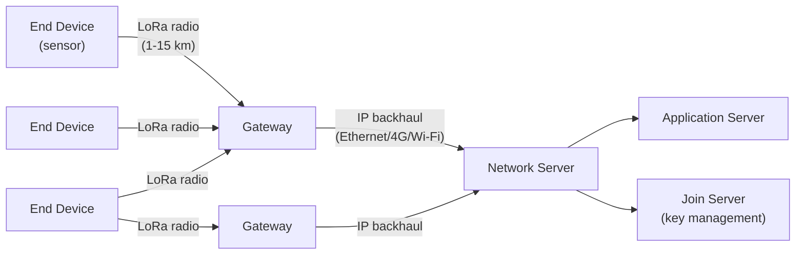
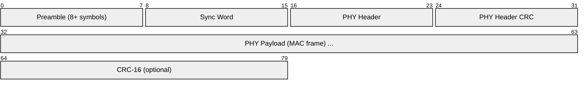
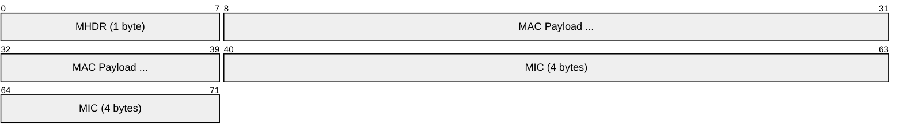
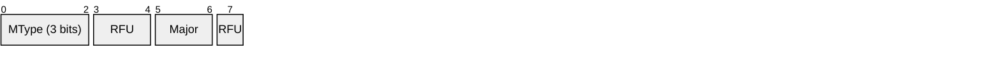
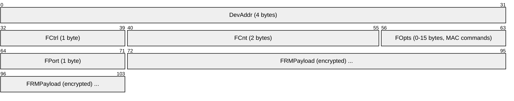
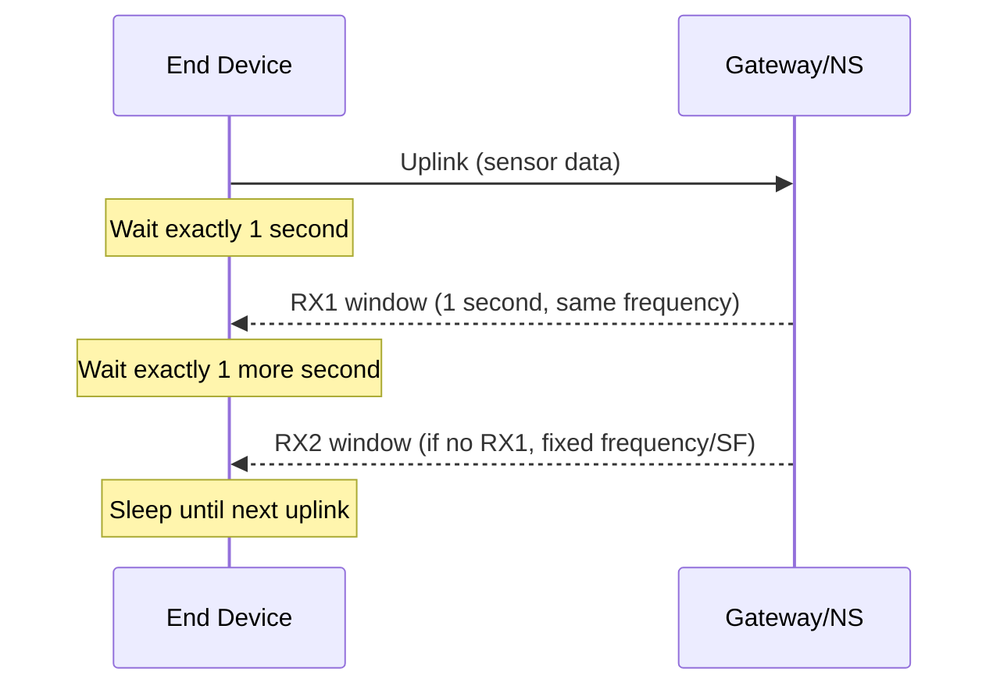
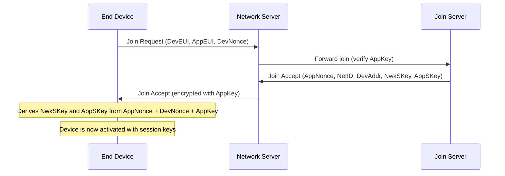

# LoRaWAN (Long Range Wide Area Network)

> **Standard:** [LoRaWAN Specification (lora-alliance.org)](https://lora-alliance.org/about-lorawan/) | **Layer:** Data Link / Network (Layers 2-3) | **Wireshark filter:** `lorawan`

LoRaWAN is a low-power wide-area network (LPWAN) protocol for connecting battery-powered IoT devices over distances of 2-15 km in urban areas and up to 50+ km in rural/line-of-sight conditions. It uses LoRa modulation (chirp spread spectrum) in sub-GHz ISM bands for extreme range at very low data rates (0.3-50 kbps). LoRaWAN is designed for sensors that send small amounts of data infrequently — smart meters, environmental monitoring, asset tracking, agriculture, and smart city applications.

## Architecture

| Component | Description |
|-----------|-------------|
| End Device | Sensor/actuator with LoRa radio (battery-powered) |
| Gateway | Receives LoRa packets, forwards to Network Server over IP |
| Network Server | Deduplication, routing, MAC commands, device management |
| Application Server | Application logic, data processing |
| Join Server | Manages device keys and join procedures (OTAA) |

LoRaWAN is **star-of-stars** — end devices communicate with any gateway in range, and all gateways forward to the central Network Server. There is no mesh routing.

## PHY Frame (LoRa Modulation)

### LoRa Radio Parameters

| Parameter | Value |
|-----------|-------|
| Modulation | CSS (Chirp Spread Spectrum) |
| Frequency (EU) | 868 MHz (EU868) |
| Frequency (US) | 915 MHz (US915) |
| Frequency (others) | AS923, AU915, IN865, KR920, etc. |
| Bandwidth | 125 kHz, 250 kHz, or 500 kHz |
| Spreading Factor | SF7-SF12 (higher = longer range, lower rate) |
| Data rate | 0.3 kbps (SF12) to 50 kbps (SF7) |
| Range (urban) | 2-5 km |
| Range (rural) | 10-15 km |
| Range (LOS) | 50+ km (world records >800 km) |
| Transmit power | 14-27 dBm (region dependent) |
| Sensitivity | -137 dBm (SF12, 125 kHz) |

### Spreading Factor Trade-off

| SF | Bit Rate (125 kHz BW) | Range | Air Time (10 bytes) | Battery Impact |
|----|----------------------|-------|---------------------|----------------|
| 7 | 5,470 bps | Shortest | 36 ms | Best |
| 8 | 3,125 bps | ↓ | 72 ms | ↓ |
| 9 | 1,760 bps | ↓ | 123 ms | ↓ |
| 10 | 980 bps | ↓ | 247 ms | ↓ |
| 11 | 440 bps | ↓ | 495 ms | ↓ |
| 12 | 250 bps | Longest | 991 ms | Worst |

The Network Server uses ADR (Adaptive Data Rate) to automatically select the optimal SF for each device.

## MAC Frame

### MHDR (MAC Header)

### Message Types (MType)

| MType | Name | Direction | Description |
|-------|------|-----------|-------------|
| 000 | Join Request | Up | OTAA join request |
| 001 | Join Accept | Down | OTAA join response |
| 010 | Unconfirmed Data Up | Up | Sensor data (no ack required) |
| 011 | Unconfirmed Data Down | Down | Command (no ack required) |
| 100 | Confirmed Data Up | Up | Sensor data (ack required) |
| 101 | Confirmed Data Down | Down | Command (ack required) |
| 110 | Rejoin Request | Up | Re-join for key refresh |

### Data Frame (MAC Payload)

| Field | Size | Description |
|-------|------|-------------|
| DevAddr | 4 bytes | Device address (network-assigned) |
| FCtrl | 1 byte | ADR, ACK, FPending, FOptsLen |
| FCnt | 2 bytes | Frame counter (anti-replay) |
| FOpts | 0-15 bytes | MAC commands (piggy-backed on data) |
| FPort | 1 byte | Application port (0 = MAC commands, 1-223 = app) |
| FRMPayload | Variable | Encrypted application data |

## Device Classes

| Class | Receive Windows | Latency | Power | Use Case |
|-------|----------------|---------|-------|----------|
| **A** (All) | 2 short windows after each uplink | High (must wait for uplink) | Lowest | Sensors, meters |
| **B** (Beacon) | Scheduled ping slots (beacon-synchronized) | Medium (~128s max) | Medium | Actuators needing periodic downlink |
| **C** (Continuous) | Always listening (except when transmitting) | Low (~seconds) | Highest | Mains-powered actuators, streetlights |

### Class A Receive Windows

## Security

LoRaWAN uses AES-128 encryption with two separate keys:

| Key | Name | Encrypts | Purpose |
|-----|------|----------|---------|
| NwkSKey | Network Session Key | MAC commands, MIC computation | Network integrity and routing |
| AppSKey | Application Session Key | FRMPayload | End-to-end application data encryption |

The Network Server sees MAC commands but **cannot read application data**. The Application Server can read data but cannot forge MAC commands.

### Activation Methods

| Method | Description |
|--------|-------------|
| OTAA (Over-The-Air Activation) | Device sends JoinRequest with DevEUI + AppKey; server returns session keys. **Recommended.** |
| ABP (Activation By Personalization) | Keys pre-provisioned on device. No join procedure. Less secure. |

### OTAA Join Flow

## Duty Cycle Limitations (EU868)

European regulations limit air time:

| Sub-band | Frequency | Max Duty Cycle | Effective |
|----------|-----------|---------------|-----------|
| g (default) | 868.1-868.5 MHz | 1% | ~36s/hour |
| g1 | 868.7-869.2 MHz | 0.1% | ~3.6s/hour |
| g2 | 869.4-869.65 MHz | 10% | ~360s/hour |

This limits how often a device can transmit — typically every few minutes to once per hour depending on payload size and SF.

## LoRaWAN vs Other LPWAN

| Feature | LoRaWAN | Sigfox | NB-IoT | LTE-M |
|---------|---------|--------|--------|-------|
| Spectrum | Unlicensed ISM | Unlicensed ISM | Licensed (cellular) | Licensed (cellular) |
| Range | 2-15 km | 3-50 km | 1-10 km | 1-10 km |
| Data rate | 0.3-50 kbps | 100-600 bps | 250 kbps | 1 Mbps |
| Payload | 51-222 bytes | 12 bytes up, 8 down | 1600 bytes | 1600 bytes |
| Power | Very low | Very low | Low | Low-medium |
| Bidirectional | Yes (class A/B/C) | Limited (4 DL/day) | Yes | Yes |
| Private network | Yes (own gateways) | No (operator only) | No (operator only) | No |
| Cost per device | Low (commodity radio) | Low | Medium (cellular modem) | Medium |

## Standards

| Document | Title |
|----------|-------|
| [LoRaWAN 1.0.4](https://lora-alliance.org/resource_hub/lorawan-104-specification-package/) | LoRaWAN L2 specification |
| [LoRaWAN 1.1](https://lora-alliance.org/resource_hub/lorawan-specification-v1-1/) | LoRaWAN 1.1 (roaming, key management improvements) |
| [Regional Parameters](https://lora-alliance.org/resource_hub/rp002-1-0-4-regional-parameters/) | Regional radio parameters (EU868, US915, etc.) |
| [Semtech LoRa](https://www.semtech.com/lora) | LoRa PHY modulation (proprietary to Semtech) |

## See Also

- [6LoWPAN](6lowpan.md) — IPv6 adaptation for constrained networks (Thread uses it, LoRaWAN does not)
- [Zigbee](zigbee.md) — short-range mesh alternative
- [Thread](thread.md) — IP-based mesh for smart home
- [MQTT](../messaging/mqtt.md) — common application protocol for LoRaWAN payloads
- [CoAP](../web/coap.md) — lightweight REST for constrained devices
