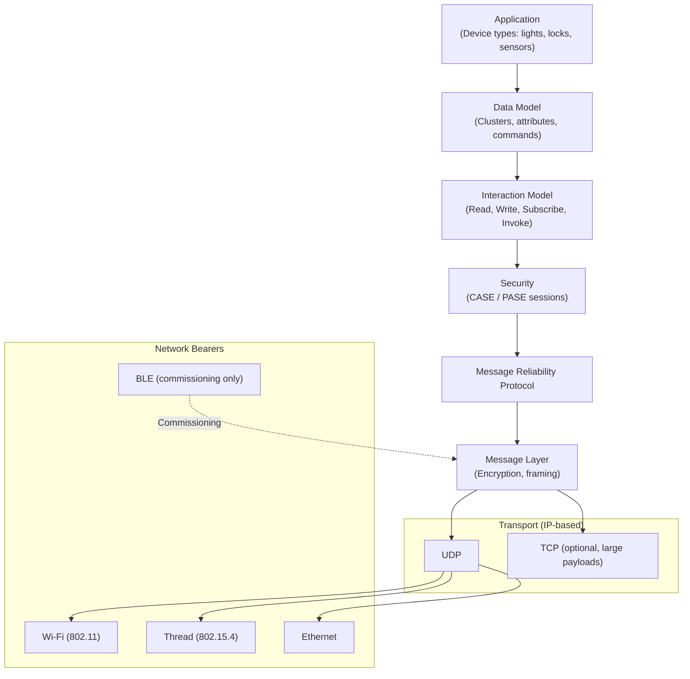
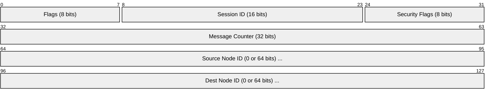
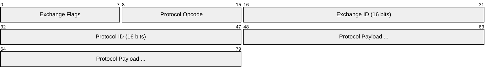
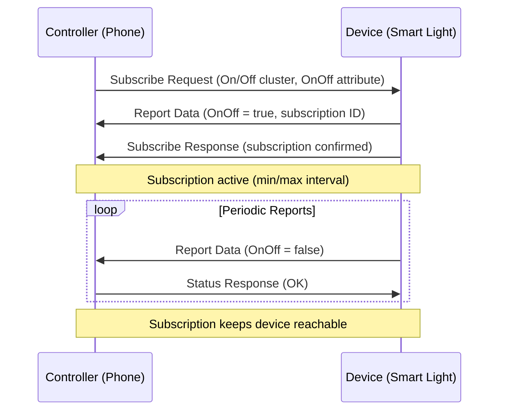
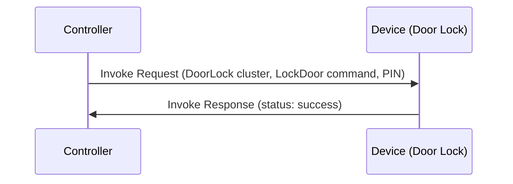
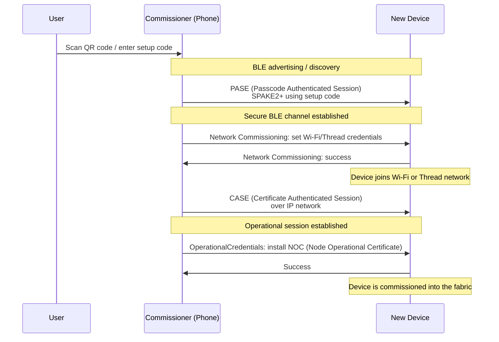
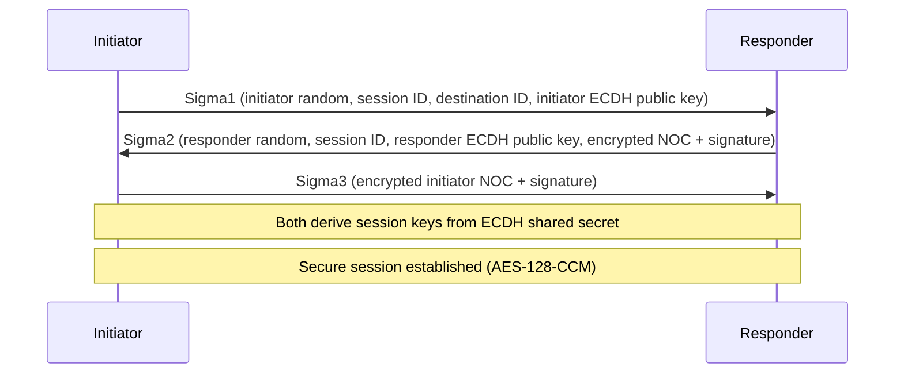
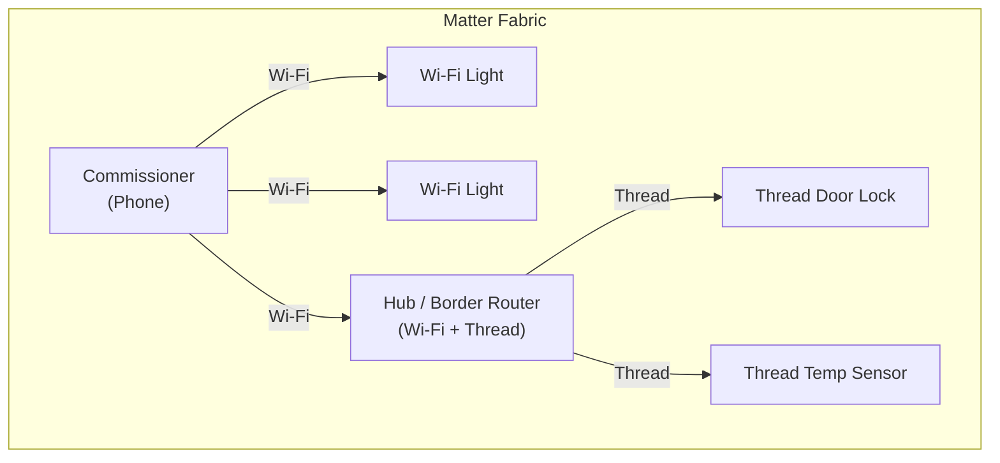

# Matter

> **Standard:** [CSA Matter Specification](https://csa-iot.org/all-solutions/matter/) | **Layer:** Application (Layer 7, runs over IP) | **Wireshark filter:** `matter` (limited; Matter traffic is encrypted)

Matter (formerly Project CHIP — Connected Home over IP) is an open-source, royalty-free smart home interoperability standard developed by the Connectivity Standards Alliance (CSA, formerly Zigbee Alliance) with backing from Apple, Google, Amazon, and Samsung. Matter provides a unified application layer that runs over existing IP networks — Wi-Fi, Thread (802.15.4), and Ethernet — with BLE used for device commissioning. Any Matter-certified device from any manufacturer works with any Matter-certified controller, solving the fragmentation problem that plagued Zigbee, Z-Wave, and proprietary ecosystems.

## Protocol Stack

## Matter Message Frame

All Matter messages share a common framing structure. Messages are encrypted after session establishment.

### Message Header

### Protocol Header (inside encrypted payload)

## Key Fields

| Field | Size | Description |
|-------|------|-------------|
| Flags | 8 bits | Version (4 bits), source/dest node ID presence flags |
| Session ID | 16 bits | Identifies the secure session (CASE or PASE) |
| Security Flags | 8 bits | Session type, privacy flag, message extensions |
| Message Counter | 32 bits | Anti-replay counter, incremented per message |
| Source Node ID | 0 or 64 bits | Sender's operational node ID (omitted in group messages) |
| Dest Node ID | 0 or 64 bits | Recipient's node ID or group ID |
| Exchange Flags | 8 bits | Initiator flag, acknowledgment requested, reliability flags |
| Protocol Opcode | 8 bits | Operation within the protocol (Read, Write, Report, etc.) |
| Exchange ID | 16 bits | Correlates request-response pairs |
| Protocol ID | 16 bits | Identifies the protocol (Interaction Model, BDX, etc.) |

### Message Security Flags

| Bit | Name | Description |
|-----|------|-------------|
| 0-1 | Session Type | 0 = Unicast, 1 = Group |
| 2 | Privacy | Message header is encrypted (Thread privacy) |
| 3-7 | Reserved | Must be zero |

## Interaction Model

The Interaction Model defines how controllers (clients) communicate with devices (servers):

| Action | Direction | Description |
|--------|-----------|-------------|
| Read | Client -> Server | Read one or more attribute values |
| Write | Client -> Server | Set attribute values on the device |
| Subscribe | Client -> Server | Register for periodic attribute reports |
| Invoke | Client -> Server | Execute a command (e.g., toggle, lock) |
| Report | Server -> Client | Deliver attribute data (response to Read or subscription update) |

### Interaction Flow — Subscribe

### Interaction Flow — Invoke (Command)

## Data Model — Clusters

Matter uses a cluster-based data model inherited from Zigbee's ZCL. Each device type is composed of required and optional clusters:

### Common Clusters

| Cluster | ID | Description |
|---------|-----|-------------|
| On/Off | 0x0006 | Binary switch (on, off, toggle) |
| Level Control | 0x0008 | Brightness, volume, or other continuous control |
| Color Control | 0x0300 | Hue, saturation, color temperature |
| Temperature Measurement | 0x0402 | Temperature sensor readings |
| Humidity Measurement | 0x0405 | Relative humidity |
| Occupancy Sensing | 0x0406 | Motion / presence detection |
| Door Lock | 0x0101 | Lock, unlock, set PIN codes |
| Thermostat | 0x0201 | HVAC setpoint and mode control |
| Fan Control | 0x0202 | Fan speed and mode |
| Window Covering | 0x0102 | Blinds, shades, shutters |
| Descriptor | 0x001D | Lists endpoints, device types, clusters on a node |
| Basic Information | 0x0028 | Vendor, product, serial number, software version |
| OTA Software Update | 0x002A | Over-the-air firmware updates |
| Network Commissioning | 0x0031 | Wi-Fi/Thread network joining |

### Device Types

| Device Type | ID | Required Clusters |
|-------------|-----|-------------------|
| On/Off Light | 0x0100 | On/Off, Level Control |
| Dimmable Light | 0x0101 | On/Off, Level Control |
| Color Temperature Light | 0x010C | On/Off, Level Control, Color Control |
| Contact Sensor | 0x0015 | Boolean State |
| Temperature Sensor | 0x0302 | Temperature Measurement |
| Door Lock | 0x000A | Door Lock |
| Thermostat | 0x0301 | Thermostat |
| Window Covering | 0x0202 | Window Covering |

## Commissioning

Commissioning is the process of adding a new device to a Matter fabric. BLE is used for the initial secure channel when the device has no network:

### Setup Payload

Devices carry a setup code (printed or in QR code) containing:

| Field | Size | Description |
|-------|------|-------------|
| Version | 3 bits | Payload version |
| Vendor ID | 16 bits | Manufacturer identifier |
| Product ID | 16 bits | Product identifier |
| Custom Flow | 2 bits | Commissioning flow (0 = standard, 1 = user-intent, 2 = custom) |
| Discovery Capabilities | 8 bits | BLE, Wi-Fi SoftAP, On-network |
| Discriminator | 12 bits | Distinguishes devices of the same type |
| Passcode | 27 bits | SPAKE2+ PIN (000000-99999999, excluding reserved values) |

## Security

| Mechanism | Protocol | Description |
|-----------|----------|-------------|
| PASE | SPAKE2+ | Passcode-based session during commissioning (setup code) |
| CASE | Sigma (3-pass) | Certificate-based session for operational communication |
| Encryption | AES-128-CCM | All messages encrypted after session establishment |
| Message Integrity | AES-128-CCM | Authentication tag on every message |
| Anti-Replay | Message Counter | Monotonically increasing counter per session |
| Node Certificates | X.509 (NOC) | Each node receives a Node Operational Certificate from the fabric CA |
| Group Security | Group Key (epoch keys) | Multicast messages use shared symmetric keys |

### CASE Session Establishment

### Multi-Admin (Multi-Fabric)

A single Matter device can be commissioned into multiple fabrics simultaneously — for example, both Apple Home and Google Home can control the same light. Each fabric has its own certificate authority and operational credentials.

## Network Topology

## Matter vs Zigbee vs Z-Wave

| Feature | Matter | Zigbee | Z-Wave |
|---------|--------|--------|--------|
| Transport | IP (Wi-Fi, Thread, Ethernet) | IEEE 802.15.4 | ITU-T G.9959 (sub-GHz) |
| Network layer | IPv6 | Zigbee NWK | Z-Wave NWK |
| Application model | Clusters (ZCL-derived) | ZCL clusters | Z-Wave command classes |
| Encryption | AES-128-CCM per session | AES-128 network/link key | S2 (AES-128-CCM) |
| Max nodes | Fabric-dependent (1000s) | 65,000 | 232 |
| Multi-vendor | Yes (by design) | Partial | Partial |
| Multi-ecosystem | Yes (multi-admin) | No | No |
| Commissioning | BLE + QR code | Install codes | SmartStart QR |
| IP-based | Yes | No | No |
| Mesh support | Via Thread | Built-in | Built-in |

## Standards

| Document | Title |
|----------|-------|
| [Matter 1.0 Specification](https://csa-iot.org/all-solutions/matter/) | Core Specification (CSA members, public summary available) |
| [Matter 1.3 Specification](https://csa-iot.org/all-solutions/matter/) | Latest release with energy management, EV charging |
| [connectedhomeip (GitHub)](https://github.com/project-chip/connectedhomeip) | Open-source Matter SDK |
| [Thread 1.3](https://www.threadgroup.org/What-is-Thread) | IPv6 mesh networking for Matter |
| [RFC 9202](https://www.rfc-editor.org/rfc/rfc9202) | DTLS/TLS Profiles for the Internet of Things |

## See Also

- [Zigbee](zigbee.md) — predecessor, Matter's cluster model is derived from Zigbee ZCL
- [BLE](ble.md) — used for Matter device commissioning
- [NFC](nfc.md) — alternative commissioning path (NFC tag with setup payload)
- [Bluetooth](bluetooth.md) — BLE transport for commissioning phase
