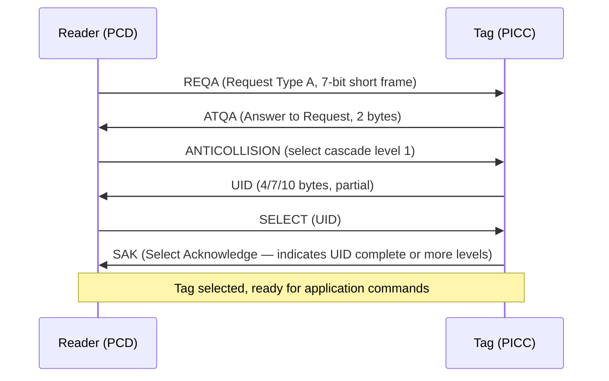
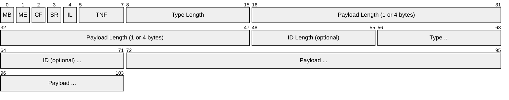
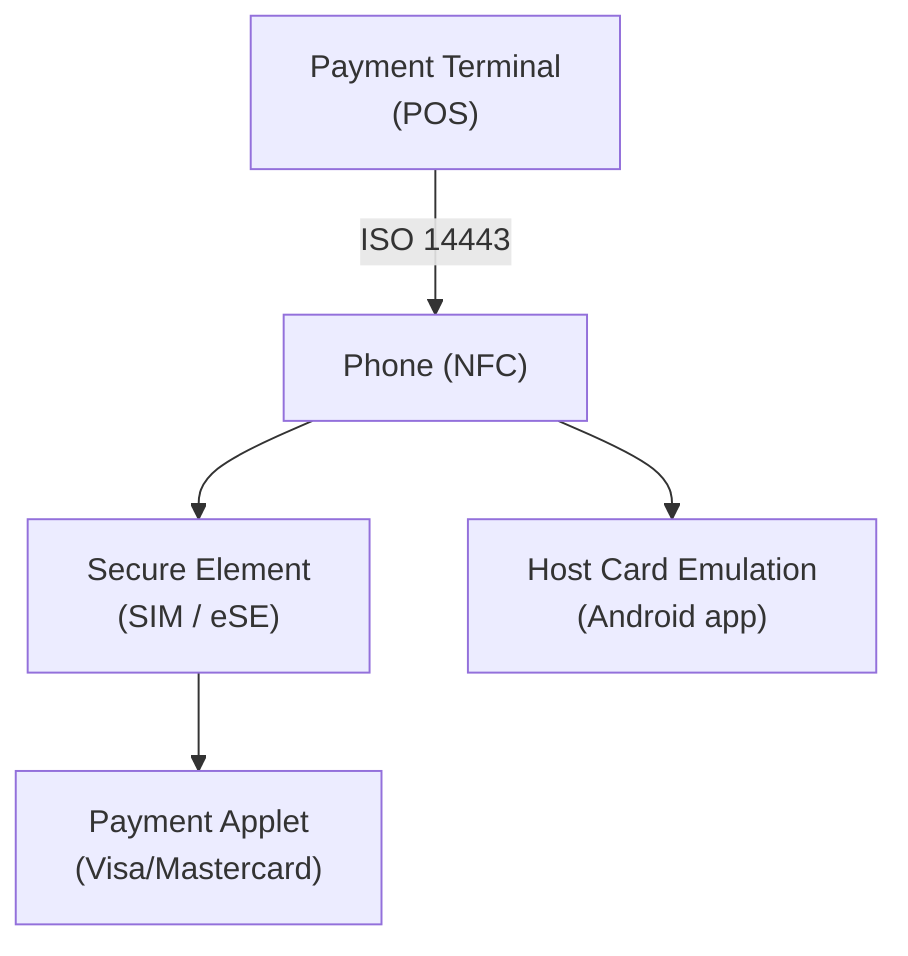

# NFC (Near Field Communication)

> **Standard:** [ISO/IEC 18092 (NFCIP-1)](https://www.iso.org/standard/56692.html) / [NFC Forum Specifications](https://nfc-forum.org/build/specifications) | **Layer:** Physical / Data Link | **Wireshark filter:** N/A (specialized NFC capture hardware)

NFC is a set of short-range wireless protocols operating at 13.56 MHz for communication between devices within approximately 4 cm. It evolved from RFID technology and enables contactless payments (Apple Pay, Google Pay), transit cards, access badges, Bluetooth/Wi-Fi pairing, and data exchange between phones. NFC supports three modes: reader/writer (tag reading), peer-to-peer (device-to-device), and card emulation (phone acts as a contactless card).

## Operating Modes

| Mode | Description | Typical Use |
|------|-------------|-------------|
| Reader/Writer | Active device reads/writes a passive NFC tag | Reading product info, smart posters, Amiibo |
| Peer-to-Peer | Two active devices exchange data | Android Beam (deprecated), handover to Bluetooth/Wi-Fi |
| Card Emulation | Device emulates a contactless smart card | Mobile payments, transit cards, access badges |

## Radio Parameters

| Parameter | Value |
|-----------|-------|
| Frequency | 13.56 MHz (ISM band) |
| Range | ≤ 4 cm (practical), 10 cm (theoretical) |
| Data rates | 106, 212, 424, 848 kbps |
| Modulation | ASK (Type A), Load modulation (Type B, Type F) |
| Coupling | Inductive (magnetic field) |
| Power | Passive tags powered by the reader's RF field |
| Duplex | Half-duplex |

## NFC Communication Types

| Type | Standard | Modulation | Rate | Origin |
|------|----------|-----------|------|--------|
| NFC-A | ISO 14443A | Modified Miller / Manchester | 106 kbps | Philips (NXP) MIFARE |
| NFC-B | ISO 14443B | NRZ / BPSK | 106 kbps | Various manufacturers |
| NFC-F | JIS X 6319-4 (FeliCa) | Manchester | 212/424 kbps | Sony FeliCa |
| NFC-V | ISO 15693 | ASK / FSK | 26.48 kbps | Vicinity cards |

## NFC-A (ISO 14443A) Anti-Collision

## NFC Tag Types (NFC Forum)

| Type | Standard | Memory | Data Rate | Examples |
|------|----------|--------|-----------|---------|
| Type 1 | ISO 14443A (Topaz) | 96-2048 bytes | 106 kbps | Broadcom Topaz |
| Type 2 | ISO 14443A | 48-2048 bytes | 106 kbps | NXP NTAG213/215/216 |
| Type 3 | JIS X 6319-4 (FeliCa) | Variable | 212/424 kbps | Sony FeliCa Lite |
| Type 4 | ISO 14443A/B | Up to 32 KB | 106-424 kbps | NXP DESFire |
| Type 5 | ISO 15693 | Variable | 26.48 kbps | NXP ICODE SLIX |

## NDEF (NFC Data Exchange Format)

NDEF is the standard message format for NFC data exchange. An NDEF message contains one or more records:

### NDEF Record

| Field | Description |
|-------|-------------|
| MB | Message Begin — first record in the message |
| ME | Message End — last record in the message |
| CF | Chunk Flag — payload is chunked |
| SR | Short Record — payload length is 1 byte (≤ 255) |
| IL | ID Length present |
| TNF | Type Name Format (3 bits) |

### Type Name Format (TNF)

| TNF | Name | Description |
|-----|------|-------------|
| 0x00 | Empty | Empty record |
| 0x01 | NFC Forum well-known type | URI, Text, Smart Poster, etc. |
| 0x02 | Media type (RFC 2046) | MIME type (e.g., `image/png`) |
| 0x03 | Absolute URI | URI as the type |
| 0x04 | NFC Forum external type | Custom types (`example.com:myapp`) |
| 0x05 | Unknown | Payload type unknown |

### Common Well-Known Types

| Type | Record Type | Description |
|------|-------------|-------------|
| `U` | URI | URL — web address, phone number, email |
| `T` | Text | Human-readable text with language code |
| `Sp` | Smart Poster | URI + title + icon + action |
| `Hc` | Handover Carrier | Bluetooth/Wi-Fi handover parameters |
| `Hr` | Handover Request | Request for connection handover |
| `Hs` | Handover Select | Selected handover method |
| `ac` | Alternative Carrier | Carrier description for handover |

### URI Identifier Codes

The URI record compresses common prefixes:

| Code | Prefix |
|------|--------|
| 0x01 | `http://www.` |
| 0x02 | `https://www.` |
| 0x03 | `http://` |
| 0x04 | `https://` |
| 0x05 | `tel:` |
| 0x06 | `mailto:` |

## Card Emulation (Payments)

Mobile payments use Host Card Emulation (HCE) or Secure Element (SE):

Payment cards use ISO 7816-4 APDU commands over the contactless interface, following EMV contactless specifications.

## Standards

| Document | Title |
|----------|-------|
| [ISO/IEC 18092](https://www.iso.org/standard/56692.html) | NFC Interface and Protocol (NFCIP-1) |
| [ISO/IEC 14443](https://www.iso.org/standard/73598.html) | Contactless Smart Cards (Type A and B) |
| [ISO/IEC 15693](https://www.iso.org/standard/73602.html) | Vicinity Cards |
| [NFC Forum NDEF](https://nfc-forum.org/build/specifications) | NFC Data Exchange Format |
| [NFC Forum Tag Types](https://nfc-forum.org/build/specifications) | Tag Type Technical Specifications |
| [EMV Contactless](https://www.emvco.com/) | EMV Contactless payment specifications |

## See Also

- [Bluetooth](bluetooth.md) — NFC often used to initiate Bluetooth pairing
- [I2C](../bus/i2c.md) — NFC controller ICs connect to host MCU via I2C/SPI
