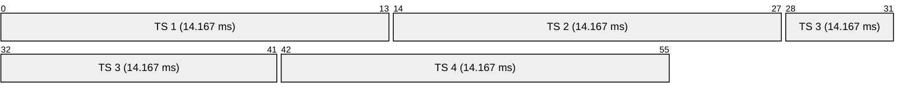
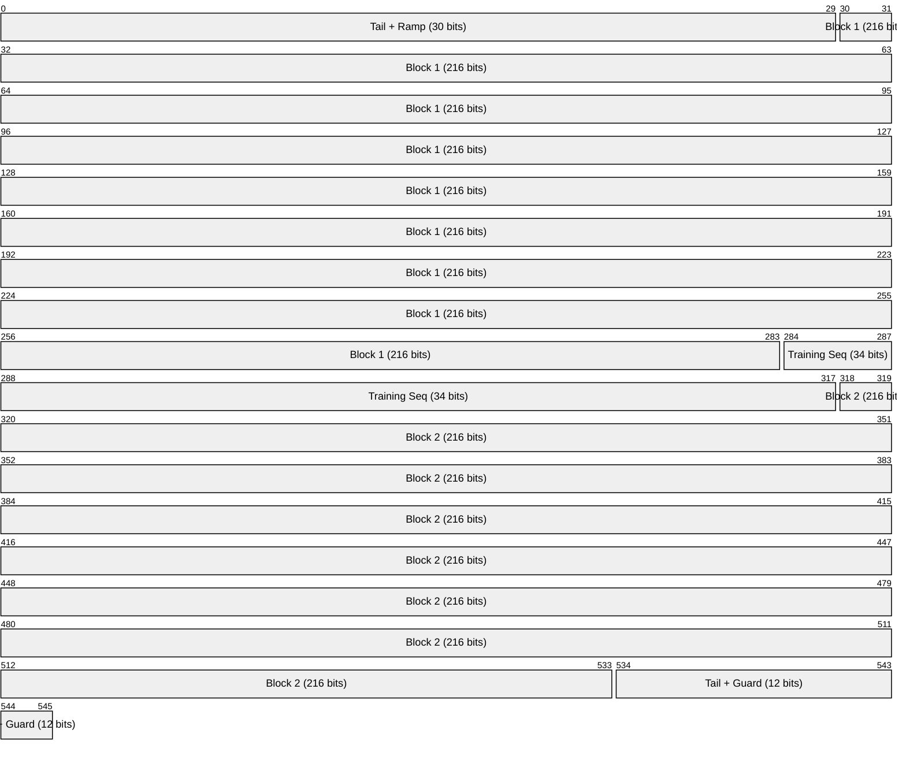
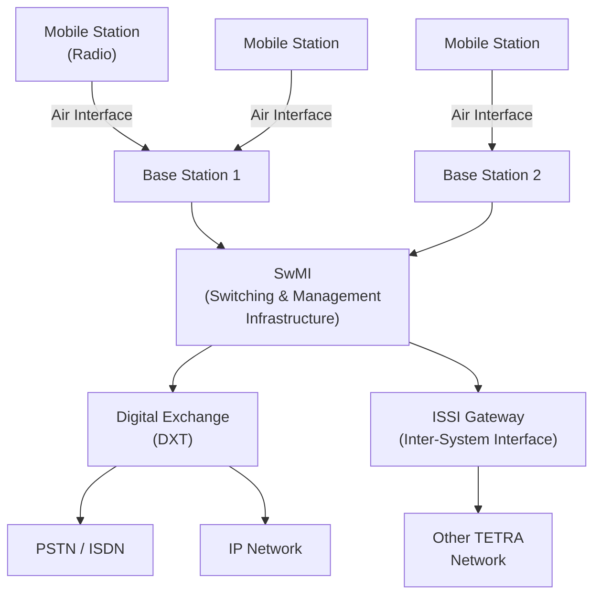
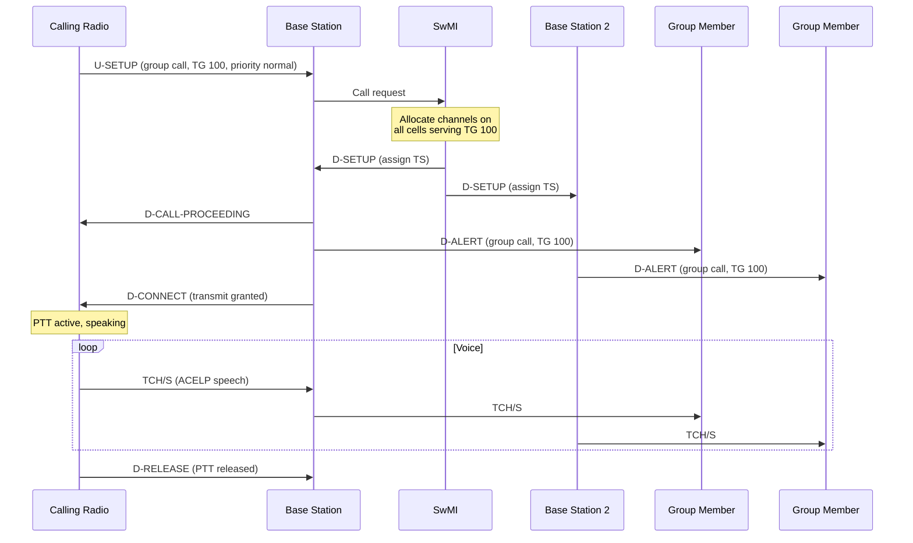
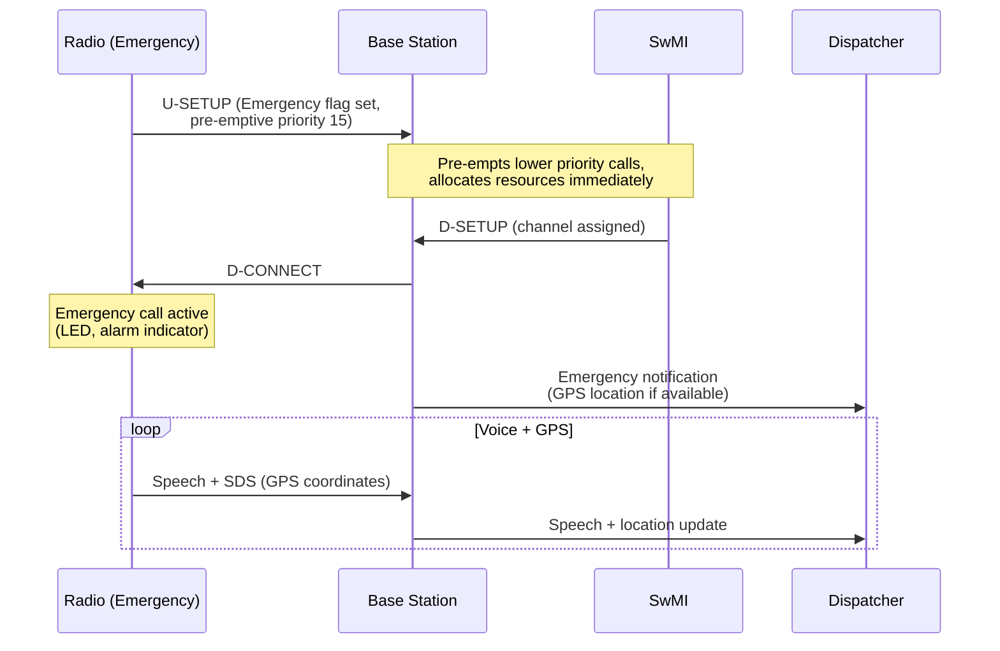

# TETRA (Terrestrial Trunked Radio)

> **Standard:** [ETSI EN 300 392 series](https://www.etsi.org/technologies/tetra) | **Layer:** Full stack (Physical through Application) | **Wireshark filter:** `tetra`

TETRA is a digital trunked radio standard developed by ETSI, designed primarily for public safety and emergency services (police, fire, ambulance), as well as transport, utilities, and military. It provides group calls, individual calls, direct mode operation (without infrastructure), emergency pre-emptive calling, short data messaging, and encryption -- capabilities essential for mission-critical communications. TETRA uses TDMA with 4 time slots per 25 kHz carrier, and is deployed in over 130 countries. It is the dominant PMR technology for European emergency services and is widely used in Asia, the Middle East, and Africa.

## TDMA Frame Structure

TETRA divides a 25 kHz carrier into 4 time slots, each 14.167 ms, within a 56.67 ms TDMA frame:

### Multiframe Structure

| Level | Composition | Duration |
|-------|-------------|----------|
| Time Slot | 1 of 4 per frame | 14.167 ms |
| TDMA Frame | 4 time slots | 56.67 ms |
| Multiframe | 18 TDMA frames | 1.02 s |
| Hyperframe | 60 multiframes | 61.2 s |

Frame 18 of each multiframe is used for control signaling (AACH, STCH, SCH), while frames 1-17 carry traffic and control.

## Modulation and RF

| Parameter | Value |
|-----------|-------|
| Modulation | pi/4-DQPSK |
| Symbol rate | 18,000 symbols/s |
| Bit rate | 36,000 bps per carrier |
| Bit rate per slot | 9,000 bps per time slot (gross) |
| Channel spacing | 25 kHz |
| Frequency bands | 380-400 MHz (emergency), 410-430 MHz, 450-470 MHz, 870-876 / 915-921 MHz |

## Burst Structure

Each time slot contains a burst of 510 bits:

| Field | Size | Description |
|-------|------|-------------|
| Tail + Ramp-up | 30 bits | Power ramp-up and known bits for synchronization |
| Block 1 | 216 bits | First half of coded data (speech, data, or signaling) |
| Training Sequence | 34 bits | Channel estimation and synchronization |
| Block 2 | 216 bits | Second half of coded data |
| Tail + Guard | 12 bits | Ramp-down and guard time between slots |

## Logical Channels

### Traffic Channels

| Channel | Description |
|---------|-------------|
| TCH/S | Speech traffic channel (full rate, 7.2 kbps net) |
| TCH/7.2 | Unprotected data channel (7.2 kbps) |
| TCH/4.8 | Low-protection data channel (4.8 kbps net) |
| TCH/2.4 | High-protection data channel (2.4 kbps net) |
| TCH/S+D | Speech + low-rate data multiplexed |

### Control Channels

| Channel | Description |
|---------|-------------|
| BCCH | Broadcast Control Channel -- system information, frequencies, LA |
| BNCH | Broadcast Network Channel -- neighbor cell information |
| SCH/F | Signaling Channel Full -- call setup, registration, mobility |
| SCH/H | Signaling Channel Half -- shared signaling |
| STCH | Stealing Channel -- urgent signaling stealing a traffic slot |
| AACH | Access Assignment Channel -- slot usage indicator (per frame) |
| BSCH | Broadcast Synchronization Channel -- time sync, color code |

## Voice Codec

| Parameter | Value |
|-----------|-------|
| Codec | ACELP (Algebraic Code-Excited Linear Prediction) |
| Bit rate | 4,567 bps (net speech) |
| FEC overhead | Results in 7,200 bps gross |
| Frame duration | 30 ms (speech), 4 frames per 120 ms |
| Audio bandwidth | ~300-3400 Hz |

TETRA speech quality is generally rated as equivalent to or slightly below GSM, but is optimized for intelligibility in noisy environments.

## Trunking Architecture

TETRA uses automatic trunking managed by the SwMI (Switching and Management Infrastructure):

The SwMI automatically assigns free channels on demand -- users do not select frequencies manually. This is the core trunking advantage: a pool of channels serves a large number of users efficiently.

## Services

### Call Types

| Service | Description |
|---------|-------------|
| Group Call | One-to-many push-to-talk within a talkgroup |
| Individual Call | Private one-to-one call (half or full duplex) |
| Broadcast Call | One-to-all announcement (no response) |
| Emergency Call | Pre-emptive priority call -- overrides all other traffic |
| Ambience Listening | Covert remote activation of microphone |
| Include Call | Adding a party to an ongoing group call |

### Data Services

| Service | Description |
|---------|-------------|
| SDS (Short Data Service) | Up to 2047 bits per message (similar to SMS) |
| SDS-TL | Transport layer SDS with delivery confirmation |
| Status Messages | Pre-coded 16-bit status values (e.g., "on scene", "available") |
| IP Packet Data | Multi-slot packet data for IP connectivity |
| WAP | Wireless application browsing (legacy) |

## Group Call Setup

## Emergency Call

Emergency calls have the highest priority (level 15) and will pre-empt any ongoing non-emergency call. Pressing the emergency button also typically enables GPS reporting and ambient listening.

## Direct Mode Operation (DMO)

DMO allows TETRA radios to communicate directly without infrastructure, essential when out of coverage:

| Feature | Description |
|---------|-------------|
| MS-MS Direct | Radio to radio on a pre-assigned DMO frequency |
| DMO Repeater | A radio acting as a simplex repeater to extend range |
| DMO Gateway | A radio bridging DMO and trunked mode (infrastructure relay) |
| Communication range | Typically 1-5 km (handheld), up to 15 km (mobile/vehicular) |

## Encryption

| Algorithm | Designation | Description |
|-----------|-------------|-------------|
| TEA1 | TETRA Encryption Algorithm 1 | Export-grade, for commercial use |
| TEA2 | TETRA Encryption Algorithm 2 | European public safety (restricted distribution) |
| TEA3 | TETRA Encryption Algorithm 3 | Non-European public safety |
| TEA4-TEA7 | Reserved | Future algorithms |
| E2EE | End-to-End Encryption | Additional layer over air interface encryption |

Note: TEA1 was found to have a deliberate weakness (reduced key space) that was disclosed in 2023. TEA2 remains considered secure for its intended use.

### Security Layers

| Layer | Function |
|-------|----------|
| Authentication | Mutual authentication between MS and SwMI (challenge-response) |
| Air Interface Encryption | TEA1/2/3 encrypt traffic on the radio link |
| End-to-End Encryption | Optional AES-256 or national algorithms from terminal to terminal |
| Enable/Disable | Remote kill/stun of stolen radios |
| OTAR | Over-the-Air Rekeying for key management |

## TETRA Enhanced Data Service (TEDS)

TEDS extends TETRA with wider bandwidth channels and higher-order modulation:

| Channel Width | Modulation Options | Peak Data Rate |
|--------------|-------------------|---------------|
| 25 kHz | pi/4-DQPSK, pi/8-D8PSK, 4-QAM, 16-QAM, 64-QAM | Up to 115 kbps |
| 50 kHz | Same | Up to 230 kbps |
| 100 kHz | Same | Up to 461 kbps |
| 150 kHz | Same | Up to 691 kbps |

## ISSI (Inter-System Interface)

ISSI connects separate TETRA networks (e.g., police and fire departments on different systems) to enable cross-network group calls and individual calls. It uses IP-based signaling and voice transport between SwMI nodes.

## Standards

| Document | Title |
|----------|-------|
| [ETSI EN 300 392-1](https://www.etsi.org/technologies/tetra) | General network design |
| [ETSI EN 300 392-2](https://www.etsi.org/technologies/tetra) | Air Interface (AI) |
| [ETSI EN 300 392-3](https://www.etsi.org/technologies/tetra) | Interworking at the ISI |
| [ETSI EN 300 392-7](https://www.etsi.org/technologies/tetra) | Security |
| [ETSI EN 300 392-12](https://www.etsi.org/technologies/tetra) | Supplementary services |
| [ETSI EN 300 396-3](https://www.etsi.org/technologies/tetra) | Direct Mode Operation (DMO) |
| [ETSI TS 100 392-18](https://www.etsi.org/technologies/tetra) | Air interface optimized codec (ACELP) |
| [ETSI EN 300 394-1](https://www.etsi.org/technologies/tetra) | TETRA Enhanced Data Service (TEDS) |

## See Also

- [DMR](dmr.md) -- 2-slot TDMA digital radio (simpler, lower cost)
- [Bluetooth](bluetooth.md) -- short-range wireless for comparison
- [GSM](../telecom/gsm.md) -- cellular network architecture comparison
