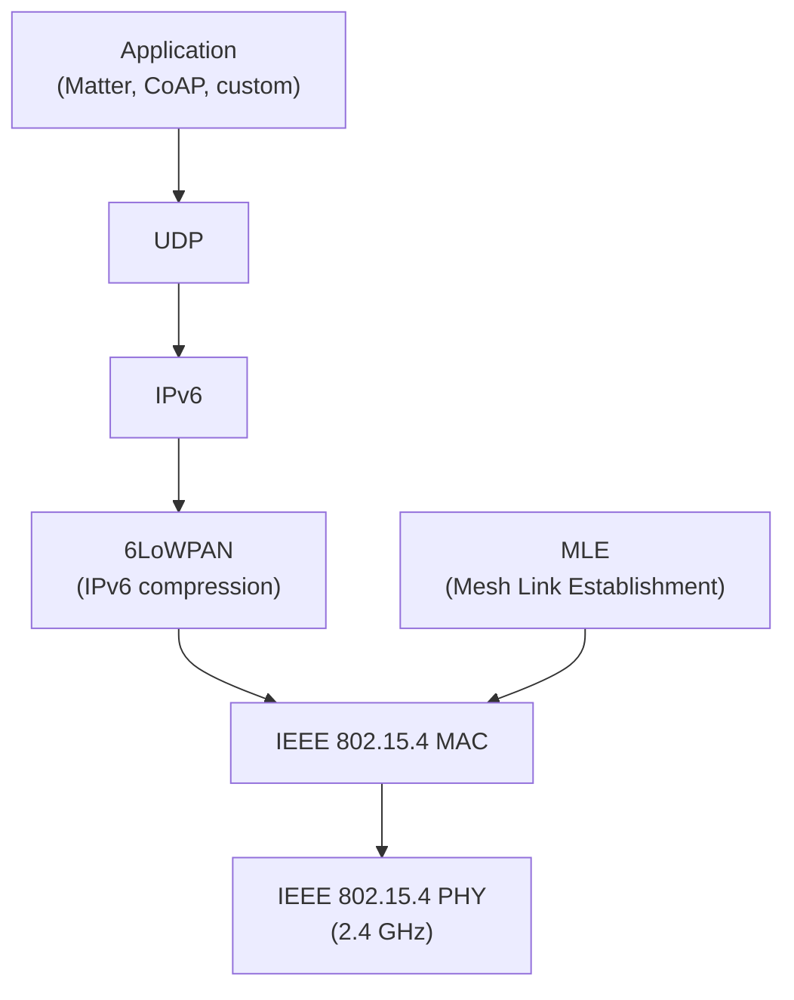
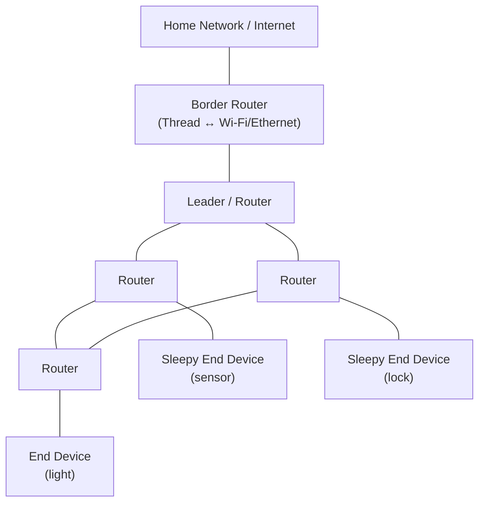
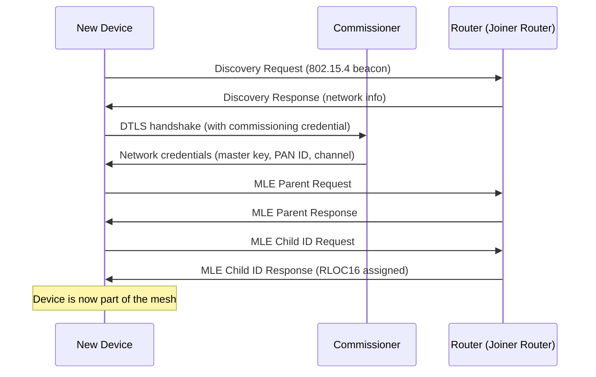
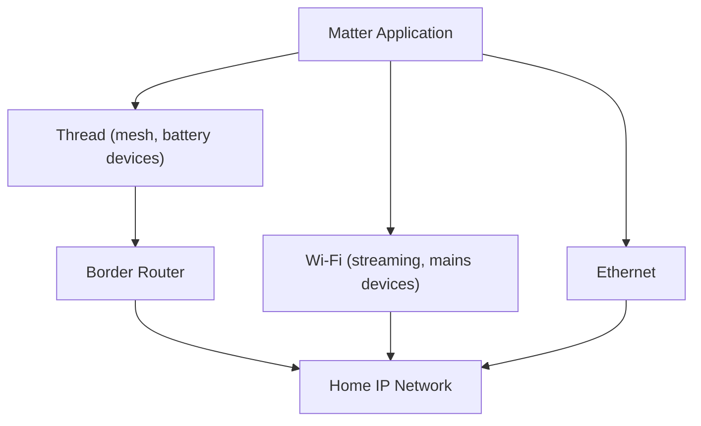

# Thread

> **Standard:** [Thread Specification (threadgroup.org)](https://www.threadgroup.org/What-is-Thread) | **Layer:** Network / Mesh (Layers 2-3) | **Wireshark filter:** `wpan` or `6lowpan` or `mle`

Thread is an IPv6-based mesh networking protocol for IoT and smart home devices. Built on IEEE 802.15.4 (same radio as Zigbee) with 6LoWPAN for IPv6 adaptation, Thread provides a reliable, self-healing mesh network where every device has a standard IPv6 address — no proprietary gateways or application-layer translation needed. Thread is the mesh transport for **Matter** (the unified smart home standard backed by Apple, Google, Amazon, and Samsung).

## Protocol Stack

Unlike Zigbee (which uses a proprietary network layer), Thread uses standard IPv6/UDP end-to-end. Any IPv6 application protocol (CoAP, DTLS, DNS, mDNS) works natively.

## Key Concepts

| Concept | Description |
|---------|-------------|
| **IP-native** | Every Thread device has a routable IPv6 address — no gateway translation |
| **Mesh** | Self-healing mesh; devices route for each other automatically |
| **No single point of failure** | Leader role migrates; any router can become leader |
| **Border Router** | Bridges Thread mesh to Wi-Fi/Ethernet (home network + Internet) |
| **Low power** | Sleepy End Devices wake periodically; battery life measured in years |
| **Matter** | The smart home standard that runs over Thread (and Wi-Fi) |

## Device Roles

| Role | Description | Power | Routes |
|------|-------------|-------|--------|
| Leader | Manages router IDs, partition, network data | Mains | Yes |
| Router | Forwards messages, keeps neighbor table | Mains | Yes |
| REED (Router-Eligible End Device) | Can become a router if needed | Mains | No (until promoted) |
| SED (Sleepy End Device) | Sleeps, polls parent for messages | Battery | No |
| SSED (Synchronized Sleepy) | Tighter sync with parent for lower latency | Battery | No |
| MED (Minimal End Device) | Always-on end device, doesn't route | Mains | No |
| Border Router | Connects Thread mesh to external IP networks | Mains | Yes + bridge |

### Network Topology

The mesh self-heals — if R1 fails, R3 finds an alternate route through R2 or Leader.

## Radio Parameters

| Parameter | Value |
|-----------|-------|
| Radio | IEEE 802.15.4 |
| Frequency | 2.4 GHz (channels 11-26) |
| Data rate | 250 kbps |
| Modulation | O-QPSK with DSSS |
| Range | 10-30m indoor per hop |
| Max hops | ~32 (practical mesh depth) |
| Max devices | 250+ routers, thousands of end devices (per partition) |
| Channel | Single channel per network |

## Addressing

Thread devices have multiple IPv6 addresses:

| Address Type | Scope | Example | Description |
|-------------|-------|---------|-------------|
| Link-Local | Link | `fe80::...` | Auto-generated from MAC, single-hop only |
| Mesh-Local (RLOC) | Mesh | `fd00::ff:fe00:RLOC16` | Routing Locator — changes with topology |
| Mesh-Local (ML-EID) | Mesh | `fd00::random` | Stable mesh-local endpoint ID |
| Global Unicast | Global | `2001:db8::...` | Internet-routable (via Border Router, SLAAC or DHCPv6) |

### RLOC16 (Routing Locator)

The RLOC16 encodes the device's position in the mesh hierarchy — which router it's attached to and its child index.

## Mesh Link Establishment (MLE)

MLE is Thread's protocol for forming and maintaining mesh links:

| Message | Description |
|---------|-------------|
| Link Request | Request to form a link with a neighbor |
| Link Accept | Accept a link request |
| Link Accept and Request | Accept + request in one message |
| Advertisement | Periodic broadcast of routing info |
| Parent Request | End device looking for a parent router |
| Parent Response | Router offering to be a parent |
| Child ID Request | End device requesting attachment |
| Child ID Response | Router assigns a child ID |
| Data Request | Sleepy device polls for pending messages |
| Data Response | Router delivers buffered messages |

### Joining a Thread Network

## Security

| Layer | Mechanism |
|-------|-----------|
| 802.15.4 MAC | AES-128-CCM (per-link encryption, network-wide key) |
| MLE | AES-128-CCM (mesh key) |
| Application | DTLS 1.2 (per-session encryption, e.g., for Matter/CoAP) |
| Commissioning | DTLS with JPAKE (password-authenticated key exchange) |

### Thread Network Key

All devices in a Thread network share a **Network Master Key** (128-bit AES). This key encrypts all 802.15.4 frames at the MAC layer. It is distributed during commissioning.

## Thread vs Zigbee vs Z-Wave vs Wi-Fi

| Feature | Thread | Zigbee | Z-Wave | Wi-Fi |
|---------|--------|--------|--------|-------|
| IP-based | **Yes (IPv6 native)** | No (proprietary NWK) | No | Yes |
| Mesh | Yes | Yes | Yes (4 hops) | 802.11s only |
| Radio | 802.15.4 (2.4 GHz) | 802.15.4 (2.4 GHz) | Sub-GHz | 2.4/5/6 GHz |
| Data rate | 250 kbps | 250 kbps | 100 kbps | Mbps-Gbps |
| Power | Low (battery years) | Low | Low | High (mains) |
| Application layer | Any (CoAP, Matter) | Zigbee Cluster Library | Z-Wave command classes | Any |
| Interop standard | **Matter** | Via bridge | Via bridge | **Matter** |
| Gateway needed | Border Router (for Internet) | Zigbee gateway (for IP) | Z-Wave hub (for IP) | Wi-Fi router |

## Thread and Matter

Matter is the smart home application protocol. It can run over **Thread** (for low-power battery devices) or **Wi-Fi** (for high-bandwidth devices):

## Standards

| Document | Title |
|----------|-------|
| [Thread 1.3 Specification](https://www.threadgroup.org/) | Thread Networking Protocol |
| [IEEE 802.15.4](https://standards.ieee.org/standard/802_15_4-2020.html) | Low-Rate Wireless PANs |
| [RFC 4944](https://www.rfc-editor.org/rfc/rfc4944) | 6LoWPAN (IPv6 over 802.15.4) |
| [RFC 6775](https://www.rfc-editor.org/rfc/rfc6775) | 6LoWPAN Neighbor Discovery |
| [Matter Specification](https://csa-iot.org/all-solutions/matter/) | Matter application layer |

## See Also

- [6LoWPAN](6lowpan.md) — IPv6 adaptation layer Thread uses
- [Zigbee](zigbee.md) — alternative 802.15.4 mesh (non-IP)
- [Z-Wave](zwave.md) — alternative home automation mesh (sub-GHz)
- [CoAP](../web/coap.md) — constrained REST protocol used over Thread
- [BLE](ble.md) — Bluetooth Low Energy (Matter also uses BLE for commissioning)
- [802.11 (Wi-Fi)](80211.md) — Matter's other transport
