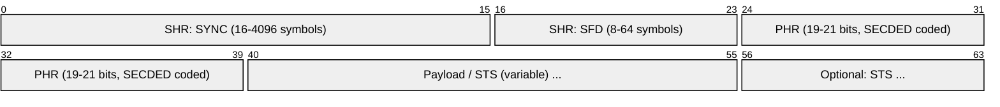
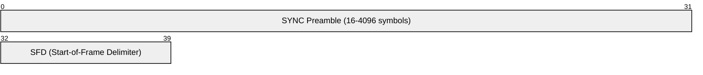
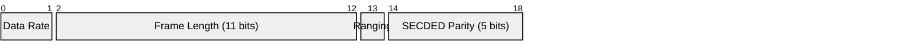
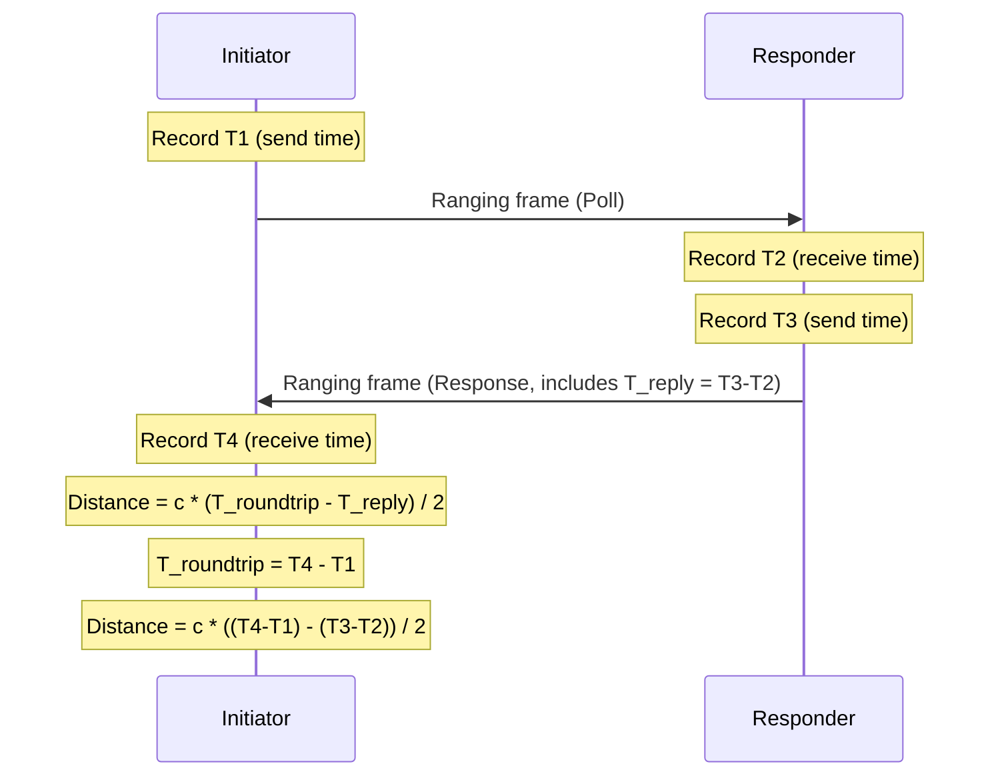
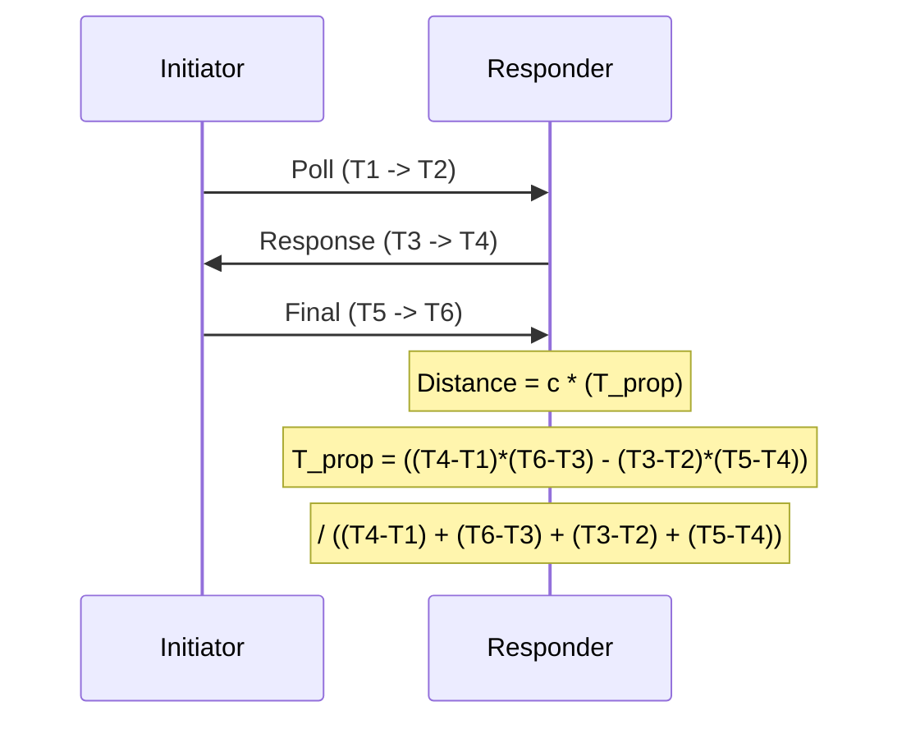
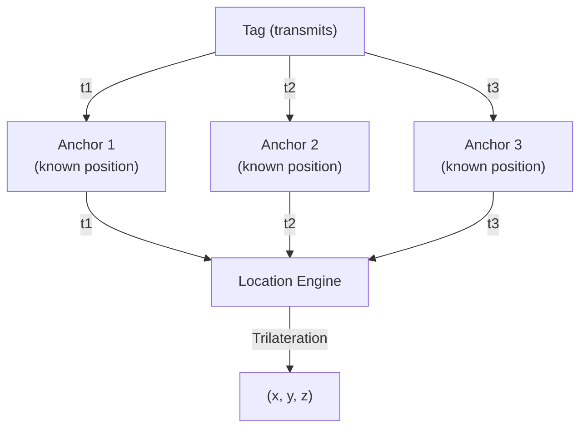
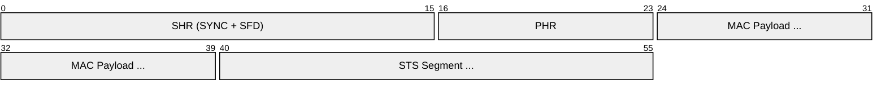
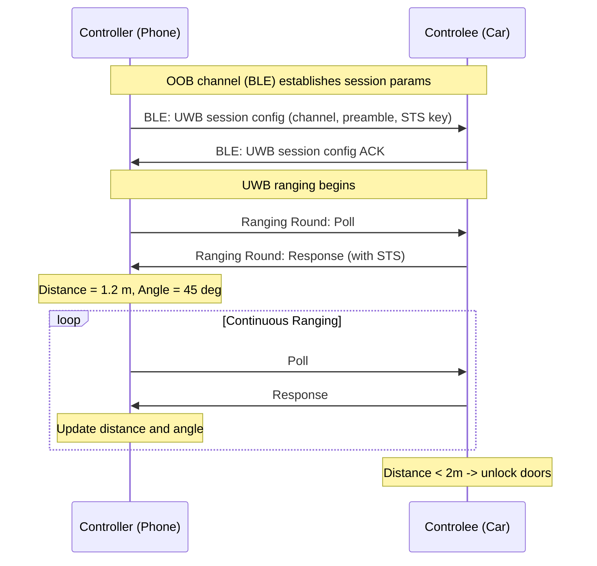
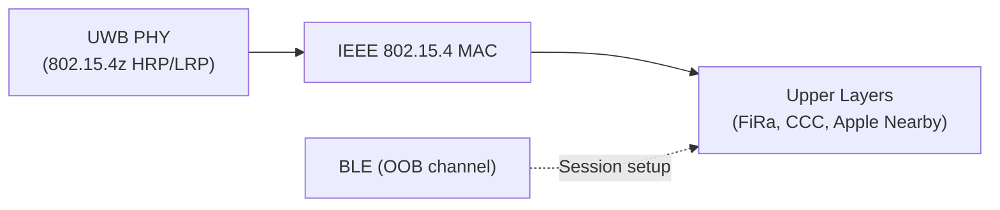

# UWB (Ultra-Wideband)

> **Standard:** [IEEE 802.15.4z-2020](https://standards.ieee.org/standard/802_15_4z-2020.html) / [FiRa Consortium](https://www.firaconsortium.org/) | **Layer:** Physical / Data Link | **Wireshark filter:** `wpan` (IEEE 802.15.4 dissector; UWB-specific fields require specialized capture)

Ultra-Wideband (UWB) is a short-range radio technology that uses very wide bandwidth pulses (>500 MHz) to achieve centimeter-level positioning accuracy and secure ranging between devices. Unlike Bluetooth or Wi-Fi, UWB's primary purpose is not data transfer but precise distance measurement — enabled by sub-nanosecond pulse timing. IEEE 802.15.4z (2020) added enhanced ranging with anti-spoofing protections (Scrambled Timestamp Sequence), making UWB suitable for security-sensitive applications: digital car keys, access control, asset tracking (Apple AirTag, Samsung SmartTag+), and indoor positioning systems.

## Radio Parameters

| Parameter | Value |
|-----------|-------|
| Frequency bands | 3.1-4.8 GHz (low band), 6.0-10.6 GHz (high band) |
| Common channels | Channel 5 (6.5 GHz), Channel 9 (7.9 GHz) |
| Bandwidth | >500 MHz per channel |
| Data rates | 110 kbps, 850 kbps, 6.8 Mbps, 27.2 Mbps |
| Modulation | BPM-BPSK (Burst Position Modulation with BPSK) |
| Pulse duration | ~2 ns |
| Transmit power | -41.3 dBm/MHz (FCC limit, very low) |
| Range | Typically 10-30 m (indoor), up to 200 m (line of sight) |
| Ranging accuracy | 5-30 cm (typical), <10 cm (ideal conditions) |
| Time resolution | ~65 ps (enables cm-level distance calculation) |

## PHY Frame Structure (HRP UWB)

The IEEE 802.15.4z HRP (High Rate Pulse) PHY frame:

### SHR (Synchronous Header)

### PHR (PHY Header)

## Key Fields

| Field | Size | Description |
|-------|------|-------------|
| SYNC Preamble | 16-4096 symbols | Preamble code for receiver synchronization and channel estimation |
| SFD | 8-64 symbols | Start-of-Frame Delimiter marks end of preamble |
| Data Rate | 2 bits | 00=110 kbps, 01=850 kbps, 10=6.8 Mbps, 11=27.2 Mbps |
| Frame Length | 11 bits | Payload length in octets |
| Ranging | 1 bit | 1 = frame is used for ranging (timestamp captured) |
| SECDED | 5 bits | Single Error Correct, Double Error Detect parity over PHR |
| Payload | Variable | MAC frame data (IEEE 802.15.4 MAC) |
| STS | Variable | Scrambled Timestamp Sequence (802.15.4z security) |

## PHY Modes

IEEE 802.15.4z defines two PHY modes:

| Mode | Pulse Rate | Data Rate | Range | Use Case |
|------|-----------|-----------|-------|----------|
| HRP (High Rate Pulse) | 15.6 / 62.4 / 124.8 MHz | 850 kbps - 27.2 Mbps | 10-100 m | Smartphones, car keys, tracking tags |
| LRP (Low Rate Pulse) | 1-4 MHz | ~50-250 kbps | Up to 200 m | Access control readers, industrial |

### HRP vs LRP

| Feature | HRP | LRP |
|---------|-----|-----|
| Peak pulse rate | Up to 124.8 MHz | 1-4 MHz |
| Preamble codes | TERNARY (31/127 length) | Binary |
| Complexity | Higher (smartphone SoC) | Lower (simple readers) |
| FiRa support | Primary mode | Supplementary |
| Power consumption | Higher | Lower |
| Common devices | iPhone, Galaxy, AirTag | Door locks, access readers |

## Ranging Methods

### Two-Way Ranging (TWR)

TWR measures round-trip time of flight between two devices to calculate distance:

Distance = speed of light * (round-trip time - processing delay) / 2. At ~3.3 ns per meter, sub-nanosecond timing resolution yields centimeter-level accuracy.

### Double-Sided TWR (DS-TWR)

DS-TWR adds a third exchange to cancel out clock drift errors:

### Time Difference of Arrival (TDoA)

TDoA uses multiple synchronized anchors — the tag only transmits, anchors compute position from arrival time differences:

TDoA is more scalable than TWR for large deployments (warehouses, stadiums) because the tag does not need to participate in two-way exchanges with each anchor.

## Scrambled Timestamp Sequence (STS)

STS is the key security addition in IEEE 802.15.4z. It prevents relay attacks and distance spoofing:

| Feature | Description |
|---------|-------------|
| Purpose | Secure the time-of-arrival measurement against manipulation |
| Mechanism | Cryptographically generated pseudo-random pulse sequence appended to the frame |
| Key derivation | STS key derived from a shared secret between initiator and responder |
| Verification | Receiver correlates incoming STS against expected sequence |
| Attack prevention | Relay attacks, early-detect / late-commit, distance reduction |

### STS Modes (802.15.4z)

| Mode | STS Position | Description |
|------|-------------|-------------|
| SP0 | No STS | Legacy mode, no secure ranging |
| SP1 | After payload | STS appended after the MAC payload |
| SP2 | Before payload | STS placed between SFD and payload |
| SP3 | No payload | STS only (ranging-only frames, no data) |

### Frame with STS (SP1)

## FiRa Consortium Profiles

The FiRa Consortium defines interoperability profiles on top of IEEE 802.15.4z:

| Profile | Description | Example Applications |
|---------|-------------|---------------------|
| PACS (Physical Access Control) | Secure door/gate access | Office badges, hotel rooms |
| Peer-to-Peer Ranging | Device-to-device distance | Find My (AirTag), nearby sharing |
| Device Tracking | Tag-to-infrastructure ranging | Warehouse inventory, luggage tracking |
| Secure Ranging | High-security distance bounding | Digital car keys (CCC), payment terminals |

### FiRa Ranging Session

## Use Cases

| Application | Method | Accuracy | Devices |
|-------------|--------|----------|---------|
| Apple AirTag / Find My | TWR + TDoA | ~10 cm | iPhone 11+, AirTag |
| Digital car keys (CCC) | DS-TWR + STS | ~10 cm | BMW, Hyundai, NXP |
| Indoor positioning (RTLS) | TDoA | 10-30 cm | Warehouses, hospitals |
| Smart home access | TWR + STS | ~10 cm | Door locks, lights |
| AR/VR spatial tracking | TWR | ~5 cm | Headsets, controllers |
| Contactless payments | Secure ranging | ~30 cm | Payment terminals |
| Robotic navigation | TWR / TDoA | ~5 cm | Autonomous vehicles, drones |

## UWB vs Bluetooth vs NFC

| Feature | UWB | Bluetooth (BLE) | NFC |
|---------|-----|-----------------|-----|
| Primary purpose | Ranging / positioning | Data transfer, audio | Tap interaction |
| Range | 10-200 m | 10-100 m | <4 cm |
| Accuracy | 5-30 cm | 1-3 m (RSSI), ~50 cm (BLE 6.0 CS) | N/A |
| Data rate | 6.8-27.2 Mbps | 1-2 Mbps | 106-424 kbps |
| Anti-relay | STS (802.15.4z) | Limited | Physical proximity |
| Power | Moderate | Low | Passive (tags) |
| Frequency | 3.1-10.6 GHz | 2.4 GHz | 13.56 MHz |
| Spatial awareness | Yes (angle + distance) | Limited (BLE 5.1 AoA) | No |

## Encapsulation

## Standards

| Document | Title |
|----------|-------|
| [IEEE 802.15.4z-2020](https://standards.ieee.org/standard/802_15_4z-2020.html) | Enhanced HRP and LRP UWB PHY |
| [IEEE 802.15.4-2020](https://standards.ieee.org/standard/802_15_4-2020.html) | Low-Rate Wireless PAN (base MAC/PHY) |
| [FiRa Consortium](https://www.firaconsortium.org/) | UWB interoperability profiles and certifications |
| [Car Connectivity Consortium (CCC)](https://carconnectivity.org/) | Digital Key 3.0 (UWB for car access) |
| [Apple Nearby Interaction](https://developer.apple.com/nearby-interaction/) | iOS UWB framework (U1/U2 chip) |

## See Also

- [BLE](ble.md) — often used alongside UWB for session setup and fallback
- [Bluetooth](bluetooth.md) — Bluetooth 6.0 Channel Sounding competes with UWB for ranging
- [NFC](nfc.md) — alternative for very-short-range secure interaction
- [Zigbee](zigbee.md) — shares IEEE 802.15.4 MAC layer heritage
