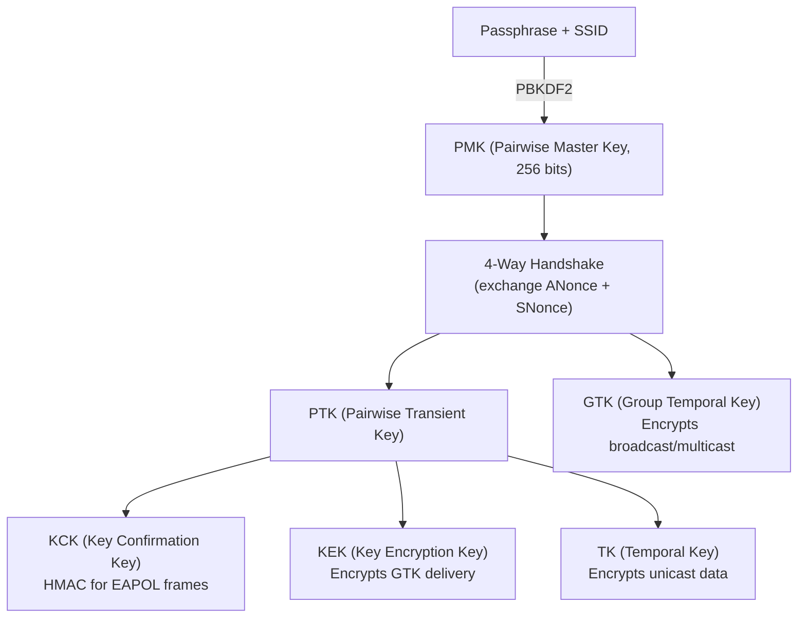
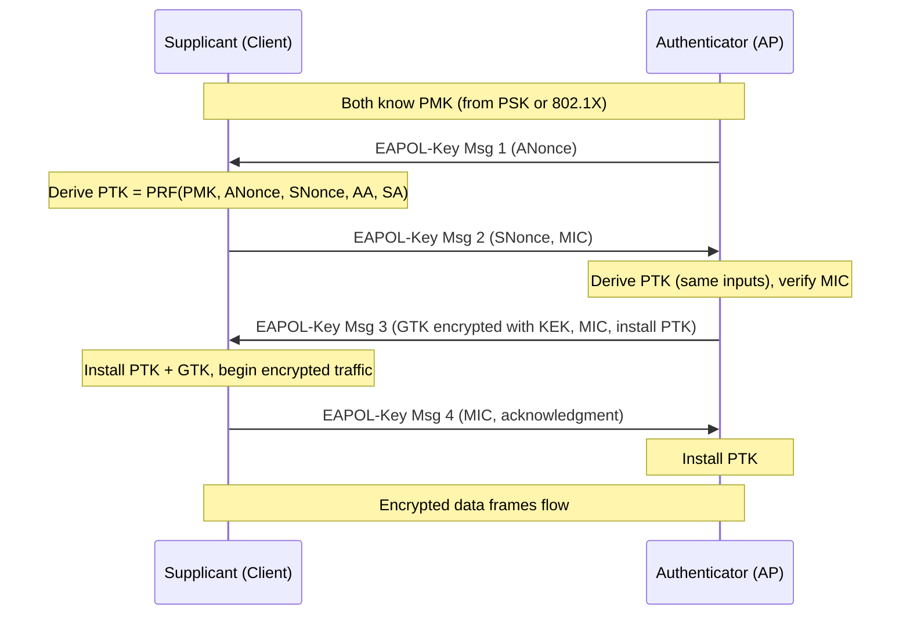
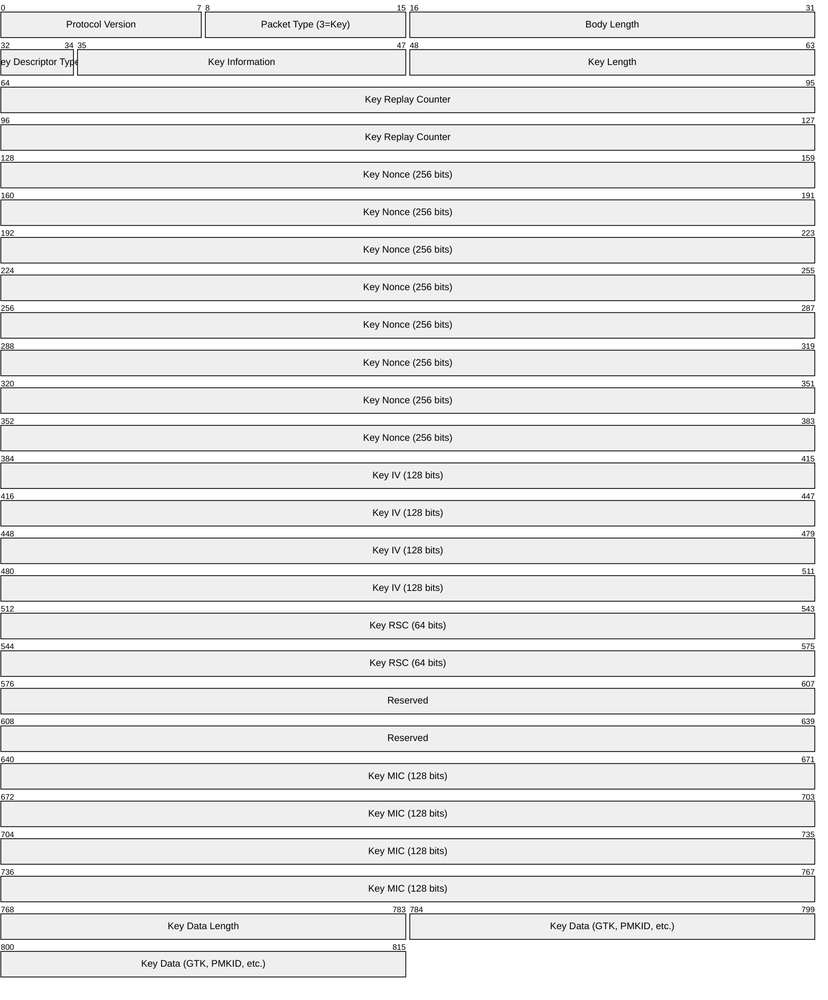
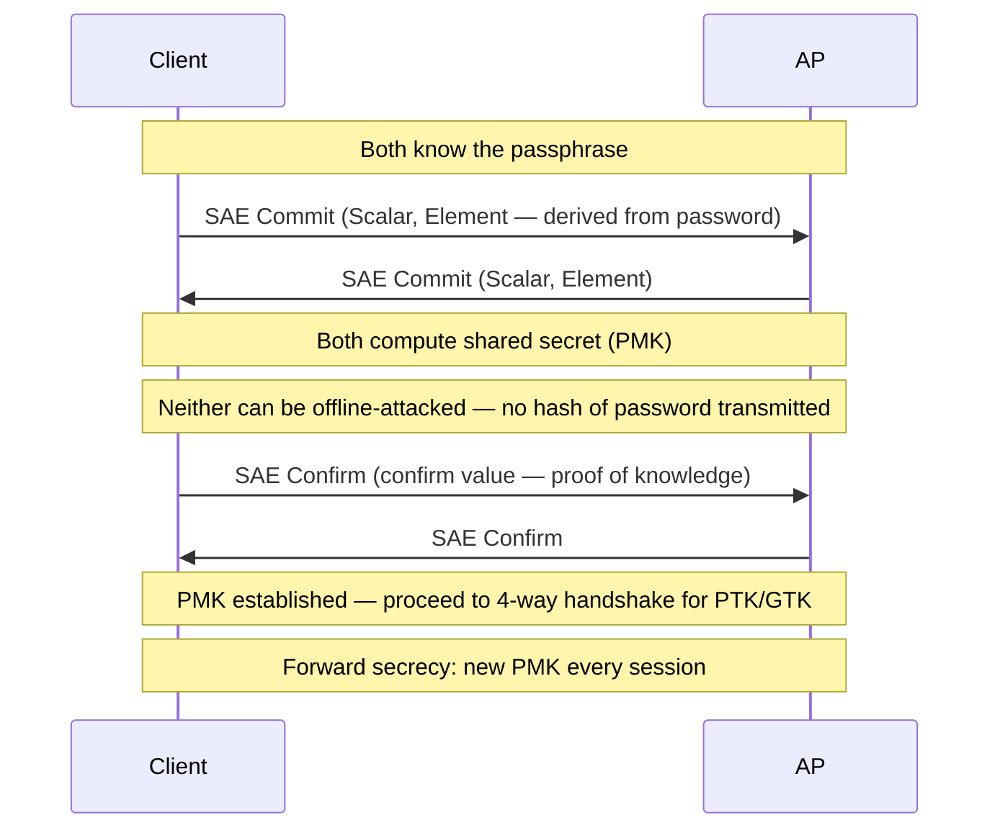
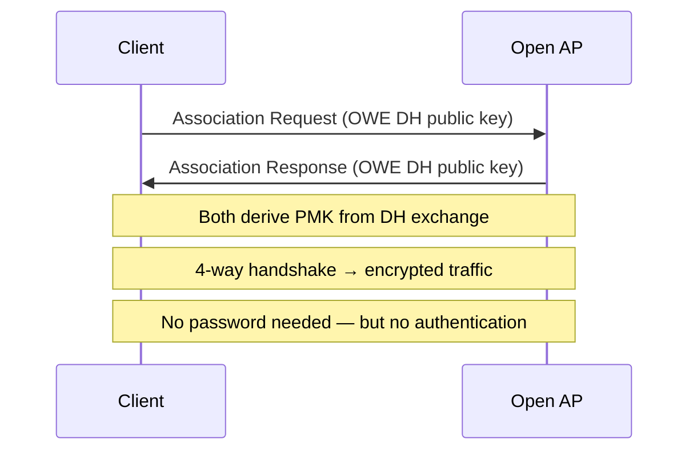
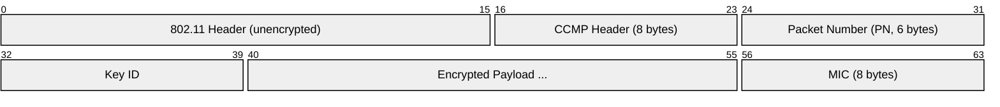
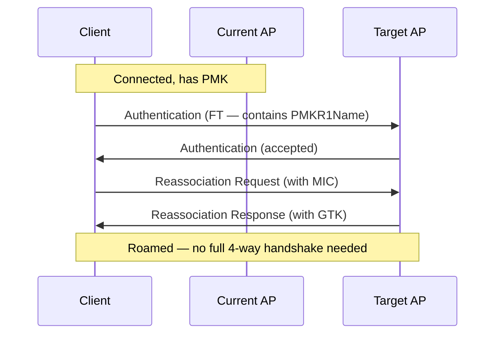
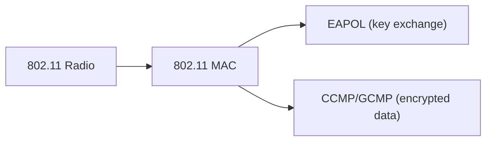

# WPA2 / WPA3 (Wi-Fi Protected Access)

> **Standard:** [IEEE 802.11i (WPA2)](https://standards.ieee.org/standard/802_11i-2004.html) / [Wi-Fi Alliance WPA3](https://www.wi-fi.org/discover-wi-fi/security) | **Layer:** Data Link (Layer 2) | **Wireshark filter:** `eapol`

WPA2 and WPA3 are the security protocols that protect Wi-Fi networks from eavesdropping and unauthorized access. WPA2 (2004) uses AES-CCMP encryption with a 4-way handshake to establish per-session keys. WPA3 (2018) replaces the Pre-Shared Key exchange with SAE (Simultaneous Authentication of Equals), providing forward secrecy and resistance to offline dictionary attacks. Both support Personal (password) and Enterprise (802.1X/RADIUS) modes.

## Security Evolution

| Standard | Year | Encryption | Key Exchange | Status |
|----------|------|-----------|--------------|--------|
| WEP | 1997 | RC4 (broken) | Static key | **Broken — never use** |
| WPA | 2003 | TKIP (RC4, improved) | 4-way handshake (PSK) | **Deprecated** |
| WPA2 | 2004 | AES-128-CCMP | 4-way handshake (PSK) | Current |
| WPA3 | 2018 | AES-128-CCMP or AES-256-GCMP | SAE (Dragonfly) | Current (recommended) |

## Modes

| Mode | Authentication | Key Source | Use Case |
|------|---------------|-----------|----------|
| Personal (PSK/SAE) | Shared password | Derived from passphrase + SSID | Home, small office |
| Enterprise (802.1X) | Per-user credentials via RADIUS | Per-session from EAP exchange | Corporate, campus |

## WPA2 — 4-Way Handshake

The 4-way handshake derives per-session encryption keys from the PMK (Pairwise Master Key) without transmitting the PMK itself:

### Key Hierarchy



### PSK Derivation

```
PMK = PBKDF2(SHA1, passphrase, SSID, 4096 iterations, 256 bits)
```

### 4-Way Handshake



### PTK Derivation

```
PTK = PRF-384(PMK, "Pairwise key expansion",
              min(AA,SA) || max(AA,SA) || min(ANonce,SNonce) || max(ANonce,SNonce))
```

Where AA = Authenticator Address (AP MAC), SA = Supplicant Address (client MAC).

| PTK Component | Size | Purpose |
|--------------|------|---------|
| KCK | 128 bits | MIC calculation for EAPOL frames |
| KEK | 128 bits | Encrypt GTK in message 3 |
| TK | 128 bits | Encrypt unicast data (AES-CCMP) |

### EAPOL-Key Frame



## WPA3 — SAE (Simultaneous Authentication of Equals)

SAE replaces the PSK 4-way handshake with a zero-knowledge proof based on the Dragonfly key exchange:

### SAE Handshake



### WPA3 Improvements

| Feature | WPA2 | WPA3 |
|---------|------|------|
| Key exchange | PSK (PBKDF2 → 4-way handshake) | SAE (Dragonfly → 4-way handshake) |
| Offline attack | Vulnerable (captured handshake can be brute-forced) | Resistant (zero-knowledge proof) |
| Forward secrecy | No (same PMK from same password) | Yes (fresh PMK per session) |
| Open networks | Unencrypted | OWE (Opportunistic Wireless Encryption) |
| Enterprise (192-bit) | Optional | Mandatory 192-bit mode (CNSA suite) |
| PMF (Protected Management Frames) | Optional | Mandatory |

## WPA3 OWE (Opportunistic Wireless Encryption)

OWE encrypts open networks (coffee shops, airports) without a password using a Diffie-Hellman exchange:



## Encryption Algorithms

| Protocol | Cipher | Key Size | Integrity |
|----------|--------|----------|-----------|
| WPA (TKIP) | RC4 | 128 bits | Michael MIC (64 bits) |
| WPA2 (CCMP) | AES-CTR | 128 bits | AES-CBC-MAC (64 bits) |
| WPA3 (CCMP-256) | AES-CTR | 256 bits | AES-CBC-MAC (128 bits) |
| WPA3 (GCMP-256) | AES-GCM | 256 bits | GHASH (128 bits) |

### CCMP Encryption



The Packet Number (PN) is a 48-bit counter — it must never repeat for the same key, providing replay protection.

## Protected Management Frames (PMF — 802.11w)

PMF prevents deauthentication attacks by encrypting/signing management frames:

| Frame | Without PMF | With PMF |
|-------|-------------|----------|
| Deauthentication | Spoofable (trivial DoS) | Authenticated (MIC-protected) |
| Disassociation | Spoofable | Authenticated |
| Action frames | Unprotected | Encrypted |

PMF is optional in WPA2 and **mandatory in WPA3**.

## Key Caching and Roaming

| Mechanism | Standard | Description |
|-----------|----------|-------------|
| PMK Caching (PMKSA) | 802.11i | Cache PMK for faster reconnection |
| Pre-authentication | 802.11i | Authenticate with next AP before roaming |
| 802.11r (FT) | 802.11r | Fast BSS Transition — roam in <50ms |
| OKC | Vendor | Opportunistic Key Caching across APs |

### 802.11r Fast Roaming



## Encapsulation



## Standards

| Document | Title |
|----------|-------|
| [IEEE 802.11i-2004](https://standards.ieee.org/standard/802_11i-2004.html) | MAC Security Enhancements (WPA2 basis) |
| [IEEE 802.11-2020](https://standards.ieee.org/standard/802_11-2020.html) | Consolidated WLAN standard (includes 802.11i, 802.11w, SAE) |
| [IEEE 802.11w-2009](https://standards.ieee.org/standard/802_11w-2009.html) | Protected Management Frames |
| [IEEE 802.11r-2008](https://standards.ieee.org/standard/802_11r-2008.html) | Fast BSS Transition |
| [RFC 7664](https://www.rfc-editor.org/rfc/rfc7664) | Dragonfly Key Exchange (SAE basis) |
| [Wi-Fi Alliance WPA3](https://www.wi-fi.org/discover-wi-fi/security) | WPA3 certification program |

## See Also

- [802.11 (Wi-Fi)](80211.md) — base Wi-Fi framing and PHY
- [802.1X / EAP](8021x.md) — enterprise authentication framework
- [RADIUS](../application-layer/radius.md) — authentication server for WPA Enterprise
- [Kerberos](../application-layer/kerberos.md) — sometimes used via EAP-FAST/EAP-TLS
