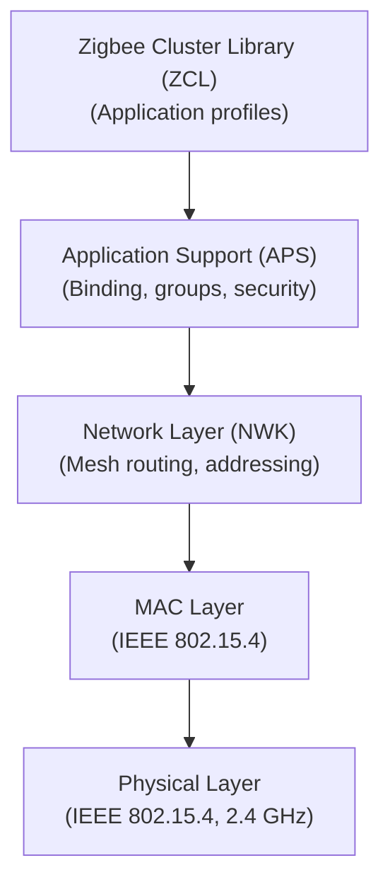
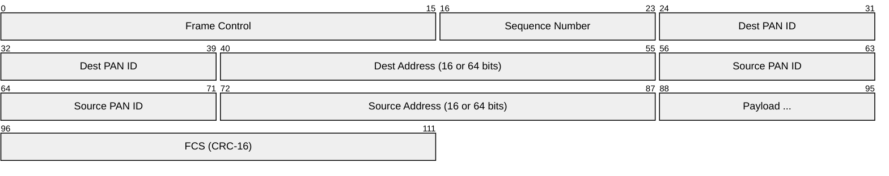
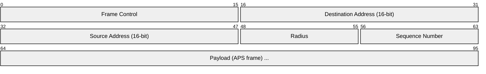
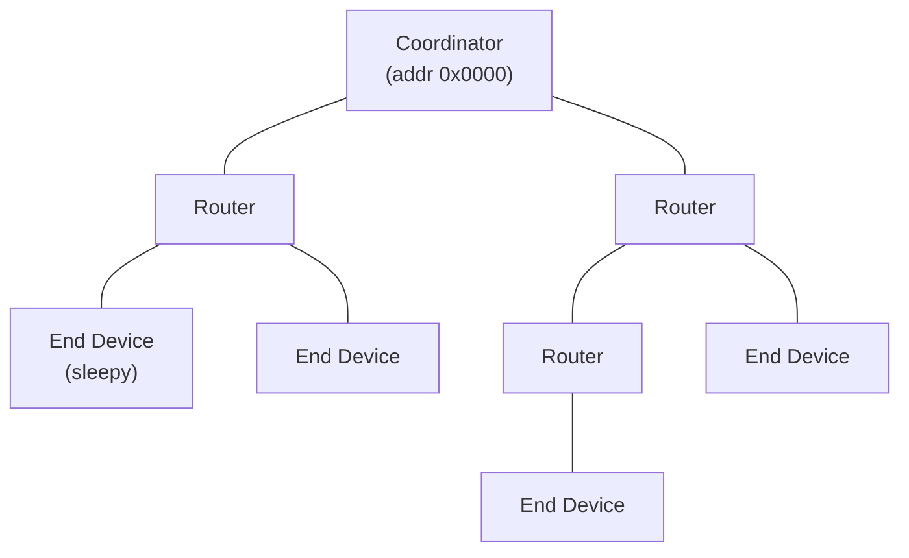
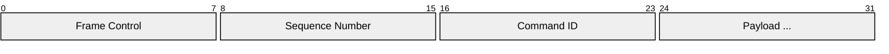

# Zigbee

> **Standard:** [Zigbee 3.0 (CSA)](https://csa-iot.org/all-solutions/zigbee/) / [IEEE 802.15.4](https://standards.ieee.org/standard/802_15_4-2020.html) | **Layer:** Full stack (Physical through Application) | **Wireshark filter:** `zbee_nwk` or `wpan`

Zigbee is a low-power, low-data-rate wireless mesh networking protocol built on the IEEE 802.15.4 physical and MAC layers. It is designed for IoT and home automation — smart lighting (Philips Hue), sensors, switches, and industrial monitoring. Zigbee supports self-healing mesh networks with up to 65,000 nodes, AES-128 encryption, and very low power consumption (battery-powered devices can last years). Zigbee 3.0 unified earlier profiles (Home Automation, Light Link, etc.) into a single standard.

## Protocol Stack

## IEEE 802.15.4 Frame (MAC Layer)

## Key Fields (MAC)

| Field | Size | Description |
|-------|------|-------------|
| Frame Control | 16 bits | Frame type, security, addressing mode, PAN compression |
| Sequence Number | 8 bits | Frame sequence for acknowledgment matching |
| Dest PAN ID | 16 bits | Destination Personal Area Network ID |
| Dest Address | 16 or 64 bits | Short (network) or extended (IEEE/MAC) address |
| Source PAN ID | 16 bits | Source PAN ID (omitted with PAN compression) |
| Source Address | 16 or 64 bits | Short or extended address |
| Payload | Variable | NWK + APS + application data |
| FCS | 16 bits | CRC-16-CCITT |

### Radio Parameters

| Parameter | Value |
|-----------|-------|
| Frequency | 2.4 GHz (worldwide), 915 MHz (NA), 868 MHz (EU) |
| Channels | 16 channels at 2.4 GHz (channels 11-26) |
| Data rate | 250 kbps (2.4 GHz) |
| Modulation | O-QPSK with DSSS |
| Range (indoor) | 10-30 m |
| Range (outdoor) | 100+ m |
| Max payload (MAC) | 127 bytes total frame |
| Transmit power | Typically 0-20 dBm |

## Network Layer (NWK)

### Device Types

| Type | Role | Power | Can Route |
|------|------|-------|-----------|
| Coordinator | Forms the network, trust center | Mains | Yes |
| Router | Extends the mesh, relays packets | Mains | Yes |
| End Device | Leaf node, can sleep | Battery | No |

### Network Topology

Zigbee supports star, tree, and mesh topologies. The mesh self-heals — if a router fails, alternative routes are discovered.

### Routing

| Method | Description |
|--------|-------------|
| AODV (Ad-hoc On-demand Distance Vector) | Default mesh routing — routes discovered when needed |
| Many-to-One | Optimized for sensor networks reporting to a collector |
| Source Routing | Route specified by the sender (for efficiency after discovery) |
| Tree Routing | Hierarchical routing based on network address assignment |

## Application Layer (ZCL)

The Zigbee Cluster Library defines standardized clusters (functional groups):

### Common Clusters

| Cluster | ID | Description |
|---------|-----|-------------|
| On/Off | 0x0006 | Binary switch control |
| Level Control | 0x0008 | Dimming, volume, etc. |
| Color Control | 0x0300 | Hue, saturation, color temperature |
| Temperature Measurement | 0x0402 | Temperature sensor |
| Humidity Measurement | 0x0405 | Humidity sensor |
| Occupancy Sensing | 0x0406 | Motion/presence detection |
| IAS Zone | 0x0500 | Intrusion Alarm System (door/window, smoke) |
| Door Lock | 0x0101 | Lock/unlock control |
| Thermostat | 0x0201 | HVAC control |
| Electrical Measurement | 0x0B04 | Power monitoring |
| OTA Upgrade | 0x0019 | Over-the-air firmware update |

### ZCL Frame

### Frame Types

| Type | Description |
|------|-------------|
| Global | Standard commands (read/write attribute, report, discover) |
| Cluster-specific | Commands defined by each cluster (on, off, move, step) |

## Security

| Layer | Mechanism |
|-------|-----------|
| Network | AES-128-CCM encryption with network key (all devices share) |
| Application | AES-128-CCM with link key (per device pair) |
| Trust Center | Coordinator manages key distribution and device admission |
| Install Codes | Pre-shared key derived from device-specific code (Zigbee 3.0) |

### Security Levels

| Level | Description |
|-------|-------------|
| No Security | Unencrypted (not recommended) |
| Network Key | All devices share one key — protects against external attackers |
| Link Key | Per-pair keys — protects against compromised network devices |

## Zigbee vs Z-Wave vs Thread

| Feature | Zigbee | Z-Wave | Thread |
|---------|--------|--------|--------|
| Frequency | 2.4 GHz | Sub-GHz | 2.4 GHz |
| Data rate | 250 kbps | 100 kbps | 250 kbps |
| Range | 10-30 m | 30 m | 10-30 m |
| Max nodes | 65,000 | 232 | 250+ |
| Mesh | Yes | Yes (4 hops) | Yes |
| IP-based | No | No | Yes (IPv6/6LoWPAN) |
| Interoperability | Via Matter bridge | Via Matter bridge | Native Matter |

## Standards

| Document | Title |
|----------|-------|
| [IEEE 802.15.4-2020](https://standards.ieee.org/standard/802_15_4-2020.html) | Low-Rate Wireless PANs (PHY and MAC) |
| [Zigbee 3.0](https://csa-iot.org/all-solutions/zigbee/) | Zigbee PRO stack and Zigbee Cluster Library |
| [Zigbee Cluster Library (ZCL)](https://csa-iot.org/) | Application-layer cluster definitions |
| [Zigbee Green Power](https://csa-iot.org/) | Ultra-low-power / energy-harvesting devices |

## See Also

- [Z-Wave](zwave.md) — alternative home automation mesh (sub-GHz)
- [802.11s](80211s.md) — Wi-Fi mesh networking
- [CAN](../bus/can.md) — wired alternative for industrial sensing
