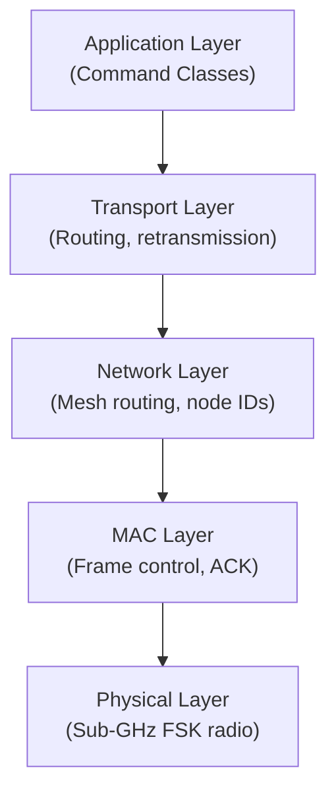
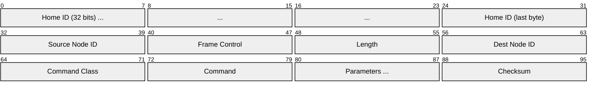
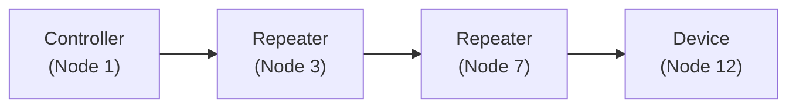

# Z-Wave

> **Standard:** [ITU-T G.9959 / Z-Wave Specification](https://z-wavealliance.org/) | **Layer:** Full stack (Physical through Application) | **Wireshark filter:** `zwave`

Z-Wave is a low-power wireless mesh networking protocol designed for home automation. It operates in the sub-GHz ISM band (908.42 MHz in North America, 868.42 MHz in Europe), which provides better range and wall penetration than 2.4 GHz alternatives. Z-Wave supports up to 232 devices per network with a mandatory security layer (S2 framework). It is widely used for smart locks, sensors, switches, thermostats, and other IoT devices. Since 2020, the specification has been open through the Z-Wave Alliance.

## Protocol Stack

## Frame (MAC Layer)

## Key Fields

| Field | Size | Description |
|-------|------|-------------|
| Home ID | 32 bits | Identifies the Z-Wave network (set during inclusion) |
| Source Node ID | 8 bits | Sender's node ID (1-232) |
| Frame Control | 8 bits | Frame type, routed flag, ACK request, speed |
| Length | 8 bits | Remaining bytes in the frame |
| Destination Node ID | 8 bits | Recipient node ID (0xFF = broadcast) |
| Command Class | 8 bits | Functional category (see below) |
| Command | 8 bits | Specific operation within the class |
| Parameters | Variable | Command-specific data |
| Checksum | 8 bits | XOR of all preceding bytes |

## Field Details

### Radio Parameters

| Parameter | Z-Wave | Z-Wave Long Range |
|-----------|--------|-------------------|
| Frequency (NA) | 908.42 MHz | 912 MHz |
| Frequency (EU) | 868.42 MHz | 868.4 MHz |
| Data rates | 9.6 / 40 / 100 kbps | 100 kbps |
| Modulation | FSK | DSSS-OQPSK |
| Range (indoor) | ~30 m | ~200 m |
| Range (outdoor) | ~100 m | ~1.6 km |
| Max nodes | 232 | 4000 (with Long Range) |
| Mesh hops | Up to 4 | Direct (no mesh) |

### Frame Types

| Type | Description |
|------|-------------|
| Singlecast | Direct message to one node |
| Multicast | Message to a group of nodes |
| Broadcast | Message to all nodes (Node ID 0xFF) |
| Routed | Multi-hop message through repeater nodes |
| ACK | Acknowledgment of received frame |

### Common Command Classes

| Class | ID | Description |
|-------|----|-------------|
| Basic | 0x20 | Simple on/off/level control |
| Switch Binary | 0x25 | On/off switch |
| Switch Multilevel | 0x26 | Dimmable switch (0-99%) |
| Sensor Binary | 0x30 | Binary sensor (open/closed, motion) |
| Sensor Multilevel | 0x31 | Measured values (temperature, humidity, power) |
| Meter | 0x32 | Accumulated measurements (energy, water) |
| Thermostat Mode | 0x40 | HVAC mode (heat, cool, auto) |
| Thermostat Setpoint | 0x43 | Temperature setpoints |
| Door Lock | 0x62 | Lock/unlock control |
| Alarm/Notification | 0x71 | Alerts (smoke, CO, intrusion, water leak) |
| Battery | 0x80 | Battery level reporting |
| Wake Up | 0x84 | Sleepy device scheduling |
| Configuration | 0x70 | Device-specific parameters |
| Association | 0x85 | Direct device-to-device linking |
| Security 2 | 0x9F | S2 encryption and authentication |

### Security

| Framework | Description |
|-----------|-------------|
| S0 (legacy) | AES-128 encryption, single network key |
| S2 | AES-128-CCM, per-class keys, ECDH key exchange |
| S2 Access Control | Highest security (door locks, garage doors) |
| S2 Authenticated | Intermediate security (sensors, switches) |
| S2 Unauthenticated | Encrypted but no authentication pin |

### Mesh Routing

Z-Wave uses source routing — the controller computes the route and includes it in the frame header:

Maximum 4 hops per route. Explorer frames can discover new routes when existing ones fail.

## Standards

| Document | Title |
|----------|-------|
| [ITU-T G.9959](https://www.itu.int/rec/T-REC-G.9959) | Short range narrow-band digital radiocommunication |
| [Z-Wave Specification](https://z-wavealliance.org/) | Z-Wave Alliance public specification |
| [Z-Wave Long Range](https://z-wavealliance.org/) | Extended range specification (800 series) |

## See Also

- [Zigbee](zigbee.md) — alternative home automation mesh protocol (2.4 GHz)
- [802.11s](../wireless/80211s.md) — Wi-Fi mesh networking
